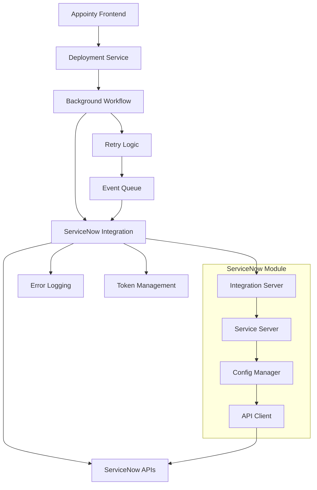
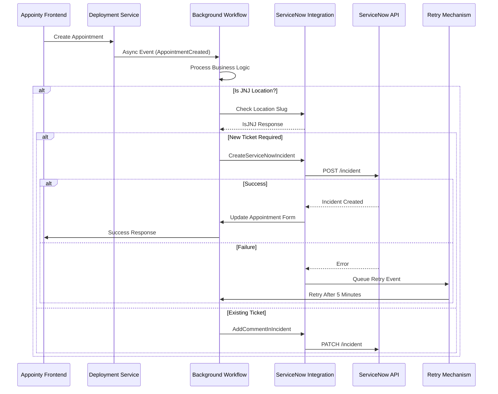
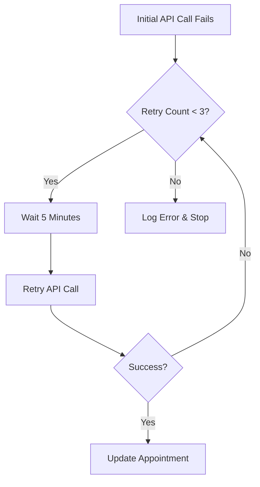

# ServiceNow Integration Module - Comprehensive Developer Documentation

## **Overview**

This module was developed as a **custom integration** for our client **JNJ (Johnson & Johnson)**. Its core purpose is to automatically **create and manage ServiceNow incidents** based on actions triggered in the **Appointy System**. The integration ensures that for every appointment-related event such as **creation, rescheduling, or cancellation**, a corresponding **incident is either created or updated** in **ServiceNow**.

> **⚠️ Important:** This integration is specifically designed for JNJ's enterprise ITSM (IT Service Management) solution and follows their internal ServiceNow instance specifications.

**ServiceNow Integration Module Repository**:  
🔗 [GitLab - ServiceNow Module](https://gitlab.com/appointy/waqt/service-now)

---

## **Architecture Overview**

### **Integration Structure**



### **Core Components**

| Component | Purpose | Location |
|-----------|---------|----------|
| **Integration Server** | Handles OAuth token management | `service-now/integration.go` |
| **Service Server** | Core business logic for incident management | `service-now/service_now.go` |
| **Background Integration** | Workflow orchestration and event handling | `background/integrations/serviceNow/main.go` |
| **Configuration Manager** | Manages JNJ-specific settings and mappings | `service-now/service_now.json` |
| **Retry Mechanism** | Handles failed incident creation with exponential backoff | `background/notification/email/mailer/service-now-retry.go` |

---

## **Integration Interface Implementation**

- **Interface:** `IntegrationServer`  
- **Integration Type:** `IntegrationType_SERVICE_NOW` (enum value: 27)
- **Purpose:** Generate API token frequently to communicate with ServiceNow APIs using OAuth 2.0 authentication
- **Authentication Method:** Microsoft Azure AD OAuth 2.0 (JNJ's identity provider)

### **Token Configuration**

```json
{
  "itype": 27,
  "name": "SERVICE_NOW",
  "client_id": "abcd123xyzlmnop456",
  "client_secret": "efgh789qrstuvw012",
  "tokenUrl": "https://login.microsoftonline.com/its.jnj.com/oauth2/token?api-version=1.0",
  "resource_url": "https://ITS-APP-ISM-IRIS-Dev.jnj.com",
  "api_endpoint": "https://jnj-internal-development.apigee.net/apg-001-servicenow"
}
```

> **🔐 Security Note:** JNJ updates the `client_id` and `client_secret` annually. These credentials must be updated in the `info.json` configuration file.

---

## **Service Now API Methods**

### **1. `ListServiceNowIncidents`**

- **Called from:** Frontend (GraphQL/REST API)
- **Purpose:** Fetch a list of relevant incidents with specific states
- **HTTP Method:** `GET`
- **Endpoint:** `/v1/service-now/incidents`
- **Incident States Returned:**
  - `IncidentStates_Assigned` (200)
  - `IncidentStates_New` (100)
  - `IncidentStates_Pending` (400)
  - `IncidentStates_WorkInProgress` (300)

**Implementation Details:**
```go
func (s serviceNowServer) ListServiceNowIncidents(ctx context.Context, in *pb.ListServiceNowIncidentsRequest) (*pb.ListServiceNowIncidentsResponse, error)
```

### **2. `CreateServiceNowIncident`**

- **Called from:** Background Workflow
- **Purpose:** Create a new incident in ServiceNow
- **Triggered by Event:** `AppointmentCreated`
- **Retry Logic:** Yes (3 attempts with 5-minute intervals)

**Key Features:**
- Automatic incident template selection based on appointment metadata
- Support for multiple incident types (default, nexthink, c3i, cloudcity)
- Multi-language support for contact methods
- Automatic assignment group mapping

### **3. `AddCommentInIncident`**

- **Called from:** Background Workflow
- **Purpose:** Append comments to existing ServiceNow incidents
- **Triggered by Events:**
  - `AppointmentUpdated`
  - `AppointmentNoteUpdated`
  - `AppointmentStatusChanged`
  - `AppointmentCancelled`

### **4. `UpdateIncident`**

- **Called from:** Background Workflow
- **Purpose:** Update incident fields (assignment, state, etc.)
- **Special Handling:** Separate API calls for state and assignment updates due to ServiceNow limitations

---

## **ServiceNow API Endpoints Used**

| Action | Endpoint | Method | Purpose |
|--------|----------|---------|---------|
| **Get Incidents** | `/v1/now/table/incident` | `GET` | Retrieve incident list |
| **Create Incident** | `/v1/now/table/incident/` | `POST` | Create new incident |
| **Update Incident** | `/v1/now/table/incident/{sys_id}` | `PUT` | Update incident fields |
| **Add Comment** | `/v1/now/table/incident/{sys_id}` | `PATCH` | Add work notes/comments |

**Base URL:** `https://jnj-internal-development.apigee.net/apg-001-servicenow`

> **🔒 Authentication:** All APIs require Bearer token authentication with Microsoft Azure AD tokens.

---

## **Configuration Management**

### **Environment-Specific Configuration Files**

| Environment | File | Purpose |
|-------------|------|---------|
| **Development** | `service_now.json` | Development/testing configuration |
| **QA** | `service_now_qa.json` | QA environment settings |
| **Production** | `service_now_prod.json` | Production configuration |

### **Configuration Structure**

```go
type ServiceNowConfig struct {
    JNJs                        []string          `json:"jnjs"`
    AssignmentGroups            map[string]string `json:"assignment_groups"`
    DefaultIncident             *Incident         `json:"default_incident"`
    NexthinkIncident            *Incident         `json:"nexthink_incident"`
    C3iIncident                 *Incident         `json:"c3i_incident"`
    CloudcityIncident           *Incident         `json:"cloudcity_incident"`
    Cloudcity2Incident          *Incident         `json:"cloudcity2_incident"`
    CustomContactType           map[string]string `json:"custom_contact_type"`
    CustomLogic                 []string          `json:"custom_logic"`
    SecondAttemptLocation       string            `json:"second_attempt_location"`
    WWID                        string            `json:"wwid"`
    Answers                     map[string]int32  `json:"answers"`
    AnswersEngIndexMapping      []string          `json:"answers_eng_index_mapping"`
    UServiceLocationFormatParts []string          `json:"u_service_location_format_parts"`
}
```

### **Key Configuration Fields**

#### **JNJ Location Slugs**
List of location slugs that have ServiceNow integration enabled:
```json
{
  "jnjs": [
    "globalservicedesk",
    "jnjitsmobilitysupport",
    "jnjitsproactivesupport",
    "abiomed1l-gsd",
    "shockwavel",
    "vwaveeu"
  ]
}
```

#### **Assignment Groups Mapping**
Maps location slugs to ServiceNow assignment groups:
```json
{
  "assignment_groups": {
    "globalservicedesk": "GSD OUTBOUND",
    "jnjitsmobilitysupport": "MOBILITY SERVICES L1",
    "jnjitsproactivesupport": "Desk Side Services L2",
    "c3il": "C3I LEVEL I"
  }
}
```

#### **Multi-Language Contact Method Support**
Supports contact preferences in multiple languages:
```json
{
  "answers": {
    "Call me at my business phone number in JJEDS": 0,
    "Call me at my mobile number in JJEDS": 1,
    "Send me a message via MS Teams": 4,
    "拨打在JJEDS系统中预留的座机电话号码": 0,
    "rufen Sie mich unter meiner Firmen-Telefonnummer in JJEDS an": 0
  }
}
```

---

## **Workflow Architecture**

### **Appointment Creation Flow**



### **Event Handling**

The integration handles these appointment lifecycle events:

| Event | Trigger | Action |
|-------|---------|--------|
| `AppointmentCreated` | New appointment booked | Create incident or add comment |
| `AppointmentUpdated` | Appointment rescheduled/modified | Add comment with changes |
| `AppointmentStatusChanged` | Status updated | Add comment with status change |
| `AppointmentCancelled` | Appointment cancelled | Add cancellation comment |
| `AppointmentNoteUpdated` | Notes added/modified | Add note content to incident |

---

## **Error Handling & Retry Mechanism**

### **Retry Logic Implementation**

```go
const (
    RetryLimit                 = 3
    RetryIntervalInMinutes     = 5
)

type RetryInfo struct {
    RetryTime       int
    AppointmentId   string
    ParentEventInfo *events.Event
}
```

### **Retry Flow**



### **Error Scenarios Handled**

1. **Network Timeouts** - API calls timeout after 120 seconds
2. **Authentication Failures** - Token renewal automatically triggered
3. **ServiceNow API Errors** - Logged with detailed error information
4. **Invalid Request Data** - Validation errors logged and appointment marked

---

## **Developer Implementation Notes**

### **Critical Issues & Limitations**

1. **⚠️ ServiceNow API Limitation**: Cannot update incident state and assigned user in a single API call
   ```go
   // Requires separate API calls
   UpdateIncident(assignedTo)  // First call
   UpdateIncident(state)       // Second call
   ```

2. **🔄 Token Expiry**: JNJ tokens expire annually and must be manually updated in configuration

3. **🌐 Multi-Language Complexity**: Contact method translations are hardcoded in configuration
   ```json
   {
     "answers_eng_index_mapping": [
       "JJEDS business number",
       "JJEDS mobile number", 
       "Alternate Number",
       "Skype",
       "MS Teams"
     ]
   }
   ```

4. **📍 Location-Specific Logic**: Each JNJ location has different assignment groups and incident templates

### **Performance Considerations**

- **API Timeout**: 120 seconds (configurable via `API_TIMEOUT` constant)
- **Retry Delays**: 5-minute intervals to avoid overwhelming ServiceNow
- **Batch Processing**: Not implemented - incidents created individually
- **Memory Usage**: Configuration loaded once at startup

### **Security Considerations**

- **Token Storage**: Access tokens stored in database with encryption
- **Credential Rotation**: Annual manual update required
- **API Rate Limiting**: Not implemented (relying on ServiceNow's limits)
- **Audit Trail**: All API calls logged with request/response details

---

## **Testing & Debugging**

### **Postman Collections**

Testing collections are available (Kenvue-based, adapt values for JNJ):

### **Debug Configuration**

```go
// Enable detailed logging in development
zap.L().Debug("ServiceNow API Request", 
    zap.String("endpoint", uri.String()),
    zap.Any("payload", object),
    zap.String("token", "***masked***"))
```

### **Common Debugging Issues**

1. **Token Validation**: Check token expiry and renewal status
2. **Location Slug Mapping**: Verify slug exists in `jnjs` array
3. **Assignment Group**: Ensure location has valid assignment group
4. **Form Data**: Check intake form submissions for required fields

---

## **Deployment & Setup**

### **Adding a New JNJ Location**

1. **Update Configuration**:
   ```json
   {
     "jnjs": [
       "existing-location-slug",
       "new-location-slug"  // Add here
     ]
   }
   ```

2. **Add Assignment Group**:
   ```json
   {
     "assignment_groups": {
       "new-location-slug": "TARGET_ASSIGNMENT_GROUP"
     }
   }
   ```

3. **Optional Custom Settings**:
   ```json
   {
     "custom_contact_type": {
       "new-location-slug": "Custom Contact Type"
     }
   }
   ```

4. **Restart Services**: Background and deployment services need restart to load new configuration

### **Environment Variables**

| Variable | Purpose | Example |
|----------|---------|---------|
| `SERVICE_NOW_CONFIG_PATH` | Configuration file path | `./service_now_prod.json` |
| `SERVICE_NOW_API_TIMEOUT` | API timeout duration | `120s` |
| `SERVICE_NOW_RETRY_LIMIT` | Maximum retry attempts | `3` |

---

## **Monitoring & Observability**

### **Key Metrics to Monitor**

1. **API Success Rate**: Track successful vs failed ServiceNow API calls
2. **Token Renewal Frequency**: Monitor token expiry patterns
3. **Retry Queue Length**: Monitor failed incident creation attempts
4. **Response Times**: Track ServiceNow API response times

### **Logging Structure**

```go
// Error logging format
s.logError.LogError(ctx, &logErrorPb.LogErrorRequest{
    ErrorCode:    int32(res.StatusCode),
    ErrorMessage: fmt.Sprintf("%s (Code: %d)", object.Message, object.Code),
    EventType:    "Create Incident",
    Information:  appointmentMetadata,
})
```

### **Health Check Endpoints**

- `/health/servicenow` - Integration health status
- `/metrics/servicenow` - Performance metrics
- `/config/servicenow` - Configuration validation

---

## **Related Documentation**

- **JNJ Confluence**: [Internal Documentation](https://confluence.jnj.com/x/a3loG) (Contact: [Yash Vasaniya](mailto:yashvardhan@appointy.com))
- **Video Explanation**: [YouTube Tutorial](https://www.youtube.com/watch?v=U8RPNclrbZo)
- **API Reference**: ServiceNow REST API v1 Documentation
- **OAuth Setup**: Microsoft Azure AD for JNJ Integration

---

## **Future Improvements**

### **Recommended Enhancements**

1. **🔄 Automatic Token Renewal**: Implement automated credential refresh
2. **📊 Batch Processing**: Support multiple incident creation in single API call
3. **🌍 Dynamic Language Support**: Database-driven translation system
4. **📈 Performance Optimization**: Implement API response caching
5. **🔍 Enhanced Monitoring**: Real-time dashboard for integration health
6. **🛡️ Circuit Breaker**: Implement circuit breaker pattern for API failures

### **Technical Debt**

1. **Hardcoded Constants**: Move configuration to database
2. **Error Handling**: Implement more granular error categorization  
3. **Testing Coverage**: Add comprehensive integration tests
4. **Documentation**: Auto-generate API documentation from protobuf

---

## **Contact & Support**

- **Integration Owner**: [Yash Vasaniya](mailto:yashvardhan@appointy.com)
- **JNJ Technical Contact**: [Contact via Confluence](https://confluence.jnj.com/x/a3loG)
- **Emergency Support**: AppointyX Development Team

> **📝 Note**: This documentation covers the release/jnj branch implementation. For other branches or environments, configuration may differ. 