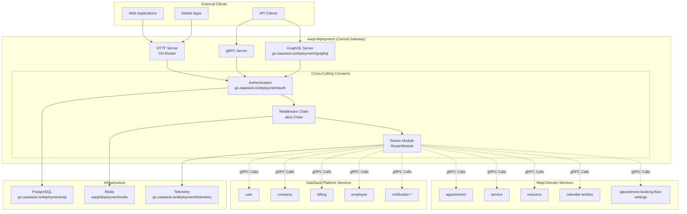
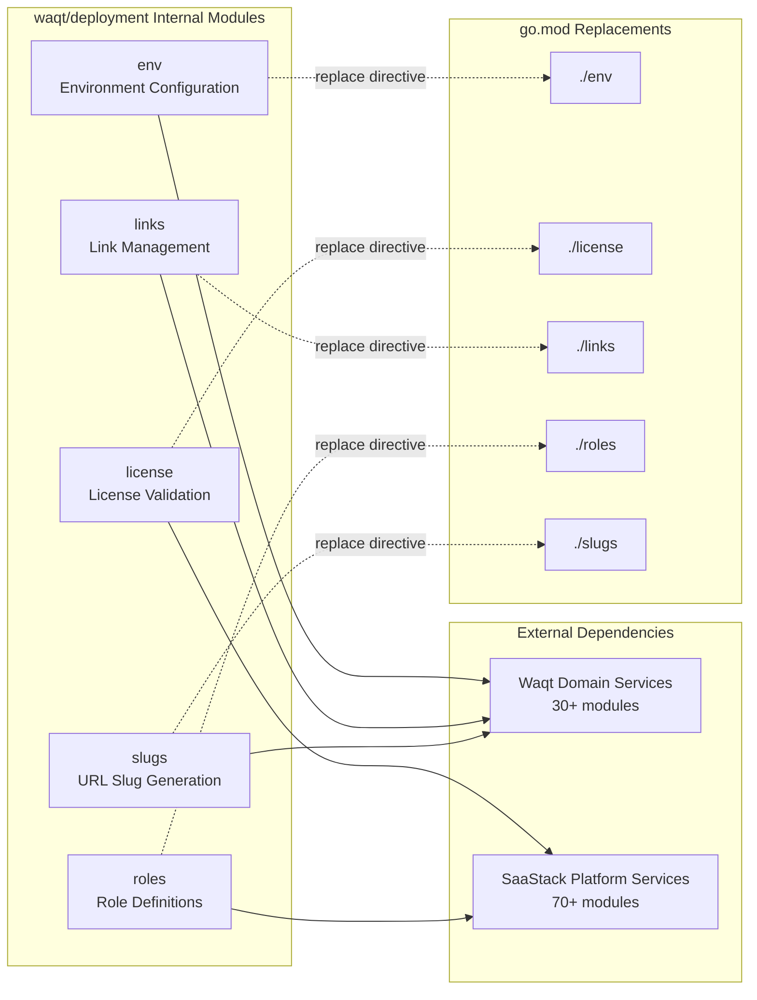

# Overview

Relevant source files

The following files were used as context for generating this wiki page:

- [go.mod](go.mod)
- [main.go](main.go)
- [modules.go](modules.go)

## Purpose and Scope

The `waqt-deployment` repository serves as the central API gateway and service orchestrator for the waqt appointment booking platform. This service acts as the primary entry point for external clients, coordinating access to dozens of microservices across two main domains: waqt-specific appointment booking functionality and saastack.io platform services.

This document provides a high-level overview of the system architecture, service integration patterns, and core responsibilities. For detailed information about specific aspects:
- Service architecture and microservice integration: see [Architecture](#2)
- GraphQL schema federation and data access: see [GraphQL Gateway](#2.2) 
- Authentication mechanisms and authorization: see [Authentication & Authorization](#2.3)
- Individual component implementations: see [Core Components](#3)
- API protocol specifics: see [API Layer](#4)

## System Architecture

The deployment service implements a centralized gateway pattern, serving as the orchestration layer between external clients and internal microservices.

**High-Level System Architecture**

Sources: [main.go:56-122](), [go.mod:1-198]()

## Service Integration Overview

The deployment service orchestrates access to over 100 microservices through the `ServiceModules` configuration, which uses Uber's fx dependency injection framework to wire services together.

**Service Module Integration Pattern**

```mermaid
graph TB
    subgraph "main.go"
        MAIN["main()<br/>Entry Point"]
        FX_APP["fx.New()<br/>Dependency Container"]
    end
    
    subgraph "modules.go"
        SERVICE_MODULES["ServiceModules<br/>fx.Options"]
        
        subgraph "Waqt Services (30+)"
            STUDENT["student.Module"]
            APPOINTMENT_MOD["appointment.Module"] 
            SERVICE_MOD["service.Module"]
            RESOURCE_MOD["resource.Module"]
            BLOCK_HOUR["blockHour.Module"]
        end
        
        subgraph "SaaStack Services (70+)"
            COMPANY_MOD["company.Module"]
            USER_MOD["userProfile.Module"]
            BILLING_MOD["billing.Module"]
            EMPLOYEE_MOD["employee.Module"]
            AUTH_MOD["authentication.Module"]
        end
        
        subgraph "Internal Modules"
            LICENSE_MOD["license.Module"]
            LINKS_MOD["links.Module"]
            ROLES_MOD["roles.Module"]
            SLUGS_MOD["slugs.Module"]
        end
    end
    
    subgraph "Deployment Modules"
        GRPC_MOD["grpc.Module"]
        HTTP_MOD["http.Module"]
        GRAPHQL_MOD["graphql.Module"]
        AUTH_DEPLOY["auth.Module"]
        SQL_MOD["sql.Module"]
    end
    
    MAIN --> FX_APP
    FX_APP --> SERVICE_MODULES
    FX_APP --> GRPC_MOD
    FX_APP --> HTTP_MOD
    FX_APP --> GRAPHQL_MOD
    FX_APP --> AUTH_DEPLOY
    FX_APP --> SQL_MOD
    
    SERVICE_MODULES --> STUDENT
    SERVICE_MODULES --> APPOINTMENT_MOD
    SERVICE_MODULES --> SERVICE_MOD
    SERVICE_MODULES --> RESOURCE_MOD
    SERVICE_MODULES --> BLOCK_HOUR
    
    SERVICE_MODULES --> COMPANY_MOD
    SERVICE_MODULES --> USER_MOD
    SERVICE_MODULES --> BILLING_MOD
    SERVICE_MODULES --> EMPLOYEE_MOD
    SERVICE_MODULES --> AUTH_MOD
    
    SERVICE_MODULES --> LICENSE_MOD
    SERVICE_MODULES --> LINKS_MOD
    SERVICE_MODULES --> ROLES_MOD
    SERVICE_MODULES --> SLUGS_MOD
```

Sources: [modules.go:155-312](), [main.go:88]()

## Core Responsibilities

The deployment service manages several key responsibilities as the central orchestration layer:

| Responsibility | Implementation | Key Components |
|---|---|---|
| **API Gateway** | Multi-protocol support (HTTP, gRPC, GraphQL) | `grpc.Module`, `http.Module`, `graphql.Module` |
| **Authentication** | JWT, API keys, service tokens, external JWT | `auth.Module`, `AuthProviderModule` |
| **Service Orchestration** | Dependency injection and service wiring | `ServiceModules`, `fx.Options` |
| **Request Routing** | Chi-based HTTP routing with middleware | `RouterModule`, `alice.Chain` |
| **Data Federation** | GraphQL schema federation across services | `RegisterGraphQLConnections` |
| **Infrastructure** | Database, caching, telemetry | `sql.Module`, `redis.Module`, `telemetry.Module` |

Sources: [main.go:61-121]()

## Internal Module Structure

The deployment service includes several internal modules that provide deployment-specific functionality:

**Internal Module Dependencies**

Sources: [go.mod:32-36](), [go.mod:399-403](), [main.go:12-20]()

## API Protocol Support

The service exposes three main API protocols to accommodate different client needs:

- **HTTP REST API**: Chi-based routing with middleware chain for web and mobile clients
- **gRPC API**: High-performance RPC for service-to-service communication  
- **GraphQL API**: Unified schema federation across all microservices with subscription support

Each protocol is configured through dedicated deployment modules and shares common authentication and authorization mechanisms. The service also provides specialized endpoints for domain verification, health checks, and debugging.

Sources: [main.go:61](), [main.go:68](), [main.go:87](), [main.go:110-115]()