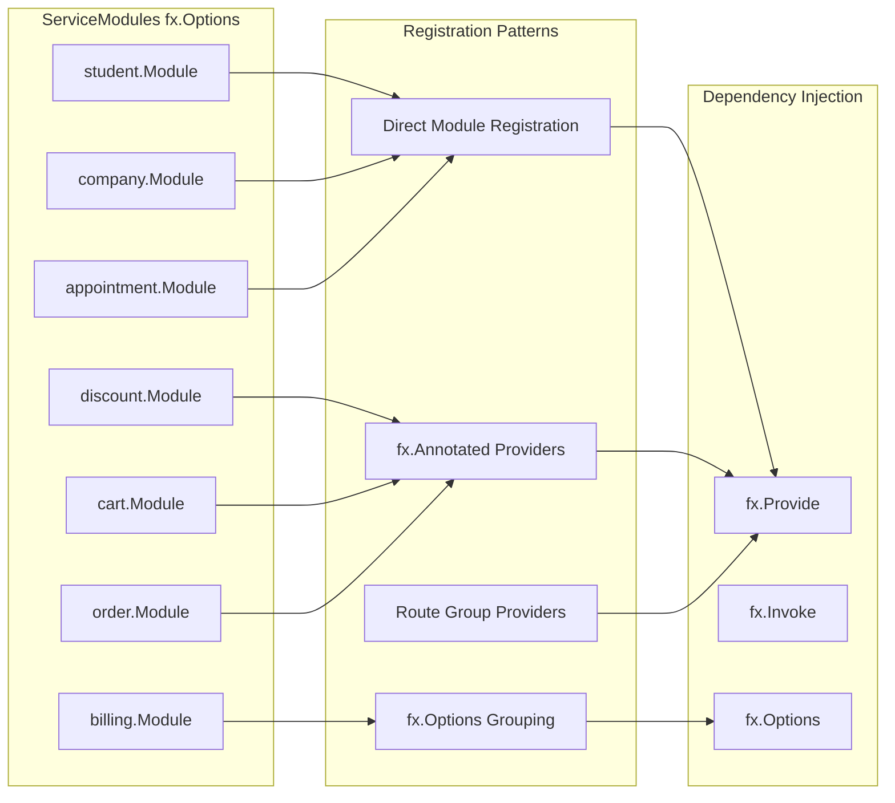
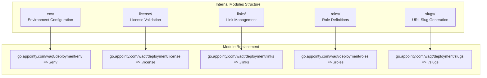

# Architecture

Relevant source files

The following files were used as context for generating this wiki page:

- [go.mod](go.mod)
- [modules.go](modules.go)

## Purpose and Scope

This document describes the high-level architecture of the `waqt-deployment` service, which serves as the central API gateway and orchestrator for the waqt appointment booking platform. The service integrates over 100 microservices from both the `waqt` domain (appointment-specific services) and `saastack.io` platform (shared SaaS infrastructure services) into a unified API layer supporting HTTP, gRPC, and GraphQL protocols.

For detailed information about specific authentication mechanisms, see [Authentication & Authorization](#2.3). For GraphQL-specific federation patterns, see [GraphQL Gateway](#2.2).

## System Overview

The `waqt-deployment` service acts as a microservices orchestrator that consolidates functionality from distributed services into cohesive API endpoints. The architecture follows a dependency injection pattern using `go.uber.org/fx` to manage the complex web of service integrations.

```mermaid
graph TB
    subgraph "waqt-deployment Gateway"
        MAIN[main.go<br/>Application Entry Point]
        MODULES[modules.go<br/>ServiceModules fx.Options]
        
        subgraph "Internal Modules"
            ENV[env/]
            LICENSE[license/]
            LINKS[links/]
            ROLES[roles/]
            SLUGS[slugs/]
        end
        
        subgraph "Protocol Handlers"
            HTTP[HTTP Routes<br/>Chi Router]
            GRPC[gRPC Services]
            GRAPHQL[GraphQL Gateway<br/>Jaal]
        end
    end
    
    subgraph "waqt Domain Services"
        APPT[appointment]
        SVC[service]
        RES[resource]
        BLOCK[block-hour]
        OPEN[open-hour]
        BOOKING[appointment-booking-flow-settings]
        INTAKE[intake-form]
        PRICING[service-price]
        CALENDAR[calendar-entities]
    end
    
    subgraph "saastack Platform Services"
        USER[user]
        COMPANY[company]
        CUSTOMER[customer]
        EMPLOYEE[employee]
        BILLING[billing]
        ORDER[order]
        DISCOUNT[discount]
        MEMBERSHIP[membership]
        AUTH[authentication]
        ROLE[role]
        RIGHT[right]
    end
    
    MAIN --> MODULES
    MODULES --> ENV
    MODULES --> LICENSE
    MODULES --> LINKS
    MODULES --> ROLES
    MODULES --> SLUGS
    
    MODULES -.->|"fx.Options Registration"| APPT
    MODULES -.->|"fx.Options Registration"| SVC
    MODULES -.->|"fx.Options Registration"| RES
    MODULES -.->|"fx.Options Registration"| BLOCK
    MODULES -.->|"fx.Options Registration"| OPEN
    MODULES -.->|"fx.Options Registration"| BOOKING
    MODULES -.->|"fx.Options Registration"| INTAKE
    MODULES -.->|"fx.Options Registration"| PRICING
    MODULES -.->|"fx.Options Registration"| CALENDAR
    
    MODULES -.->|"fx.Options Registration"| USER
    MODULES -.->|"fx.Options Registration"| COMPANY
    MODULES -.->|"fx.Options Registration"| CUSTOMER
    MODULES -.->|"fx.Options Registration"| EMPLOYEE
    MODULES -.->|"fx.Options Registration"| BILLING
    MODULES -.->|"fx.Options Registration"| ORDER
    MODULES -.->|"fx.Options Registration"| DISCOUNT
    MODULES -.->|"fx.Options Registration"| MEMBERSHIP
    MODULES -.->|"fx.Options Registration"| AUTH
    MODULES -.->|"fx.Options Registration"| ROLE
    MODULES -.->|"fx.Options Registration"| RIGHT
```

**Sources:** [go.mod:1-412](), [modules.go:1-312]()

## Module Dependency Structure

The service manages dependencies through Go modules and implements a plugin-like architecture where each domain service is registered as an `fx.Options` module. The dependency graph shows clear separation between domain concerns and platform services.

```mermaid
graph TB
    subgraph "Main Module"
        DEPLOYMENT["go.appointy.com/waqt/deployment"]
    end
    
    subgraph "Internal Modules"
        ENV_MOD["go.appointy.com/waqt/deployment/env"]
        LICENSE_MOD["go.appointy.com/waqt/deployment/license"]
        LINKS_MOD["go.appointy.com/waqt/deployment/links"]
        ROLES_MOD["go.appointy.com/waqt/deployment/roles"]
        SLUGS_MOD["go.appointy.com/waqt/deployment/slugs"]
    end
    
    subgraph "Core Infrastructure"
        FX["go.uber.org/fx"]
        GRPC["google.golang.org/grpc"]
        CHI["github.com/go-chi/chi"]
        JAAL["go.saastack.io/jaal"]
        REDIS["github.com/gomodule/redigo"]
    end
    
    subgraph "Domain Services (waqt.*)"
        APPT_PB["go.appointy.com/waqt/appointment"]
        SERVICE_PB["go.appointy.com/waqt/service"]
        RESOURCE_PB["go.appointy.com/waqt/resource"]
        CALENDAR_PB["go.appointy.com/waqt/calendar-entities"]
        STUDENT_PB["go.appointy.com/waqt/student"]
    end
    
    subgraph "Platform Services (saastack.*)"
        USER_PB["go.saastack.io/user"]
        COMPANY_PB["go.saastack.io/company"]
        BILLING_PB["go.saastack.io/billing"]
        AUTH_PB["go.saastack.io/authentication"]
        ROLE_PB["go.saastack.io/role"]
    end
    
    DEPLOYMENT --> ENV_MOD
    DEPLOYMENT --> LICENSE_MOD
    DEPLOYMENT --> LINKS_MOD
    DEPLOYMENT --> ROLES_MOD
    DEPLOYMENT --> SLUGS_MOD
    
    DEPLOYMENT --> FX
    DEPLOYMENT --> GRPC
    DEPLOYMENT --> CHI
    DEPLOYMENT --> JAAL
    DEPLOYMENT --> REDIS
    
    DEPLOYMENT --> APPT_PB
    DEPLOYMENT --> SERVICE_PB
    DEPLOYMENT --> RESOURCE_PB
    DEPLOYMENT --> CALENDAR_PB
    DEPLOYMENT --> STUDENT_PB
    
    DEPLOYMENT --> USER_PB
    DEPLOYMENT --> COMPANY_PB
    DEPLOYMENT --> BILLING_PB
    DEPLOYMENT --> AUTH_PB
    DEPLOYMENT --> ROLE_PB
```

The module registration pattern in `modules.go` uses `fx.Options` to compose all service modules into a single dependency injection container:

| Module Category | Count | Examples |
|----------------|--------|----------|
| waqt Domain Services | 35+ | `appointment.Module`, `service.Module`, `resource.Module` |
| saastack Platform Services | 70+ | `user.Module`, `company.Module`, `billing.Module` |
| Internal Modules | 5 | `env`, `license`, `links`, `roles`, `slugs` |

**Sources:** [go.mod:5-198](), [modules.go:155-312]()

## Service Integration Patterns

The architecture implements several integration patterns to manage the complexity of orchestrating 100+ microservices:

The service registration follows these patterns:

1. **Direct Registration**: Most services use `ServiceName.Module` directly
2. **Grouped Options**: Complex services like billing use nested `fx.Options`
3. **Annotated Providers**: Some services provide specific interfaces with annotations
4. **Route Providers**: Services like zapier provide HTTP routes through group annotations

**Sources:** [modules.go:155-312](), [modules.go:233-235](), [modules.go:271-274]()

## Internal Module Architecture

The deployment service contains five internal modules that provide deployment-specific functionality:

These internal modules are developed locally and replaced using Go module replacement directives, allowing for tight coupling with the deployment service while maintaining modularity.

**Sources:** [go.mod:32-36](), [go.mod:399-403]()

## Service Module Dependencies

The complete service dependency graph shows the scale of integration required:

| Service Domain | Module Count | Key Dependencies |
|---------------|--------------|------------------|
| User Management | 12 | `user`, `customer`, `employee`, `authentication` |
| Business Logic | 18 | `appointment`, `service`, `resource`, `calendar-entities` |
| Commerce | 8 | `billing`, `order`, `cart`, `discount`, `membership` |
| Infrastructure | 15 | `notification-*`, `template`, `analytics`, `integration` |
| Configuration | 20 | `settings`, `company-settings`, `employee-setting` |
| Specialty Services | 25 | Domain-specific integrations like `mathnasium-master`, `car-jam` |

The `ServiceModules` variable in `modules.go` registers all modules using the dependency injection framework, creating a single application context that provides access to all integrated services.

**Sources:** [modules.go:155-312]()