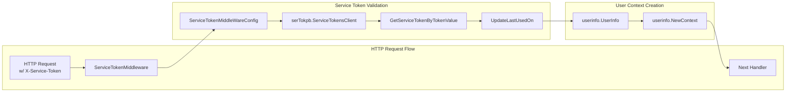
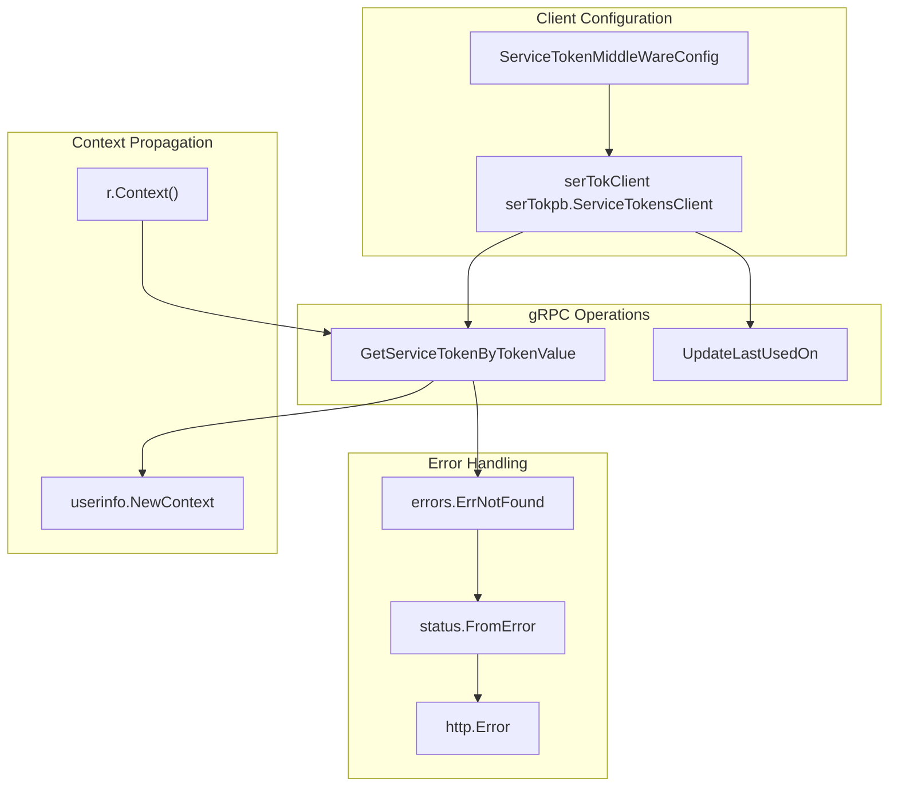
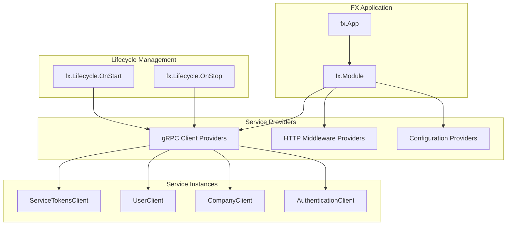

# Module Dependencies & Integration

Relevant source files

The following files were used as context for generating this wiki page:

- [go.mod](go.mod)
- [go.sum](go.sum)
- [service_token.go](service_token.go)

## Purpose and Scope

This document analyzes the module dependencies and integration patterns within the waqt-deployment service. It covers how the deployment service coordinates with external microservices, manages internal modules, and establishes service communication patterns through dependency injection.

For authentication and authorization mechanisms, see [Authentication & Authorization](#2.3). For GraphQL federation patterns, see [GraphQL Gateway](#2.2).

## Module Dependency Architecture

The waqt-deployment service operates as a central orchestrator with a sophisticated dependency structure organized into distinct layers:

### Dependency Layer Hierarchy

```mermaid
graph TB
    subgraph "Application Layer"
        DEPLOY["waqt-deployment<br/>go.appointy.com/waqt/deployment"]
    end
    
    subgraph "Internal Modules"
        ENV["env<br/>deployment/env"]
        LICENSE["license<br/>deployment/license"] 
        LINKS["links<br/>deployment/links"]
        ROLES["roles<br/>deployment/roles"]
        SLUGS["slugs<br/>deployment/slugs"]
    end
    
    subgraph "Domain Services (waqt)"
        APPT["appointment<br/>go.appointy.com/waqt/appointment"]
        SERVICE["service<br/>go.appointy.com/waqt/service"]
        RESOURCE["resource<br/>go.appointy.com/waqt/resource"]
        BOOKING["appointment-booking-flow-settings"]
        PRICING["service-price"]
        INTAKE["intake-form"]
        CALENDAR["calendar-entities"]
        BLOCKS["block-hour"]
        OPEN["open-hour"]
    end
    
    subgraph "Platform Services (saastack.io)"
        USER["user<br/>go.saastack.io/user"]
        COMPANY["company<br/>go.saastack.io/company"]
        CUSTOMER["customer<br/>go.saastack.io/customer"]
        EMPLOYEE["employee<br/>go.saastack.io/employee"]
        BILLING["billing<br/>go.saastack.io/billing"]
        AUTH["authentication<br/>go.saastack.io/authentication"]
        NOTIFICATION["notification-*"]
        ANALYTICS["analytics"]
    end
    
    subgraph "Infrastructure Libraries"
        HTTP["Chi Router<br/>github.com/go-chi/chi"]
        GRPC["gRPC<br/>google.golang.org/grpc"]
        GQL["Jaal GraphQL<br/>go.saastack.io/jaal"]
        FX["Dependency Injection<br/>go.uber.org/fx"]
        REDIS["Redis<br/>github.com/gomodule/redigo"]
    end
    
    DEPLOY --> ENV
    DEPLOY --> LICENSE
    DEPLOY --> LINKS
    DEPLOY --> ROLES
    DEPLOY --> SLUGS
    
    DEPLOY --> APPT
    DEPLOY --> SERVICE
    DEPLOY --> RESOURCE
    DEPLOY --> BOOKING
    DEPLOY --> PRICING
    DEPLOY --> INTAKE
    DEPLOY --> CALENDAR
    DEPLOY --> BLOCKS
    DEPLOY --> OPEN
    
    DEPLOY --> USER
    DEPLOY --> COMPANY
    DEPLOY --> CUSTOMER
    DEPLOY --> EMPLOYEE
    DEPLOY --> BILLING
    DEPLOY --> AUTH
    DEPLOY --> NOTIFICATION
    DEPLOY --> ANALYTICS
    
    DEPLOY --> HTTP
    DEPLOY --> GRPC
    DEPLOY --> GQL
    DEPLOY --> FX
    DEPLOY --> REDIS
```

**Sources:** [go.mod:1-198]()

### Internal Module Structure

The deployment service contains five internal modules that are locally developed and replaced in the module configuration:

| Module | Path | Purpose |
|--------|------|---------|
| `env` | `./env` | Environment configuration management |
| `license` | `./license` | License validation and enforcement |
| `links` | `./links` | Dynamic link management and validation |
| `roles` | `./roles` | Role definition and hierarchy |
| `slugs` | `./slugs` | URL slug generation and management |

These modules are replaced with local paths using the `replace` directive:

**Sources:** [go.mod:399-403](), [go.mod:32-36]()

## Service Integration Patterns

### External Service Communication

The deployment service integrates with external microservices primarily through gRPC client interfaces. The following diagram illustrates the service token validation pattern as a representative example:

**Sources:** [service_token.go:1-94]()

### Service Client Integration

The service token middleware demonstrates the standard pattern for external service integration:

**Sources:** [service_token.go:19-27](), [service_token.go:37-49](), [service_token.go:68-77](), [service_token.go:85-91]()

## Domain Service Dependencies

### Core Business Services

The deployment service depends on 48 waqt domain services that handle core business logic:

| Category | Services | Purpose |
|----------|----------|---------|
| **Appointments** | `appointment`, `appointment-booking-flow-settings` | Appointment management and booking workflows |
| **Services** | `service`, `service-price`, `service-settings` | Service definitions and pricing |
| **Resources** | `resource`, `resource-tier`, `resource-type` | Resource management and classification |
| **Calendar** | `calendar-entities`, `block-hour`, `open-hour` | Calendar integration and availability |
| **Forms** | `intake-form`, `custom-status` | Customer intake and status management |
| **Extensions** | `gift-certificate`, `dynamic-link`, `short-url` | Extended functionality modules |

**Sources:** [go.mod:20-67]()

### Platform Services Integration

The service integrates with 124 saastack.io platform services for cross-cutting concerns:

| Category | Key Services | Purpose |
|----------|--------------|---------|
| **Identity** | `user`, `authentication`, `role` | User management and authentication |
| **Organization** | `company`, `employee`, `customer` | Organizational structure |
| **Commerce** | `billing`, `order`, `cart`, `payments-manager` | Financial operations |
| **Communication** | `notification-*`, `email-sender`, `template` | Messaging and notifications |
| **Integration** | `integration`, `webhook-*`, `analytics` | External system connectivity |

**Sources:** [go.mod:69-194]()

## Dependency Injection Framework

### FX Module Configuration

The service uses `go.uber.org/fx` for dependency injection and lifecycle management. The framework coordinates the initialization of multiple service clients and middleware components:

**Sources:** [go.mod:194](), [service_token.go:23-27]()

## Infrastructure Dependencies

### Core Infrastructure Libraries

The service relies on several key infrastructure libraries:

| Library | Version | Purpose |
|---------|---------|---------|
| `github.com/go-chi/chi` | v4.1.1+incompatible | HTTP routing and middleware |
| `google.golang.org/grpc` | v1.50.1 | gRPC communication |
| `go.saastack.io/jaal` | v0.0.0-20240717063122 | GraphQL schema federation |
| `go.uber.org/fx` | v1.17.1 | Dependency injection |
| `github.com/gomodule/redigo` | v2.0.0+incompatible | Redis client |
| `github.com/rs/cors` | v1.7.0 | CORS handling |

**Sources:** [go.mod:6-18](), [go.mod:194-197]()

### Third-Party Integration Libraries

Additional libraries support external system integration:

- **Protocol Buffers**: `github.com/gogo/protobuf` for efficient serialization
- **OpenCensus**: `go.opencensus.io` for telemetry and monitoring  
- **Cloud Storage**: `cloud.google.com/go/storage` for file operations
- **Authentication**: Various OAuth2 and JWT libraries for token validation

**Sources:** [go.mod:8-19](), [go.mod:68](), [go.mod:200-387]()