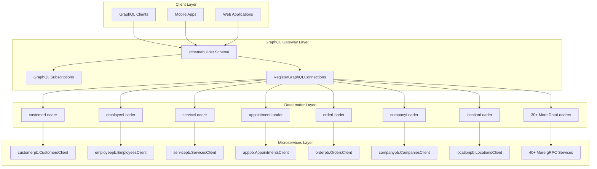
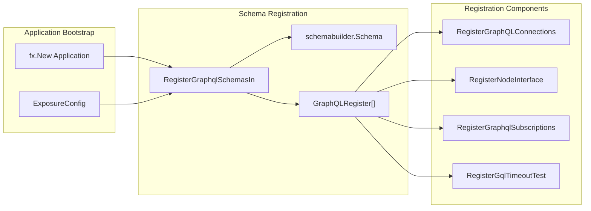
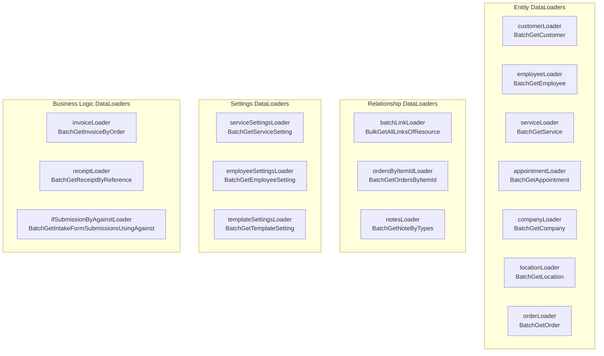
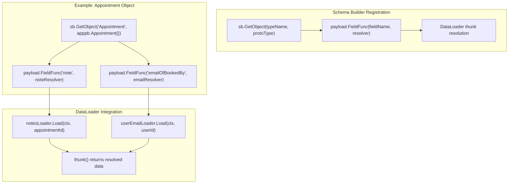
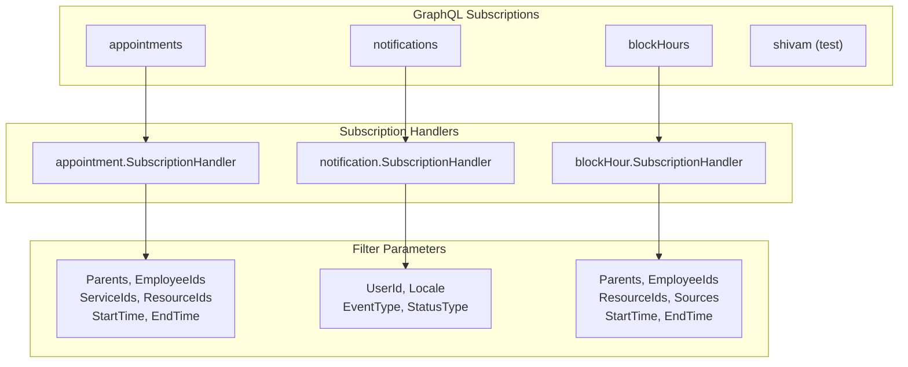

# GraphQL Gateway

<details>
<summary>Relevant source files</summary>

The following files were used as context for generating this wiki page:

- [connections.go](connections.go)
- [graphql.go](graphql.go)

</details>


## Purpose and Scope

The GraphQL Gateway serves as the unified API layer for the Waqt appointment scheduling platform, providing efficient data access and real-time capabilities across 40+ microservices. This document covers the GraphQL schema building, DataLoader batching architecture, Node interface implementation, and subscription management.

For authentication and authorization mechanisms used by the GraphQL gateway, see [Authentication & Authorization](#2.3). For microservice integration patterns, see [Microservices Integration](#2.1).

## Architecture Overview

The GraphQL Gateway operates as a central orchestration layer that consolidates data access from multiple gRPC microservices through an efficient batching mechanism.



Sources: [connections.go:88-154](), [graphql.go:9-28]()

## Schema Registration Process

The GraphQL schema registration follows a dependency injection pattern where individual services register their schema components during application startup.



The registration process is controlled by the `ExposureConfig.Graphql` flag and processes all services tagged with the `graphql-service` group annotation.

Sources: [graphql.go:9-28]()

## DataLoader Architecture

The GraphQL Gateway implements an extensive DataLoader architecture for efficient batching of requests to underlying microservices. Each DataLoader is configured with specific batching parameters to optimize performance.

### DataLoader Configuration

| Parameter | Value | Purpose |
|-----------|-------|---------|
| `WithCache` | `&dataloader.NoCache{}` | Disables caching for real-time data |
| `WithWait` | `70*time.Millisecond` | Batching window duration |
| `WithInputCapacity` | `5000` | Maximum batch size |
| `WithBatchCapacity` | `1000` | Alternative batch capacity for specific loaders |

### Core DataLoaders



Each DataLoader follows a consistent pattern where it accumulates requests during the wait period, then executes a single batch request to the corresponding gRPC service.

Sources: [connections.go:156-172](), [connections.go:442-478](), [connections.go:426-440](), [connections.go:920-934]()

### Rights Management in DataLoaders

Several DataLoaders implement rights bypassing for specific use cases:

```go
// Example from customerLoader
res, err := customer.BatchGetCustomer(userinfo.NewContextWithSkipRightKey(ctx), &customerpb.BatchGetCustomerRequest{
    Ids:           keys.Keys(),
    ViewMask:      &field_mask.FieldMask{Paths: []string{}},
    AccessContact: true,
})
```

This pattern ensures that users who have permission to see an entity can access its related data without additional permission checks.

Sources: [connections.go:159-162](), [connections.go:922-925](), [connections.go:453-456]()

## GraphQL Object Registration

The GraphQL Gateway registers object types and their field resolvers through the `RegisterGraphQLConnections` function. This process creates DataLoader-backed field functions for efficient relationship traversal.

### Object Field Registration



Each GraphQL object type gets field functions that use DataLoaders to efficiently fetch related data. The registration follows a pattern where the field function returns a thunk that resolves the DataLoader result.

Sources: [connections.go:1186-1232](), [connections.go:1233-1247]()

## Real-time Subscriptions

The GraphQL Gateway provides real-time capabilities through WebSocket subscriptions for critical business events.

### Subscription Types



### Subscription Processing Flow

Each subscription follows a common pattern:

1. **Payload Unmarshaling**: Convert the subscription payload into the appropriate protobuf message
2. **Filtering**: Apply subscription-specific filters to determine if the update is relevant
3. **Service Handler**: Delegate to the microservice's subscription handler for business logic processing

```go
// Example filtering logic for appointments
if len(args.Parents) > 0 && !contains(args.Parents, idutil.GetParent(app.GetId())) {
    return nil, graphql.ErrNoUpdate
}
```

Sources: [subscriptions.go:46-89](), [subscriptions.go:91-118](), [subscriptions.go:120-166]()

## Error Handling and Performance

### DataLoader Error Handling

DataLoaders implement consistent error handling where errors are propagated to all batched requests:

```go
for i := range keys {
    r := dataloader.Result{Error: err}
    if err == nil {
        r.Data = res.Customer[i]
    }
    results = append(results, &r)
}
```

### Performance Optimizations

| Optimization | Implementation | Purpose |
|--------------|----------------|---------|
| **Deduplication** | Unique key mapping in employeeLoader | Prevents duplicate requests |
| **Concurrent Processing** | Goroutines in notificationReceiverLoader | Parallel processing per business ID |
| **Field Masking** | `&field_mask.FieldMask{Paths: []string{}}` | Reduces payload size |
| **Capacity Management** | `WithInputCapacity(5000)` | Controls memory usage |

Sources: [connections.go:445-451](), [connections.go:395-424](), [connections.go:159-162]()

## Integration Points

The GraphQL Gateway integrates with several other system components:

- **Authentication Middleware**: All requests pass through authentication layers before reaching DataLoaders
- **Rights Management**: Service-specific rights validation through `userinfo.NewContextWithSkipRightKey()`
- **Metrics & Logging**: Request tracing and performance monitoring through structured logging
- **Policy Validation**: Source validation for policy enforcement through the policy-sources module

Sources: [policy-sources/validator.go:26-78](), [connections.go:159](), [connections.go:922]()