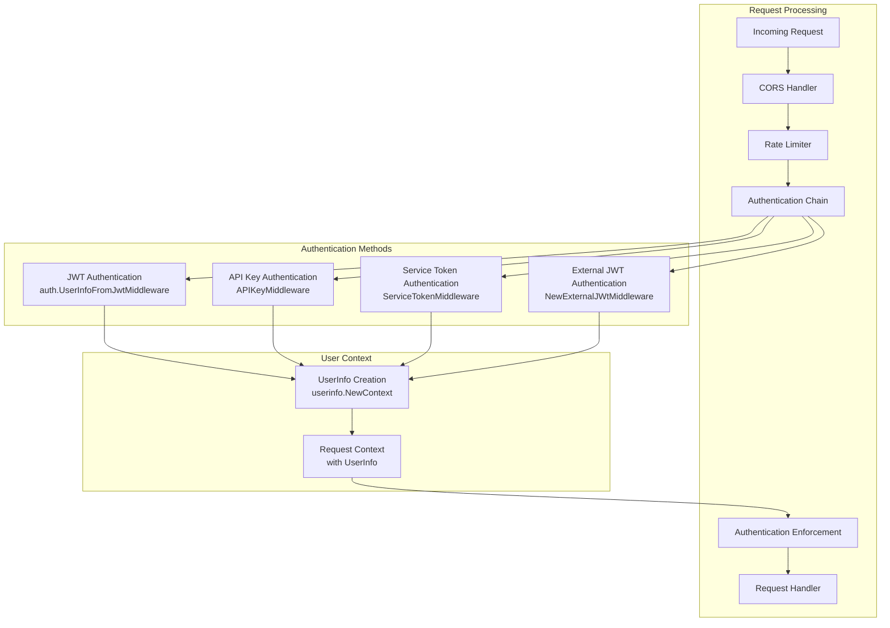
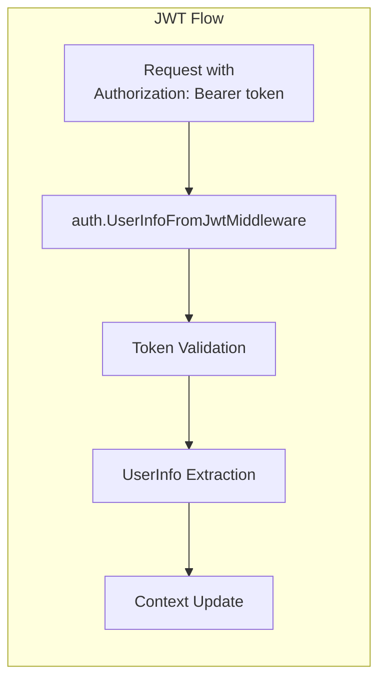
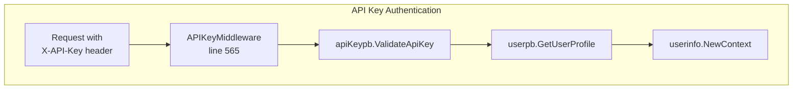
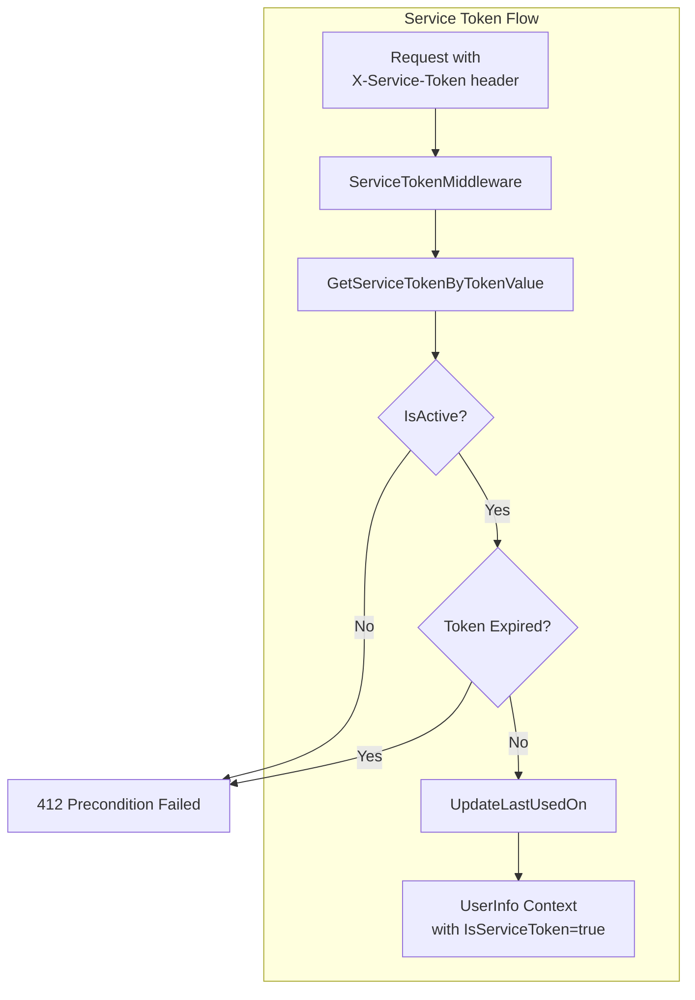
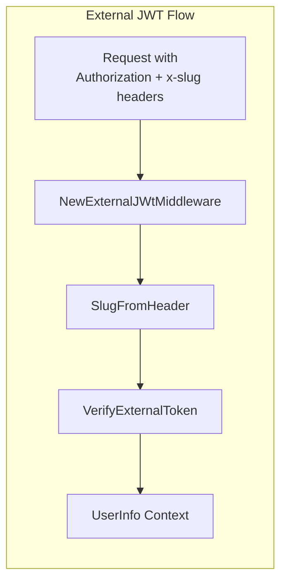
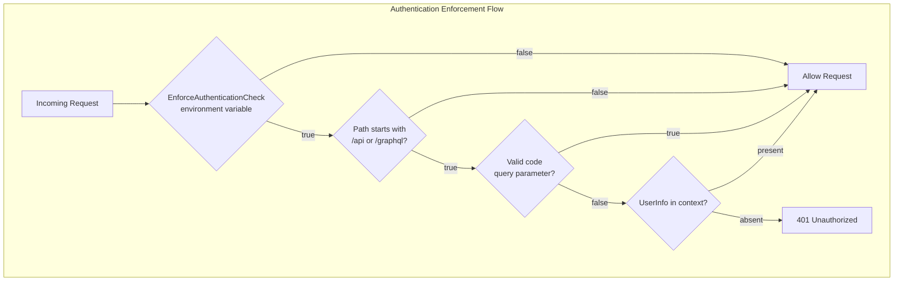
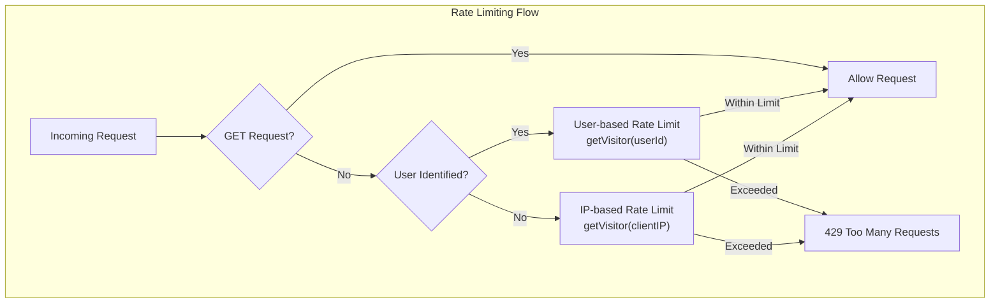
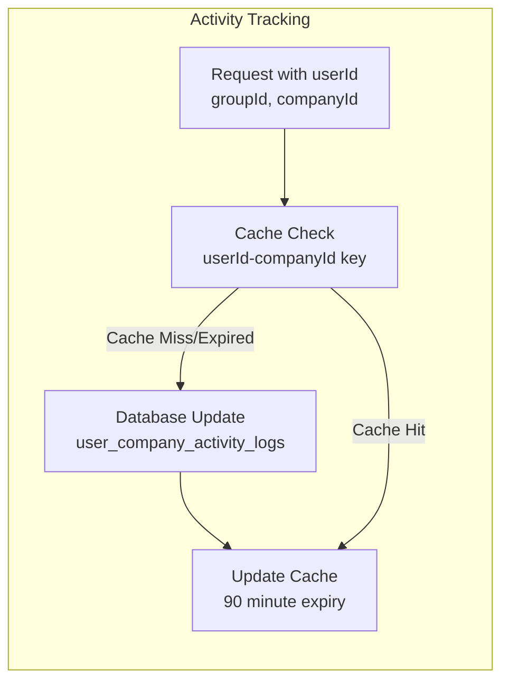

# Authentication & Authorization

Relevant source files

The following files were used as context for generating this wiki page:

- [go.sum](go.sum)
- [rate-limiter.go](rate-limiter.go)
- [redis/redis.go](redis/redis.go)
- [router.go](router.go)
- [service_token.go](service_token.go)

This document covers the multi-layered authentication and authorization system implemented in the waqt-deployment service. The system supports four distinct authentication mechanisms and implements role-based access control (RBAC) with hierarchical permissions.

For detailed information about middleware configuration and routing, see [Routing & Middleware](#3.2). For role-based access control implementation details, see [Role-Based Access Control](#5.1).

## Authentication Architecture Overview

The authentication system is built as a middleware chain that processes requests through multiple authentication layers. Each layer can independently authenticate a request, with later layers taking precedence if multiple authentication methods are present.

**Authentication Flow Architecture**

Sources: [router.go:100-163](), [router.go:388-406]()

## Authentication Methods

The system implements four distinct authentication mechanisms, each handled by dedicated middleware components.

### JWT Authentication

Standard JWT token authentication using the `Authorization` header. Tokens are validated using the configured JWT settings and user information is extracted from the token claims.

**JWT Processing Flow**

Sources: [router.go:136](), [router.go:400]()

### API Key Authentication

API key authentication using the `X-API-Key` header. Keys are validated against the API key service and associated user profiles are retrieved.

The `APIKeyMiddleware` function performs the following operations:

| Step | Action | Error Handling |
|------|--------|----------------|
| 1 | Extract `X-API-Key` header | Continue if not present |
| 2 | Validate API key via `apiKeypb.ValidateApiKey` | Return 401 if invalid |
| 3 | Fetch user profile via `userpb.GetUserProfile` | Return 500 if fails |
| 4 | Create `UserInfo` context | Continue to next middleware |

Sources: [router.go:553-608](), [router.go:54]()

### Service Token Authentication

Service token authentication using the `X-Service-Token` header. Tokens are validated for active status and expiration, with usage tracking.

Sources: [service_token.go:29-93](), [service_token.go:16]()

### External JWT Authentication

External JWT authentication for company-specific tokens using slug-based routing. Tokens are validated against external JWT configurations based on the company slug.

Sources: [router.go:610-647](), [router.go:649-652](), [router.go:53]()

## Middleware Chain Configuration

The authentication middleware chain is configured in the `NewChain` function, establishing the order of middleware execution.

**Middleware Chain Structure**

```mermaid
graph TB
    subgraph "Middleware Chain (NewChain)"
        RECOVER["Recoverer"]
        HEALTH["Heartbeat /_ah/health"]
        CORS_MW["CORS Handler"]
        RATE_MW["RateLimiterMiddleware"]
        LOGGER["Logger Middleware"]
        JWT_MW["JWT Middleware"]
        CLIENT_IP["ClientIpFromHeaderMiddleware"]
        CAPTCHA["Captcha Middlewares"]
        USER_JWT["UserInfoFromJwtMiddleware"]
        VERSION["Version Handler"]
        SKIP_RIGHT["SkipRightHeaderMiddleware"]
        API_KEY_MW["APIKeyMiddleware"]
        SERVICE_TOK_MW["ServiceTokenMiddleware"]
        EXT_JWT_MW["ExternalJwt Middleware"]
        AUTH_ENFORCE["EnforceAuthenticationCheckMiddleware"]
        ACTIVITY["TrackUserCompanyActivityLog"]
        COMPRESS["DefaultCompress"]
        GRPC_WEB["GrpcWeb Middleware"]
    end
    
    RECOVER --> HEALTH
    HEALTH --> CORS_MW
    CORS_MW --> RATE_MW
    RATE_MW --> LOGGER
    LOGGER --> JWT_MW
    JWT_MW --> CLIENT_IP
    CLIENT_IP --> CAPTCHA
    CAPTCHA --> USER_JWT
    USER_JWT --> VERSION
    VERSION --> SKIP_RIGHT
    SKIP_RIGHT --> API_KEY_MW
    API_KEY_MW --> SERVICE_TOK_MW
    SERVICE_TOK_MW --> EXT_JWT_MW
    EXT_JWT_MW --> AUTH_ENFORCE
    AUTH_ENFORCE --> ACTIVITY
    ACTIVITY --> COMPRESS
    COMPRESS --> GRPC_WEB
```

Sources: [router.go:120-162]()

## Authentication Enforcement

The `EnforceAuthenticationCheckMiddleware` provides selective authentication enforcement based on URL paths and query parameters.

### Enforcement Rules

| Condition | Action |
|-----------|--------|
| `ENFORCE_AUTHENTICATION_CHECK != "true"` | Skip enforcement |
| Path not in `/api` or `/graphql` | Skip enforcement |
| Valid UUID in `code` query parameter | Skip enforcement |
| No user in context | Return 401 Unauthorized |

Sources: [router.go:303-342](), [router.go:56]()

## Security Features

### Rate Limiting

The system implements user-based and IP-based rate limiting through the `RateLimiterConfig` and associated middleware.

**Rate Limiting Strategy**

Sources: [rate-limiter.go:78-120](), [rate-limiter.go:37-52]()

### CORS Configuration

CORS is configured with origin validation supporting both static origins and regex patterns for dynamic subdomain matching.

| Origin Type | Pattern | Usage |
|-------------|---------|-------|
| Development | `localhost:3000-3010` | Local development |
| Development | `localhost:6006-6016` | Additional dev ports |
| Production | `^https:\/\/[a-z0-9A-Z.-]+.appointy.com` | Appointy subdomains |

Sources: [router.go:254-301](), [router.go:124-131]()

### User Activity Tracking

The system tracks user-company activity timestamps for audit and analytics purposes through the `TrackUserCompanyActivityLog` middleware.

Sources: [router.go:165-252](), [router.go:59]()