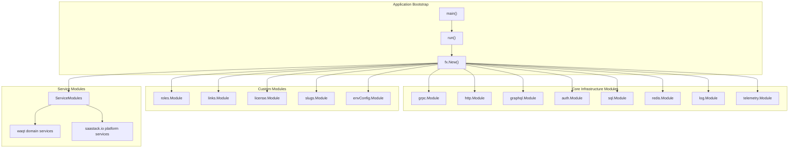
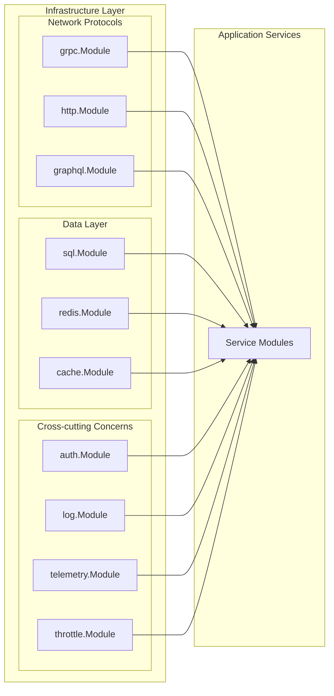
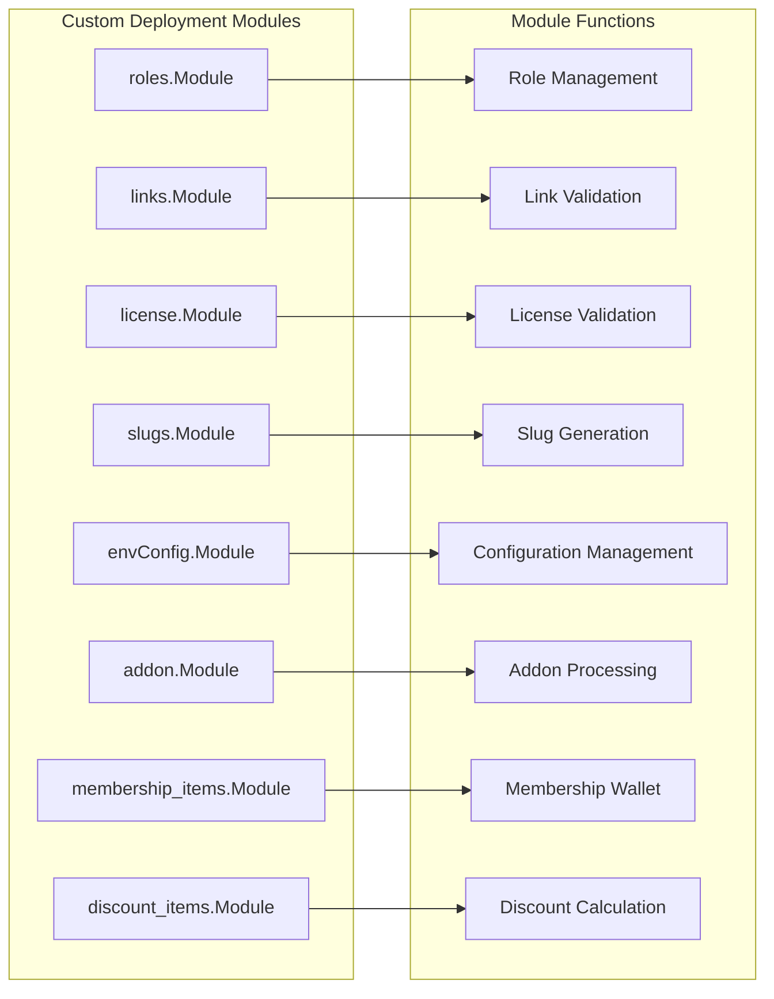
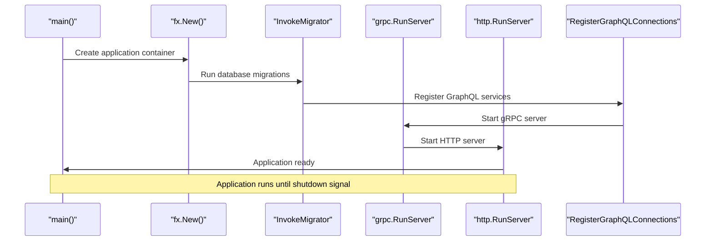
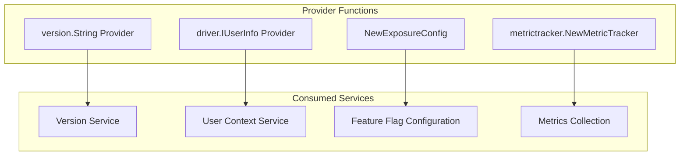
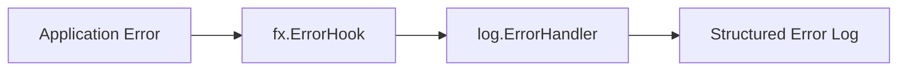

# Core Components

Relevant source files

The following files were used as context for generating this wiki page:

- [main.go](main.go)
- [modules.go](modules.go)

This document covers the essential application components that form the foundation of the waqt-deployment service. These core components handle application bootstrapping, dependency injection, service module registration, and the fundamental infrastructure required to run the multi-protocol API gateway.

For information about the specific API implementations, see [API Layer](#4). For details about the authentication and authorization mechanisms, see [Security & Access Control](#5).

## Application Bootstrap Framework

The waqt-deployment service uses Uber's FX dependency injection framework to manage component lifecycle and dependencies. The application bootstrap process is centralized in the `main` function, which constructs and configures the entire dependency graph.

The FX application is constructed with multiple module groups, each providing specific functionality. The `fx.New()` call in `run()` assembles all modules into a cohesive application container.

**Sources:** [main.go:54-131]()

## Infrastructure Module Configuration

The core infrastructure modules provide essential services that all other components depend on. These modules are loaded early in the bootstrap process to ensure availability throughout the application lifecycle.

| Module | Purpose | Key Components |
|--------|---------|----------------|
| `grpc.Module` | gRPC server and interceptors | Server, interceptor chain, service registration |
| `http.Module` | HTTP server and routing | Chi router, middleware chain, endpoints |
| `graphql.Module` | GraphQL server and schema | Schema federation, resolvers, subscriptions |
| `auth.Module` | Authentication infrastructure | JWT validation, service tokens, API keys |
| `sql.Module` | Database connectivity | PostgreSQL connections, migrations |
| `redis.Module` | Cache layer | Redis client, distributed caching |
| `log.Module` | Structured logging | Zap logger configuration |
| `telemetry.Module` | Observability | Metrics, tracing, monitoring |

**Sources:** [main.go:61-88]()

## Service Module Registry

The `ServiceModules` variable in `modules.go` defines a comprehensive registry of all business logic modules integrated into the deployment service. This registry uses FX's `fx.Options` to bundle multiple service modules for injection.

```mermaid
graph TB
    subgraph "ServiceModules Registry"
        SERVICE_MODULES["ServiceModules (fx.Options)"]
    end
    
    subgraph "waqt Domain Services"
        APPOINTMENT["appointment.Module"]
        SERVICE["service.Module"]
        RESOURCE["resource.Module"]
        BLOCK_HOUR["blockHour.Module"]
        OPEN_HOUR["openHour.Module"]
        CALENDAR["calendarEntities.CalendarInfoModule"]
        INTAKE_FORM["intakeForm.Module"]
        SERVICE_PRICE["servicePrice.Module"]
    end
    
    subgraph "saastack.io Platform Services"
        USER["userProfile.Module"]
        COMPANY["company.Module"]
        CUSTOMER["customer.Module"]
        EMPLOYEE["employee.Module"]
        BILLING["billing.Module"]
        ANALYTICS["analytics.Module"]
        INTEGRATION["integration.Module"]
        LICENSE_MOD["license.Module"]
    end
    
    subgraph "Supporting Services"
        DISCOUNT["discount.Module"]
        MEMBERSHIP["membership.Module"]
        GIFT_CERT["giftCertificate.Module"]
        DYNAMIC_LINK["dynamicLinkPb.Module"]
        SLUG["slug.Module"]
        POLICY["policy.Module"]
    end
    
    SERVICE_MODULES --> APPOINTMENT
    SERVICE_MODULES --> SERVICE
    SERVICE_MODULES --> RESOURCE
    SERVICE_MODULES --> BLOCK_HOUR
    SERVICE_MODULES --> OPEN_HOUR
    SERVICE_MODULES --> CALENDAR
    SERVICE_MODULES --> INTAKE_FORM
    SERVICE_MODULES --> SERVICE_PRICE
    
    SERVICE_MODULES --> USER
    SERVICE_MODULES --> COMPANY
    SERVICE_MODULES --> CUSTOMER
    SERVICE_MODULES --> EMPLOYEE
    SERVICE_MODULES --> BILLING
    SERVICE_MODULES --> ANALYTICS
    SERVICE_MODULES --> INTEGRATION
    SERVICE_MODULES --> LICENSE_MOD
    
    SERVICE_MODULES --> DISCOUNT
    SERVICE_MODULES --> MEMBERSHIP
    SERVICE_MODULES --> GIFT_CERT
    SERVICE_MODULES --> DYNAMIC_LINK
    SERVICE_MODULES --> SLUG
    SERVICE_MODULES --> POLICY
```

The registry contains over 100 service modules organized into three main categories:

- **waqt Domain Services**: Core appointment booking functionality
- **saastack.io Platform Services**: Cross-platform user management and billing
- **Supporting Services**: Additional features like discounts and memberships

**Sources:** [modules.go:155-312]()

## Custom Deployment Modules

The deployment service includes several custom modules that provide deployment-specific functionality not available in the core platform services.

| Module | Path | Purpose |
|--------|------|---------|
| `roles.Module` | `deployment/roles` | Role definition and management |
| `links.Module` | `deployment/links` | Link validation and management |
| `license.Module` | `deployment/license` | License validation and consumption |
| `slugs.Module` | `deployment/slugs` | URL slug generation and validation |
| `envConfig.Module` | `deployment/env` | Environment-specific configuration |

**Sources:** [main.go:79-104]()

## Application Lifecycle Management

The FX framework manages the complete application lifecycle through a series of invocation functions that initialize and start various services in the correct order.

The lifecycle includes several key invocation points:

- `InvokeMigrator`: Runs database migrations
- `RegisterApiEndpoints`: Registers HTTP API routes
- `InvokeGraphQLServices`: Initializes GraphQL schema
- `InvokeGrpcServices`: Registers gRPC services
- `RegisterGraphQLConnections`: Connects GraphQL to underlying services
- Server startup: `grpc.RunServer` and `http.RunServer`

**Sources:** [main.go:105-121]()

## Component Integration Patterns

The deployment service uses several integration patterns to connect components and manage dependencies effectively.

### Provider Functions

FX provider functions create and configure service instances:

### Error Handling

The application uses FX's error handling mechanism to ensure proper error reporting:

**Sources:** [main.go:83-97]()