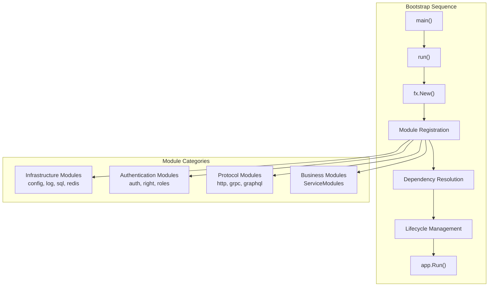
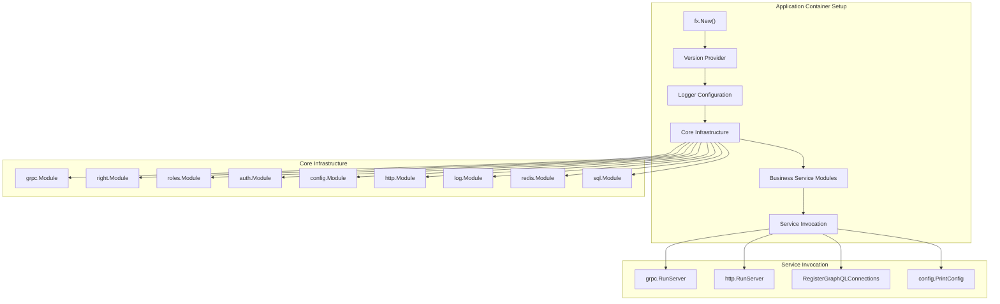
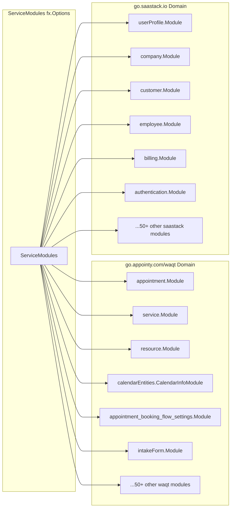
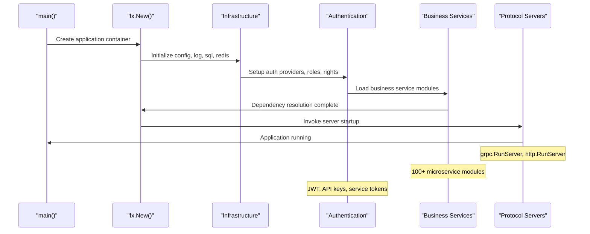
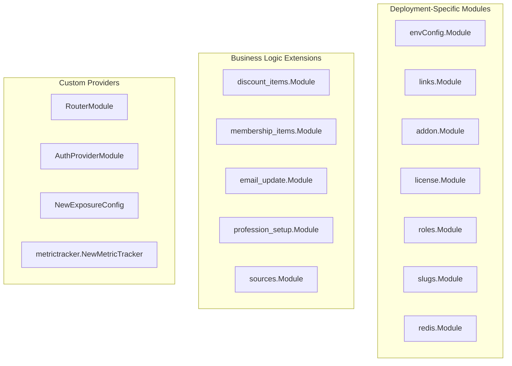

# Application Bootstrap

Relevant source files

The following files were used as context for generating this wiki page:

- [main.go](main.go)
- [modules.go](modules.go)

This document covers the application startup process, dependency injection setup, and module configuration for the waqt-deployment service. The bootstrap process uses Uber's fx framework to manage dependency injection and lifecycle management across numerous microservice modules.

For information about HTTP routing and middleware configuration, see [Routing & Middleware](#3.2). For details about individual service module implementations, see [Service Modules](#3.3).

## Overview

The waqt-deployment service bootstrap process initializes a comprehensive microservices gateway that orchestrates over 100 individual service modules. The application uses the fx dependency injection framework to manage complex inter-service dependencies and coordinate startup/shutdown sequences across multiple protocol handlers (HTTP, gRPC, GraphQL).

## Dependency Injection Framework

The application is built on Uber's fx framework, which provides constructor-based dependency injection and lifecycle management. The fx framework enables declarative module composition and automatic dependency resolution.

### Core fx Components

| Component | Purpose | Location |
|-----------|---------|----------|
| `fx.New()` | Application container creation | [main.go:56]() |
| `fx.Options` | Module aggregation | [modules.go:155]() |
| `fx.Provide` | Dependency registration | [main.go:89-97]() |
| `fx.Invoke` | Service startup functions | [main.go:109-120]() |

The application container is initialized with structured module registration that separates infrastructure concerns from business logic.

Sources: [main.go:54-131](), [modules.go:155-312]()

## Application Structure

The main application setup follows a layered initialization pattern where infrastructure modules are registered before business logic modules.

### Core Application Setup

The bootstrap process includes several custom provider functions and invocation hooks:

- **Version Provider**: [main.go:57-59]() provides build version information
- **Logger Configuration**: [main.go:60]() sets up structured logging
- **Error Handler**: [main.go:83]() configures error handling hooks
- **Metric Tracker**: [main.go:96]() initializes telemetry collection

Sources: [main.go:56-83]()

## Service Module Registration

The application aggregates over 100 microservice modules through the `ServiceModules` variable, which combines modules from two primary domains.

### Module Domain Categories

### Module Import Structure

The module imports are organized into logical groups within [modules.go:3-153]():

| Import Group | Examples | Purpose |
|--------------|----------|---------|
| Core Booking | `appointment`, `service`, `resource` | Primary booking functionality |
| Time Management | `blockHour`, `openHour`, `calendar-entities` | Availability management |
| Customer Experience | `intake-form`, `customer-settings`, `booking-portal-settings` | Customer-facing features |
| Platform Services | `user`, `company`, `employee`, `billing` | Multi-tenant platform functionality |
| Integrations | `calendar-integration`, `intercom`, `zapier` | External system connectivity |

Sources: [modules.go:1-153](), [modules.go:155-312]()

## Bootstrap Process Flow

The application bootstrap follows a specific sequence to ensure proper dependency resolution and service startup.

### Startup Sequence

### Critical Startup Functions

The `fx.Invoke` section orchestrates the final startup sequence:

1. **Server Initialization**: [main.go:110]() - `grpc.RunServer` starts gRPC services
2. **GraphQL Setup**: [main.go:111-114]() - Registers GraphQL connections and subscriptions  
3. **HTTP Server**: [main.go:115]() - `http.RunServer` starts HTTP endpoints
4. **Configuration**: [main.go:116]() - `config.PrintConfig` outputs active configuration
5. **Version Logging**: [main.go:117-119]() - Logs build version information

Sources: [main.go:109-121]()

## Deployment-Specific Modules

Beyond the shared service modules, the application includes deployment-specific modules that extend core functionality:

### Internal Extension Modules

These modules are defined in the deployment repository and provide:

- **Environment Configuration**: Application-specific environment handling
- **Link Management**: URL generation and validation
- **License Validation**: Feature licensing and usage limits
- **Role Definitions**: Deployment-specific role configurations
- **Business Extensions**: Discount processing, membership handling

Sources: [main.go:9-20](), [main.go:70-104]()

## Error Handling and Lifecycle

The bootstrap process includes comprehensive error handling and graceful shutdown capabilities through fx lifecycle hooks and error handlers.

### Error Management

- **Startup Errors**: [main.go:124-126]() checks `app.Err()` before running
- **Runtime Errors**: [main.go:83]() registers `log.ErrorHandler` for fx error hooks
- **Graceful Shutdown**: fx framework handles service shutdown ordering automatically

The application will fail fast if any critical dependencies cannot be resolved during the bootstrap phase, ensuring consistent deployment behavior across environments.

Sources: [main.go:48-131]()