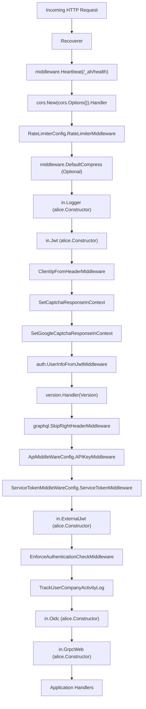
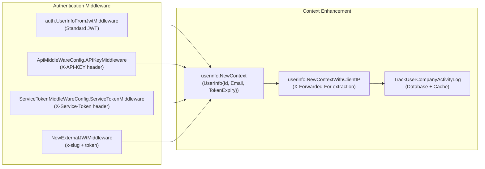
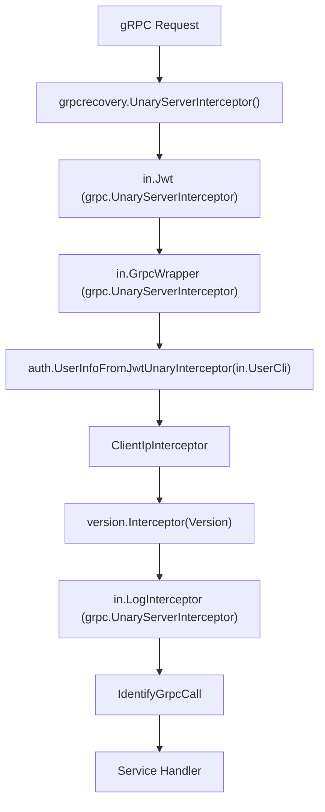
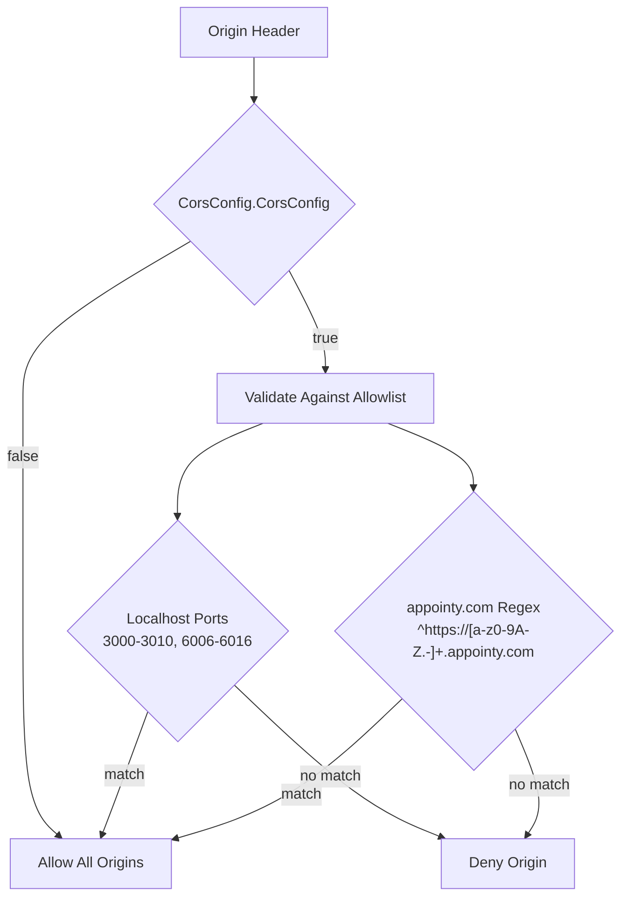
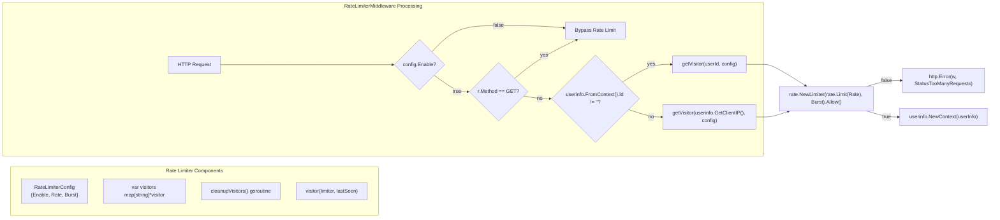
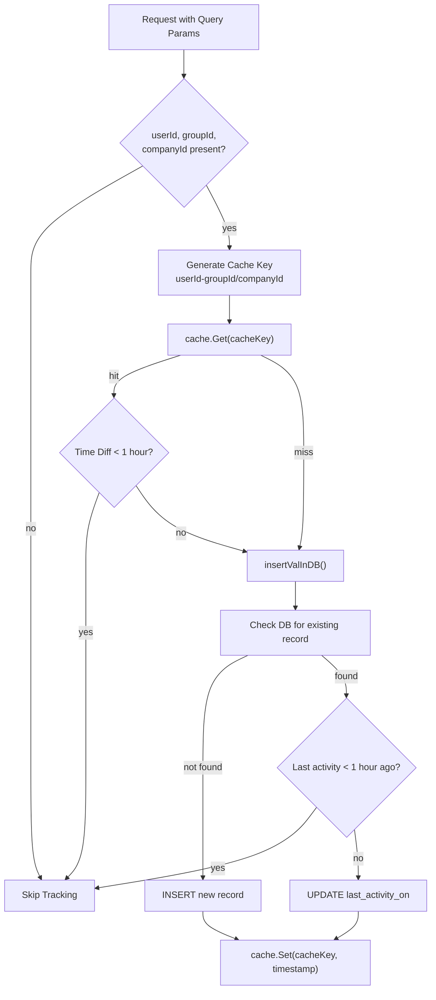

# Routing & Middleware

Relevant source files

The following files were used as context for generating this wiki page:

- [go.sum](go.sum)
- [rate-limiter.go](rate-limiter.go)
- [redis/redis.go](redis/redis.go)
- [router.go](router.go)
- [service_token.go](service_token.go)

This document covers the HTTP and gRPC routing system, middleware chain configuration, and request processing pipeline in the waqt-deployment service. The routing layer handles incoming requests through a comprehensive middleware stack that provides authentication, rate limiting, CORS, logging, and other cross-cutting concerns.

For authentication mechanisms and access control details, see [Authentication & Authorization](#2.3). For GraphQL-specific routing and schema handling, see [GraphQL Gateway](#2.2).

## Middleware Chain Architecture

The application uses the Alice middleware library to create a composable chain of HTTP middleware components. The middleware chain is constructed in the `NewChain` function within the `RouterModule` fx.Options and processes all incoming HTTP requests in a specific order.

**Alice Middleware Chain Construction in NewChain**

The `RouterModule` uses fx dependency injection to configure all middleware components and their dependencies through `fx.Provide` functions including `NewChain`, `NewInterceptors`, `NewApiMiddlewareConfig`, and `NewServiceTokenMiddlewareConfig`.

Sources: [router.go:62-98](), [router.go:100-163]()

## HTTP Middleware Components

### Core Infrastructure Middleware

The infrastructure middleware provides essential request handling capabilities:

| Middleware | Function | Purpose |
|------------|----------|---------|
| `Recoverer` | `Recoverer` | Panic recovery and error logging |
| `Heartbeat` | `middleware.Heartbeat` | Health check endpoint at `/_ah/health` |
| `DefaultCompress` | `middleware.DefaultCompress` | Response compression (configurable) |

### Security and Authentication Middleware

Multiple authentication methods are supported through dedicated middleware that populate `userinfo.UserInfo` context:

**Authentication Flow and Context Population**

#### Service Token Authentication Process

The `ServiceTokenMiddleWareConfig` handles `X-Service-Token` header validation through a comprehensive validation pipeline:

1. **Token Retrieval**: `serTokClient.GetServiceTokenByTokenValue()`
2. **Activity Check**: Validates `IsActive` flag
3. **Expiry Validation**: Checks `Expiry.Seconds` against current time  
4. **Usage Tracking**: Updates `LastUsedOn` via `UpdateLastUsedOn()`
5. **Context Population**: Creates `userinfo.UserInfo` with `IsServiceToken: true`

Sources: [router.go:140-147](), [router.go:553-608](), [router.go:610-647](), [service_token.go:29-93]()

### Request Processing Middleware

Several middleware components enrich the request context:

- **`ClientIpFromHeaderMiddleware`**: Extracts client IP from `X-Forwarded-For` header
- **`SetCaptchaResponseInContext`**: Captures `X-Captcha-Response` header
- **`SetGoogleCaptchaResponseInContext`**: Captures `g-recaptcha-response` header
- **`EnforceAuthenticationCheckMiddleware`**: Enforces authentication on `/api` and `/graphql` endpoints

Sources: [router.go:344-373](), [router.go:303-342]()

## gRPC Interceptors

The gRPC server uses a chain of unary interceptors constructed by `NewInterceptors` function for request processing:

**gRPC Interceptor Chain ([]grpc.UnaryServerInterceptor)**

Key interceptor implementations:
- **`ClientIpInterceptor`**: Extracts client IP from `peer.FromContext()` and calls `userinfo.NewContextWithClientIP()`
- **`IdentifyGrpcCall`**: Calls `userinfo.NewContextForGrpcCall()` to mark context as gRPC call
- **`GrpcWrapper`**: Uses `grpcWrapper.ByPassFunc` with `graphql.SkipRightHeaderKey` detection

The interceptor chain is constructed with fx dependency injection receiving `userPb.UserProfilesClient`, JWT interceptor, logger, and wrapper components.

Sources: [router.go:388-406](), [router.go:375-386](), [router.go:383-386](), [router.go:75-82]()

## CORS Configuration

CORS handling supports both permissive and restrictive modes based on configuration:

The `CheckCors` function validates origins against:
- Development localhost ports (3000-3010, 6006-6016)
- Production appointy.com subdomains via regex pattern

Sources: [router.go:254-301](), [router.go:124-131]()

## Rate Limiting System

The rate limiting system operates on both user ID and IP address with in-memory tracking using `golang.org/x/time/rate` package:

**Rate Limiting Decision Flow**

**Rate Limiter Implementation Details**:
- **Visitor tracking**: Global `visitors map[string]*visitor` with `sync.Mutex`
- **Limiter creation**: `rate.NewLimiter(rate.Limit(config.Rate), config.Burst)` per visitor
- **Cleanup process**: Background goroutine removes visitors inactive for >3 minutes
- **Configuration loading**: `NewConfig()` loads from config loader with defaults `{Enable: false, Rate: 10, Burst: 20}`

Sources: [rate-limiter.go:78-120](), [rate-limiter.go:20-52](), [rate-limiter.go:56-68](), [rate-limiter.go:122-134]()

## User Activity Tracking

The `TrackUserCompanyActivityLog` middleware tracks user activity timestamps with caching optimization:

Features:
- **Hourly granularity**: Only updates if last activity was over 1 hour ago
- **Cache optimization**: 90-minute cache expiry to reduce database load
- **Database fallback**: Updates `user_company_activity_logs` table when cache misses

Sources: [router.go:165-252]()

## Configuration System

The routing system uses multiple configuration structures loaded via the config loader:

| Configuration | Type | Purpose |
|---------------|------|---------|
| `RateLimiterConfig` | Rate limiting | Enable/disable, rate limits, burst capacity |
| `CorsLimiterConfig` | CORS policy | Restrictive vs permissive CORS |
| `TimeoutConfig` | Request timeouts | Default and custom query timeouts |
| `RecursiveDepthConfig` | GraphQL limits | Maximum query depth limits |

Sources: [router.go:408-431](), [router.go:654-683](), [rate-limiter.go:122-134]()