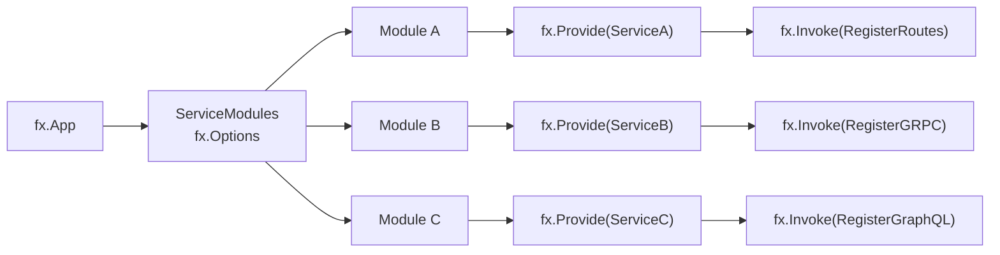
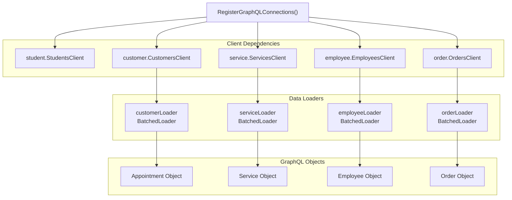
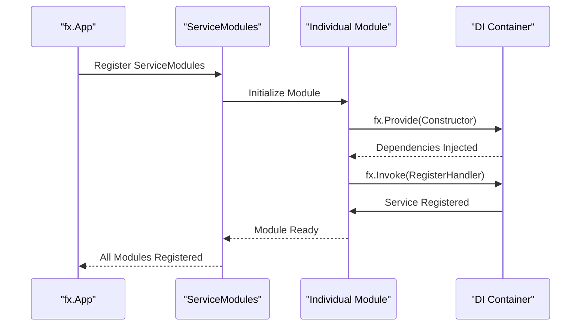

# Service Modules

Relevant source files

The following files were used as context for generating this wiki page:

- [connections.go](connections.go)
- [modules.go](modules.go)

## Purpose and Scope

The Service Modules system provides the foundational modular architecture for the waqt-deployment service, organizing business logic into discrete, independently manageable modules. This system enables domain-driven design by separating concerns across different business areas while maintaining loose coupling through dependency injection.

This document covers the module registration patterns, dependency injection configuration, and GraphQL integration mechanisms. For information about the overall application bootstrap process, see [Application Bootstrap](#3.1). For details about specific module implementations and their interfaces, see [Business Logic](#6).

## Module Architecture Overview

The service modules are organized using Uber's fx dependency injection framework, which provides lifecycle management and dependency resolution. The architecture separates modules into two primary categories: domain-specific waqt modules and shared platform saastack.io modules.

```mermaid
graph TB
    ServiceModules["ServiceModules<br/>fx.Options"]
    
    subgraph "Domain Modules (waqt)"
        APPT["appointment.Module"]
        SVC["service.Module"]
        RES["resource.Module"]
        BLOCK["blockHour.Module"]
        OPEN["openHour.Module"]
        STUDENT["student.Module"]
        INTAKE["intakeForm.Module"]
    end
    
    subgraph "Platform Modules (saastack.io)"
        USER["userProfile.Module"]
        COMPANY["company.Module"]
        EMPLOYEE["employee.Module"]
        BILLING["billing.Module"]
        LICENSE["license.Module"]
        ROLE["role.Module"]
        ORDER["order.Module"]
    end
    
    subgraph "Integration Modules"
        CALENDAR["calendar_integration.Module"]
        INTERCOM["intercom.Module"]
        ZAPIER["zapier.Module"]
        BIGCOMMERCE["bigcommerce.Module"]
    end
    
    ServiceModules --> APPT
    ServiceModules --> SVC
    ServiceModules --> RES
    ServiceModules --> BLOCK
    ServiceModules --> OPEN
    ServiceModules --> STUDENT
    ServiceModules --> INTAKE
    
    ServiceModules --> USER
    ServiceModules --> COMPANY
    ServiceModules --> EMPLOYEE
    ServiceModules --> BILLING
    ServiceModules --> LICENSE
    ServiceModules --> ROLE
    ServiceModules --> ORDER
    
    ServiceModules --> CALENDAR
    ServiceModules --> INTERCOM
    ServiceModules --> ZAPIER
    ServiceModules --> BIGCOMMERCE
```

Sources: [modules.go:155-312]()

## Module Categories

### Domain Modules (waqt)

Domain modules encapsulate core appointment booking functionality:

| Module | Purpose | Key Entities |
|--------|---------|--------------|
| `appointment.Module` | Appointment lifecycle management | Appointments, bookings, schedules |
| `service.Module` | Service definition and pricing | Services, service templates |
| `resource.Module` | Resource management | Resources, resource types |
| `blockHour.Module` | Unavailable time blocks | Block hours, availability rules |
| `openHour.Module` | Available time slots | Open hours, scheduling windows |
| `student.Module` | Student-specific functionality | Students, guardians |
| `intakeForm.Module` | Form collection and submission | Intake forms, submissions |

### Platform Modules (saastack.io)

Platform modules provide shared infrastructure services:

| Module | Purpose | Key Entities |
|--------|---------|--------------|
| `userProfile.Module` | User identity and profiles | Users, profiles, authentication |
| `company.Module` | Organization management | Companies, settings, hierarchies |
| `employee.Module` | Staff management | Employees, roles, departments |
| `billing.Module` | Payment processing | Billing plans, transactions, wallets |
| `license.Module` | Feature licensing | Licenses, consumption tracking |
| `role.Module` | Access control | Roles, permissions, user roles |
| `order.Module` | Order processing | Orders, items, payments |

Sources: [modules.go:156-311]()

## Dependency Injection Pattern

The fx framework manages module dependencies through a constructor-based dependency injection pattern. Each module exports an `fx.Option` that declares its dependencies and provided services.

The `ServiceModules` variable combines all individual modules using `fx.Options()`, which allows the application to register all services and their dependencies in a single operation.

Sources: [modules.go:155]()

## GraphQL Integration

Modules integrate with the GraphQL layer through the `RegisterGraphQLConnections` function, which establishes data loaders and connection mappings for efficient data fetching.

Each data loader implements batched loading with caching disabled and configurable wait times for optimal performance. The loaders use a consistent pattern:

- 70ms wait time for batching requests
- 5000 input capacity for high throughput
- NoCache policy for real-time data consistency

Sources: [connections.go:88-154](), [connections.go:156-173]()

## Module Registration Process

The registration process follows a structured pattern where modules declare their dependencies and register their services with the fx container:

### Special Module Configurations

Some modules require special handling or additional configuration:

- **Zapier Module**: Requires explicit route registration with `fx.Annotated` group annotation
- **Billing Module**: Wrapped in additional `fx.Options()` for complex dependency management  
- **Training Task Module**: Uses factory pattern with `task.Module()` call
- **HTTP Client Modules**: Several modules like `supressedEmails.HttpCliModule` and `emailVerify.HttpCliModule` provide HTTP client functionality

Sources: [modules.go:267-274](), [modules.go:233-235](), [modules.go:279](), [modules.go:286-287]()

## Data Loader Architecture

The GraphQL integration uses a sophisticated data loader architecture to optimize database queries and prevent N+1 query problems. Each entity type has a corresponding batched loader that aggregates requests and executes them in batches.

### Loader Configuration Patterns

All data loaders follow consistent configuration patterns:

| Configuration | Value | Purpose |
|---------------|-------|---------|
| `WithCache(&dataloader.NoCache{})` | No caching | Ensures real-time data consistency |
| `WithWait(70*time.Millisecond)` | 70ms batching window | Optimizes request grouping |
| `WithInputCapacity(5000)` | 5000 request capacity | Supports high-throughput scenarios |
| `WithBatchCapacity(1000)` | 1000 batch size | Limits individual batch sizes |

### Context and Rights Management

The data loaders implement sophisticated context and rights management:

- **Skip Rights Context**: Many loaders use `userinfo.NewContextWithSkipRightKey(ctx)` to bypass authorization checks for related data
- **User Context Injection**: Loaders inject user context information for proper authorization
- **Error Handling**: Consistent error handling with graceful degradation for missing data

Sources: [connections.go:156-173](), [connections.go:443-479](), [connections.go:870-884]()