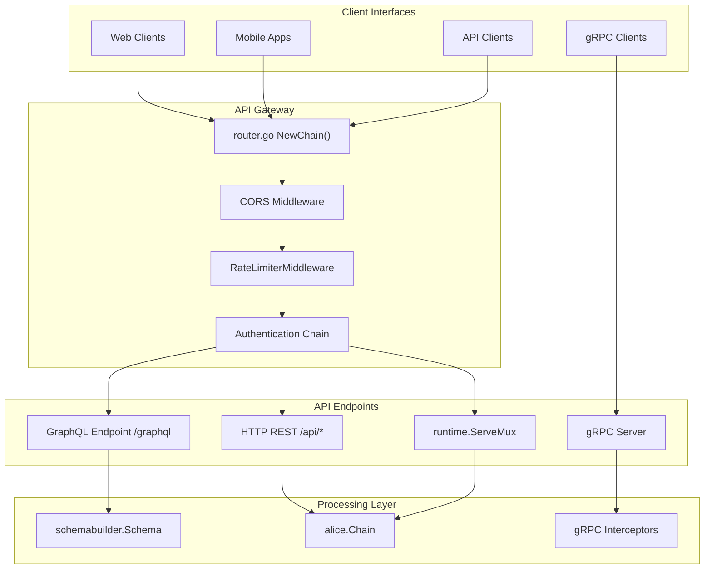
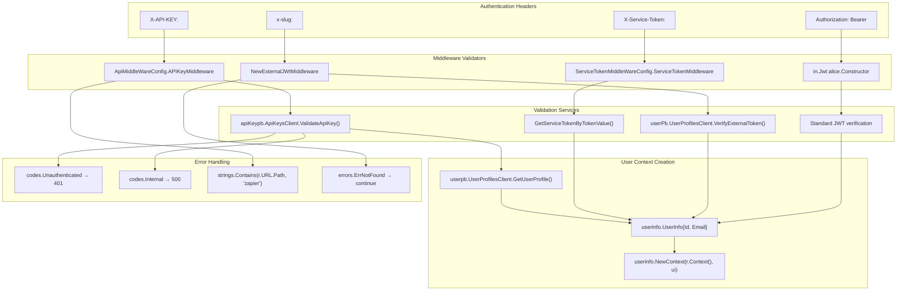
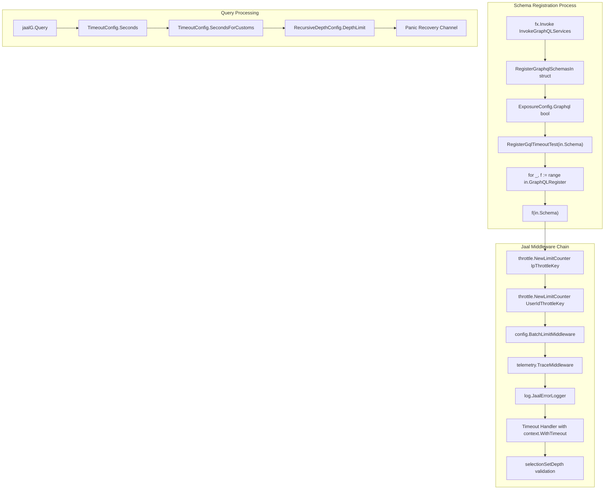
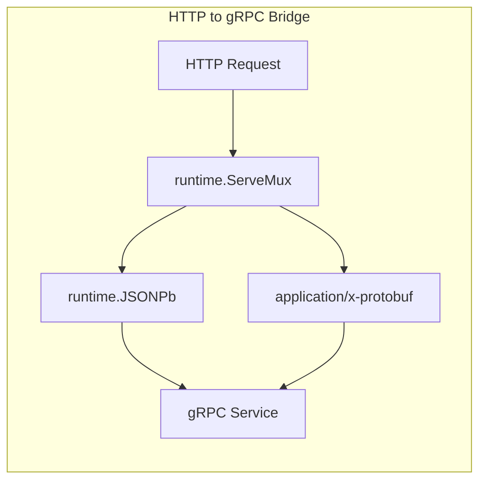
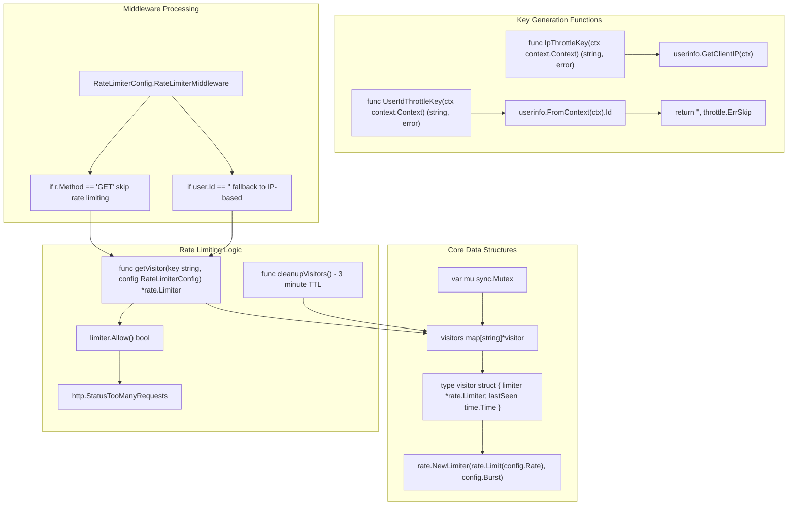
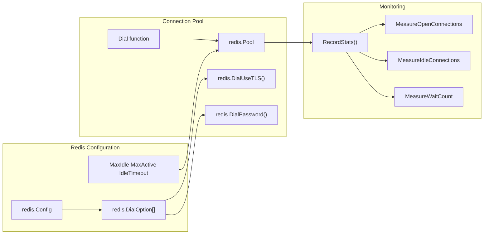

# API Layer

Relevant source files

The following files were used as context for generating this wiki page:

- [graphql.go](graphql.go)
- [rate-limiter.go](rate-limiter.go)
- [redis/redis.go](redis/redis.go)
- [router.go](router.go)

This document covers all API interfaces provided by the system including GraphQL, gRPC, and HTTP endpoints. It details the request processing pipeline, authentication mechanisms, middleware chain, and service registration patterns. For specific business logic implementation details, see [Business Logic](#6). For authentication and authorization specifics, see [Security & Access Control](#5).

## API Layer Architecture

The API layer provides multiple entry points for client applications through GraphQL, gRPC, and HTTP REST endpoints. The system uses a sophisticated middleware chain for request processing, authentication, and security.

Sources: [router.go:62-98](), [router.go:535-538](), [graphql.go:9-28]()

## Request Processing Pipeline

The `NewChain()` function in [router.go:100-163]() defines the complete middleware processing pipeline. Each request flows through this ordered chain of middleware components.

**Middleware Chain Processing Order**

```mermaid
graph LR
    subgraph "alice.Chain Middleware Order"
        RECOVERER["Recoverer"]
        HEARTBEAT["middleware.Heartbeat('/_ah/health')"]
        CORS_MW["cors.New(cors.Options{...}).Handler"]
        RATE_MW["RateLimiterConfig.RateLimiterMiddleware"]
        LOGGER["in.Logger alice.Constructor"]
        JWT_MW["in.Jwt alice.Constructor"]
        CLIENT_IP["ClientIpFromHeaderMiddleware"]
        CAPTCHA_X["SetCaptchaResponseInContext"]
        CAPTCHA_G["SetGoogleCaptchaResponseInContext"]
        USER_INFO["auth.UserInfoFromJwtMiddleware(in.UserCli)"]
        VERSION["version.Handler(Version)"]
        SKIP_RIGHT["graphql.SkipRightHeaderMiddleware"]
        API_KEY["ApiMiddleWareConfig.APIKeyMiddleware"]
        SERVICE_TOKEN["ServiceTokenMiddleWareConfig.ServiceTokenMiddleware"]
        EXTERNAL_JWT["in.ExternalJwt alice.Constructor"]
        AUTH_CHECK["EnforceAuthenticationCheckMiddleware"]
        ACTIVITY_LOG["TrackUserCompanyActivityLog(in.DB, in.Cache)"]
        COMPRESS["middleware.DefaultCompress"]
        OIDC["in.Oidc alice.Constructor"]
        GRPC_WEB["in.GrpcWeb alice.Constructor"]
    end
    
    REQUEST["HTTP Request"] --> RECOVERER
    RECOVERER --> HEARTBEAT
    HEARTBEAT --> CORS_MW
    CORS_MW --> RATE_MW
    RATE_MW --> LOGGER
    LOGGER --> JWT_MW
    JWT_MW --> CLIENT_IP
    CLIENT_IP --> CAPTCHA_X
    CAPTCHA_X --> CAPTCHA_G
    CAPTCHA_G --> USER_INFO
    USER_INFO --> VERSION
    VERSION --> SKIP_RIGHT
    SKIP_RIGHT --> API_KEY
    API_KEY --> SERVICE_TOKEN
    SERVICE_TOKEN --> EXTERNAL_JWT
    EXTERNAL_JWT --> AUTH_CHECK
    AUTH_CHECK --> ACTIVITY_LOG
    ACTIVITY_LOG --> COMPRESS
    COMPRESS --> OIDC
    OIDC --> GRPC_WEB
    GRPC_WEB --> HANDLER["Request Handler"]
```

The middleware chain is conditionally configured based on environment variables:
- `REMOVE_COMPRESSOR` controls whether `middleware.DefaultCompress` is included
- `ENFORCE_AUTHENTICATION_CHECK` controls authentication enforcement
- `TRACK_USER_COMPANY_ACTIVITY_TIMESTAMP` controls activity logging

Sources: [router.go:100-163](), [router.go:303-342](), [router.go:344-373](), [router.go:150-152]()

## Authentication Mechanisms

The API layer implements a multi-layered authentication system supporting four distinct authentication methods with specific header requirements and validation flows.

**Authentication Flow Architecture**

**Authentication Method Details**

| Method | Header | Validation Function | User Resolution |
|--------|--------|---------------------|-----------------|
| **JWT** | `Authorization: Bearer <token>` | Standard JWT verification | From JWT claims |
| **API Key** | `X-API-KEY: <key>` | `apiKeypb.ApiKeysClient.ValidateApiKey()` | `GetUserProfile(apiKey.UserId)` |
| **Service Token** | `X-Service-Token: <token>` | `GetServiceTokenByTokenValue()` | Service-to-service context |
| **External JWT** | `Authorization: Bearer <token>` + `x-slug: <slug>` | `VerifyExternalToken(token, slug)` | External system integration |

**Special Authentication Logic**:
- **Zapier Integration**: API key is required for any URL containing "zapier" [router.go:600-605]()
- **External JWT**: Requires both JWT token and company slug header [router.go:624-633]()
- **Service Token**: Used for internal service-to-service communication
- **Enforcement**: `EnforceAuthenticationCheckMiddleware` can require authentication on `/api` and `/graphql` paths [router.go:303-342]()

Sources: [router.go:553-608](), [router.go:610-647](), [router.go:140-147](), [router.go:303-342]()

## GraphQL Implementation

The GraphQL layer uses Jaal framework with `schemabuilder.Schema` registration and comprehensive middleware for security and performance.

**GraphQL Schema Registration Flow**

**GraphQL Timeout and Depth Configuration**

The system implements sophisticated query protection mechanisms:

| Configuration | Default Value | Purpose |
|---------------|---------------|---------|
| `TimeoutConfig.Seconds` | 30 seconds | Standard query timeout |
| `TimeoutConfig.SecondsForCustoms` | 60 seconds | Extended timeout for heavy queries |
| `RecursiveDepthConfig.DepthLimit` | 10 levels | Maximum query depth protection |

The `selectionSetDepth()` function [router.go:685-699]() recursively analyzes query structure to prevent deep nested queries that could cause performance issues. The `uniqueNames()` function [router.go:724-769]() extracts all field names for depth analysis.

Sources: [graphql.go:9-28](), [router.go:433-504](), [router.go:685-776](), [router.go:416-431](), [router.go:674-683]()

## gRPC Services and Interceptors

The `NewInterceptors()` function [router.go:388-406]() defines the complete gRPC interceptor chain with precise ordering for request processing.

**gRPC Interceptor Chain Architecture**

```mermaid
graph LR
    subgraph "Interceptor Processing Order"
        RECOVERY["grpcrecovery.UnaryServerInterceptor()"]
        JWT_GRPC["in.Jwt grpc.UnaryServerInterceptor"]
        GRPC_WRAPPER["in.GrpcWrapper grpcWrapper.GrpcMethodSkipMiddleware"]
        USER_INTERCEPTOR["auth.UserInfoFromJwtUnaryInterceptor(in.UserCli)"]
        CLIENT_IP_GRPC["ClientIpInterceptor"]
        VERSION_GRPC["version.Interceptor(Version)"]
        LOG_GRPC["in.LogInterceptor"]
        IDENTIFY_GRPC["IdentifyGrpcCall"]
    end
    
    subgraph "Context Enhancement Functions"
        PEER_EXTRACT["peer.FromContext(ctx)"]
        CLIENT_IP_CTX["userinfo.NewContextWithClientIP(ctx, p.Addr.String())"]
        GRPC_FLAG["userinfo.NewContextForGrpcCall(ctx)"]
    end
    
    subgraph "Bypass Mechanism"
        BYPASS_FUNC["grpcWrapper.ByPassFunc"]
        METADATA_CHECK["metadata.FromIncomingContext(ctx)"]
        SKIP_HEADER["graphql.SkipRightHeaderKey"]
        SKIP_VALUE["graphql.SkipRightHeaderValue"]
    end
    
    GRPC_REQUEST["gRPC Request"] --> RECOVERY
    RECOVERY --> JWT_GRPC
    JWT_GRPC --> GRPC_WRAPPER
    GRPC_WRAPPER --> USER_INTERCEPTOR
    USER_INTERCEPTOR --> CLIENT_IP_GRPC
    CLIENT_IP_GRPC --> VERSION_GRPC
    VERSION_GRPC --> LOG_GRPC
    LOG_GRPC --> IDENTIFY_GRPC
    
    CLIENT_IP_GRPC --> PEER_EXTRACT
    PEER_EXTRACT --> CLIENT_IP_CTX
    IDENTIFY_GRPC --> GRPC_FLAG
    
    GRPC_WRAPPER --> BYPASS_FUNC
    BYPASS_FUNC --> METADATA_CHECK
    METADATA_CHECK --> SKIP_HEADER
    SKIP_HEADER --> SKIP_VALUE
```

**Special Interceptor Functions**

The gRPC layer includes specialized interceptors for different purposes:

- **`ClientIpInterceptor`** [router.go:375-381](): Extracts client IP from `peer.FromContext()` and injects it into request context
- **`IdentifyGrpcCall`** [router.go:383-386](): Marks requests as gRPC calls using `userinfo.NewContextForGrpcCall()`
- **Bypass Mechanism** [router.go:75-83](): Allows skipping middleware based on `graphql.SkipRightHeaderKey` metadata

Sources: [router.go:388-406](), [router.go:375-381](), [router.go:383-386](), [router.go:75-83]()

## HTTP Routing and Middleware Configuration

The HTTP layer uses the Chi router with Alice middleware chaining and gRPC-Gateway for protocol bridging.

| Middleware Component | Purpose | Configuration |
|---------------------|---------|---------------|
| `Recoverer` | Panic recovery | [router.go:506-519]() |
| `Heartbeat` | Health check endpoint | `/_ah/health` |
| `CORS` | Cross-origin resource sharing | [router.go:254-301]() |
| `RateLimiterMiddleware` | Request rate limiting | [rate-limiter.go:78-120]() |
| `APIKeyMiddleware` | API key authentication | [router.go:565-608]() |
| `ServiceTokenMiddleware` | Service-to-service auth | [router.go:144]() |
| `ExternalJWTMiddleware` | External JWT validation | [router.go:610-647]() |
| `TrackUserCompanyActivityLog` | Activity logging | [router.go:165-252]() |

The system uses `runtime.ServeMux` from gRPC-Gateway for HTTP-to-gRPC protocol bridging:

Sources: [router.go:535-538](), [router.go:100-163]()

## Rate Limiting and Security

The rate limiting system uses `golang.org/x/time/rate` package with an in-memory visitor tracking system and automated cleanup.

**Rate Limiter Implementation Architecture**

**Rate Limiting Configuration and Behavior**

| Configuration Field | Default Value | Purpose |
|---------------------|---------------|---------|
| `RateLimiterConfig.Enable` | `false` | Global rate limiting toggle |
| `RateLimiterConfig.Rate` | `10` | Average requests per second |
| `RateLimiterConfig.Burst` | `20` | Maximum burst capacity |

**Rate Limiting Strategy**:
1. **GET requests**: Excluded from rate limiting [rate-limiter.go:81-84]()
2. **Authenticated users**: Rate limited by `userinfo.FromContext(ctx).Id` [rate-limiter.go:88-96]()
3. **Unauthenticated users**: Rate limited by `userinfo.GetClientIP(ctx)` [rate-limiter.go:97-107]()
4. **Cleanup mechanism**: `cleanupVisitors()` runs every minute, removing visitors inactive for >3 minutes [rate-limiter.go:56-68]()

The system also integrates with `throttle.NewLimitCounter` for GraphQL-specific throttling using Redis backend [router.go:444-449]().

Sources: [rate-limiter.go:12-134](), [router.go:521-533](), [router.go:444-449](), [rate-limiter.go:30-32]()

## Redis Integration

Redis is used for caching and session management with connection pooling and statistics tracking.

Sources: [redis/redis.go:20-88](), [redis/redis.go:139-170]()