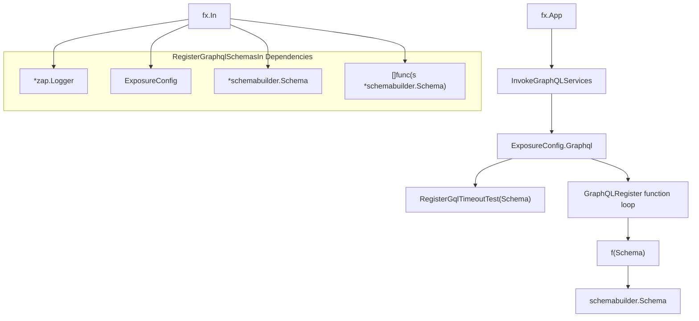
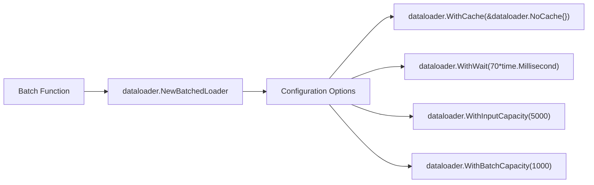
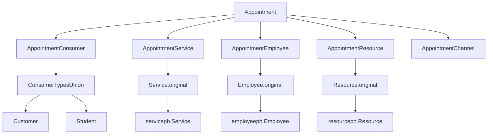
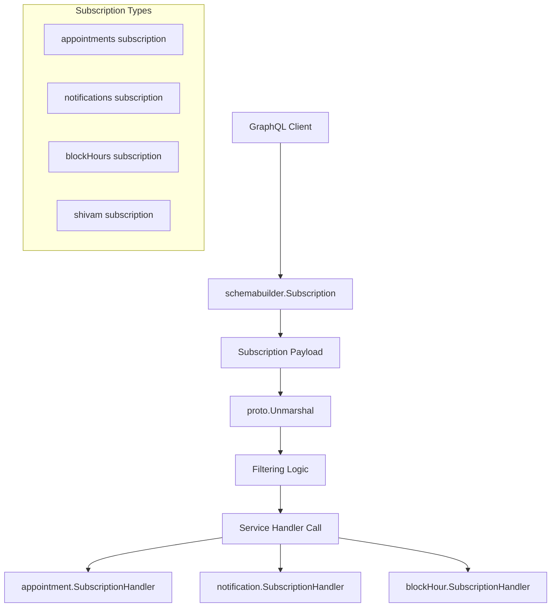
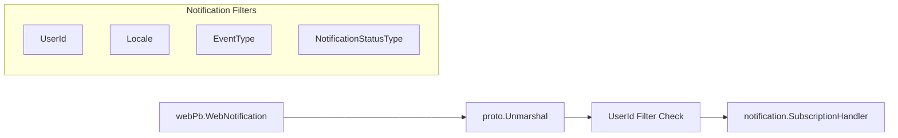
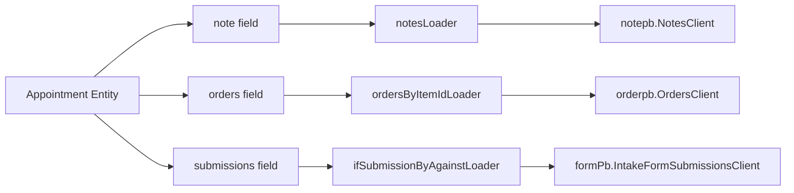
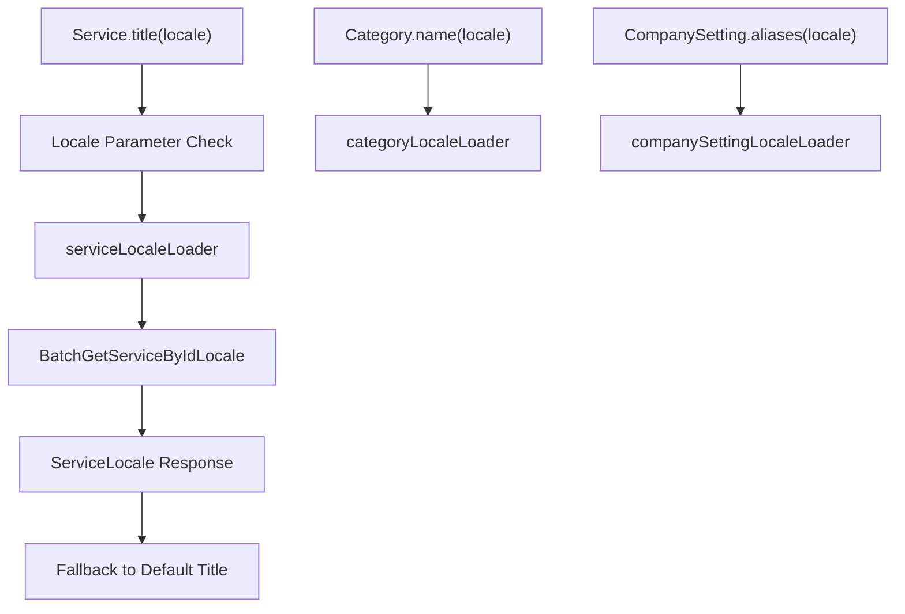
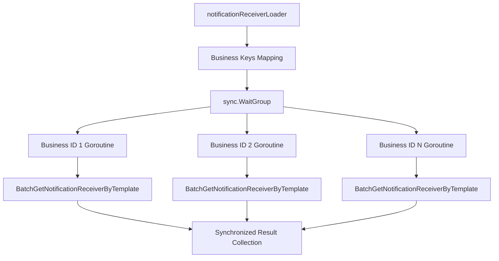
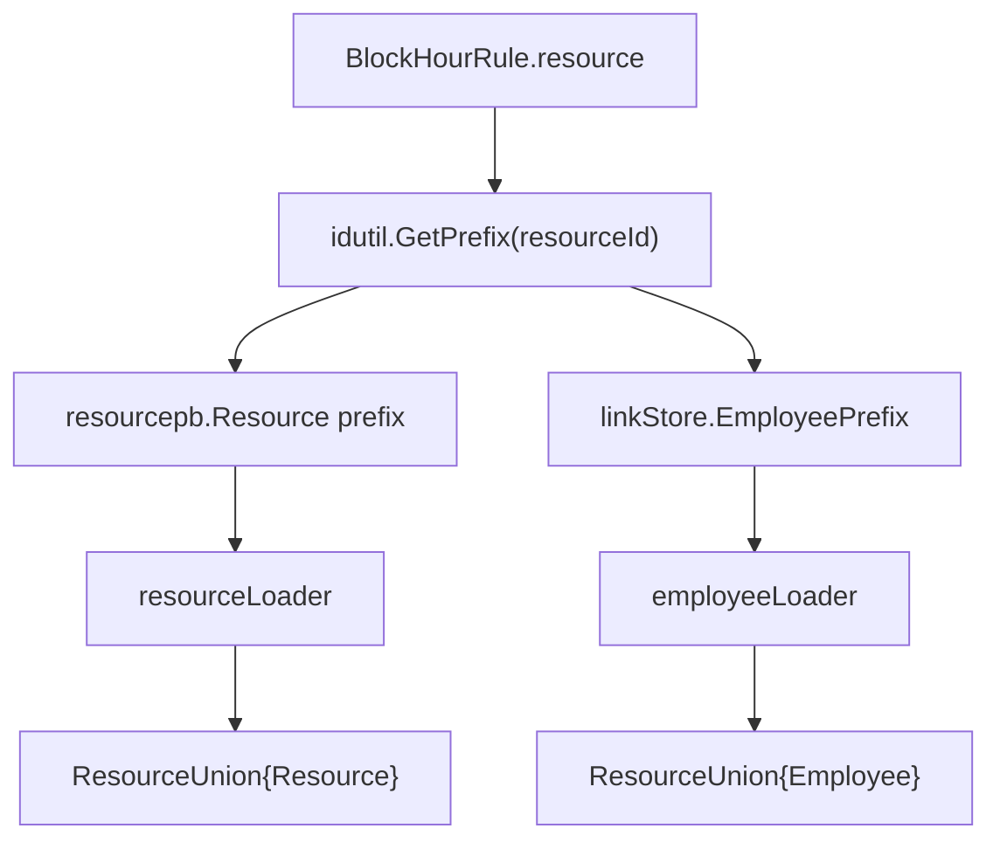
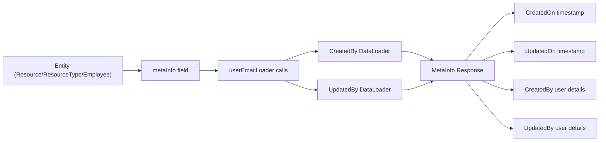

# GraphQL API

Relevant source files

The following files were used as context for generating this wiki page:

- [graphql.go](graphql.go)
- [subscriptions.go](subscriptions.go)
- [verify.go](verify.go)

This document covers the GraphQL API layer, detailing schema registration, subscription handling, and query resolution mechanisms. The GraphQL API serves as a unified gateway that aggregates data from multiple business domain services and provides real-time subscriptions for appointment booking, notifications, and calendar events.

For information about the underlying gRPC services that power this GraphQL layer, see [gRPC Services](#4.2). For details about HTTP routing and middleware, see [HTTP Endpoints](#4.3).

## Schema Registration System

The GraphQL schema registration follows a modular dependency injection pattern using Uber FX, allowing services to register their GraphQL resolvers independently through the `graphql-service` group.

The registration process is controlled by the `InvokeGraphQLServices` fx.Invoke function, which conditionally enables GraphQL based on `ExposureConfig.Graphql` and iterates through all functions in the `graphql-service` group.

| Component | Type | Purpose |
|-----------|------|---------|
| `RegisterGraphqlSchemasIn` | Struct | FX dependency container for GraphQL registration |
| `GraphQLRegister` | `[]func(s *schemabuilder.Schema)` | Array of schema registration functions |
| `ExposureConfig.Graphql` | Boolean | Feature flag for GraphQL enablement |
| `schemabuilder.Schema` | Jaal schema builder | Core GraphQL schema construction |

**Sources:** [graphql.go:9-28]()

## DataLoader Architecture

The system implements extensive DataLoader patterns to solve the N+1 query problem and optimize database access through batching. Each DataLoader is configured with specific batching parameters and caching policies.

### DataLoader Configuration Pattern

| DataLoader | Batch Capacity | Wait Time | Input Capacity | Caching |
|------------|---------------|-----------|----------------|---------|
| `customerLoader` | Default | 70ms | 5000 | NoCache |
| `employeeLoader` | 1000 | 70ms | 5000 | NoCache |
| `serviceLoader` | Default | 70ms | 5000 | NoCache |
| `orderLoader` | Default | Default | Default | NoCache |
| `categoryLoader` | Default | Default | Default | NoCache |

**Sources:** [connections.go:156-172](), [connections.go:442-478](), [connections.go:426-441]()

## Connection Patterns

The GraphQL API implements sophisticated connection patterns that bridge appointment system entities with their underlying microservice data sources.

### Core Entity Connections

Each connection type provides both wrapper objects and access to the original underlying protobuf entities through `original` field resolvers.

**Sources:** [connections.go:1471-1518](), [connections.go:1520-1547](), [connections.go:1549-1576]()

## GraphQL Subscriptions

The GraphQL API implements real-time subscriptions for critical business events using protobuf-based message passing and filtering logic. Subscriptions provide live updates for appointments, notifications, and calendar changes.

### Subscription Architecture

### Appointments Subscription

The appointments subscription provides real-time updates for appointment changes with comprehensive filtering capabilities:

| Filter Parameter | Type | Purpose |
|-----------------|------|---------|
| `Parents` | `[]string` | Filter by organizational hierarchy |
| `EmployeeIds` | `[]string` | Filter by specific employees |
| `ServiceIds` | `[]string` | Filter by service types |
| `ResourceIds` | `[]string` | Filter by resources |
| `ResourceTypeIds` | `[]string` | Filter by resource categories |
| `StartTime` | `schemabuilder.Timestamp` | Time range start |
| `EndTime` | `schemabuilder.Timestamp` | Time range end |

The subscription unmarshals `aptPb.Appointment` protobuf messages and applies filtering logic before delegating to `appointment.SubscriptionHandler`.

**Sources:** [subscriptions.go:46-89]()

### Notifications Subscription  

The notifications subscription handles real-time web notification delivery:

The notification subscription filters messages by `UserId` to ensure users only receive their own notifications.

**Sources:** [subscriptions.go:91-118]()

### Block Hours Subscription

The block hours subscription provides real-time updates for calendar availability changes:

| Filter | Description |
|--------|-------------|
| `Parents` | Organizational hierarchy filtering |
| `EmployeeIds` | Specific employee availability |  
| `ResourceIds` | Resource-specific blocks |
| `Sources` | Block hour sources |
| `ExternalSourceIds` | External calendar integration IDs |

The subscription processes `blockPb.BlockHourRule` messages and applies multiple levels of filtering before calling `blockHour.SubscriptionHandler`.

**Sources:** [subscriptions.go:120-167]()

### Cross-Service Resolution

The system resolves related entities across different microservices through DataLoader-backed field functions:

**Sources:** [connections.go:1190-1212](), [connections.go:1293-1312](), [connections.go:1313-1332]()

## Localization Support

The GraphQL API provides comprehensive localization support through specialized locale-aware DataLoaders and field resolvers.

### Locale-Aware Field Resolution

The localization system supports multiple entity types including Services, Categories, ServiceTemplates, and CompanySettings, with automatic fallback to default values when locale-specific content is unavailable.

**Sources:** [connections.go:2025-2057](), [connections.go:2335-2365](), [connections.go:2249-2308]()

## Performance Optimizations

### Batching Strategy

The system implements several batching optimizations to minimize database calls:

| Optimization | Implementation | Benefit |
|--------------|---------------|---------|
| **Request Batching** | 70ms wait windows | Reduces database roundtrips |
| **Deduplication** | Unique key mapping | Eliminates duplicate requests |
| **Capacity Limits** | 5000 input capacity | Memory usage control |
| **Right Skipping** | `userinfo.NewContextWithSkipRightKey()` | Bypasses permission checks for internal calls |

### Concurrent Processing

Complex DataLoaders like `notificationReceiverLoader` use goroutines and wait groups to process requests for different business entities concurrently.

**Sources:** [connections.go:380-424](), [connections.go:395-421]()

## Union Types and Polymorphism

The GraphQL schema leverages union types to handle polymorphic relationships across different entity types.

### Resource Union Implementation

The system uses prefix-based type discrimination to route requests to appropriate DataLoaders and construct proper union type responses.

**Sources:** [connections.go:2403-2448](), [connections.go:2412-2426](), [connections.go:2428-2442]()

## Metadata and Activity Tracking

The GraphQL API provides comprehensive metadata enrichment for entities, including creator/updater information and activity tracking.

### MetaInfo Pattern

This pattern is consistently applied across major entities like Resources, ResourceTypes, Employees, and BlockHourRules to provide audit trail information.

**Sources:** [connections.go:1754-1790](), [connections.go:1839-1875](), [connections.go:2827-2875]()