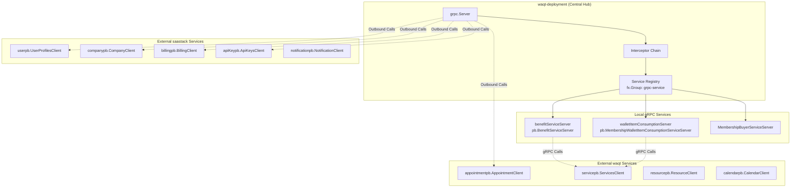
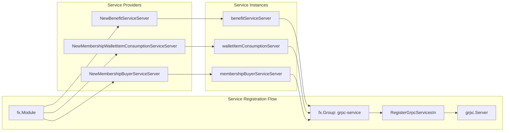
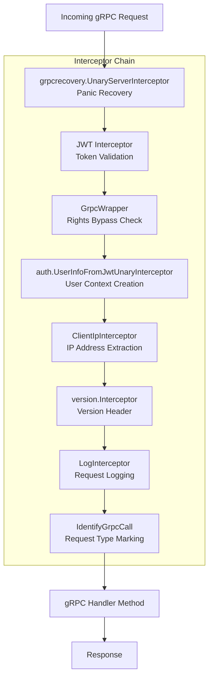
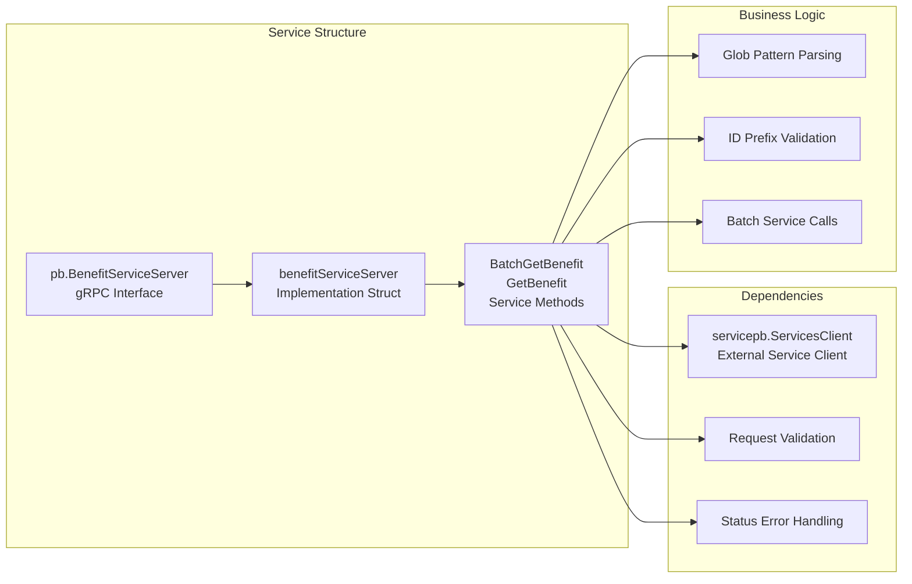
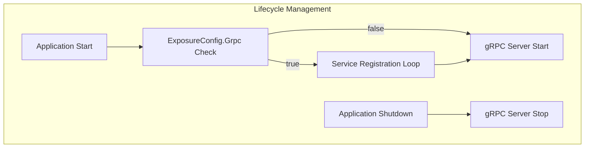

# gRPC Services

Relevant source files

The following files were used as context for generating this wiki page:

- [grpc.go](grpc.go)
- [membership-items/fx.go](membership-items/fx.go)
- [membership-items/items.go](membership-items/items.go)
- [rate-limiter.go](rate-limiter.go)
- [redis/redis.go](redis/redis.go)
- [router.go](router.go)

This document covers the gRPC service layer implementation within the waqt-deployment service, including service registration, interceptor chains, and communication patterns with external microservices. The deployment service acts as a central orchestrator that communicates with numerous backend services via gRPC protocols.

For information about HTTP routing and middleware, see [HTTP Endpoints](#4.3). For GraphQL API implementation details, see [GraphQL API](#4.1).

## Service Architecture Overview

The gRPC services in waqt-deployment follow a hub-and-spoke architecture where the deployment service acts as a central orchestrator communicating with distributed microservices across two primary domains: waqt business services and saastack.io platform services.

**Sources:** [router.go:388-406](), [grpc.go:9-26](), [membership-items/items.go:19-86]()

## Service Registration and Discovery

The gRPC service registration uses Uber's fx dependency injection framework with a group-based registration pattern. Services are automatically discovered and registered through the `grpc-service` group tag.

**Sources:** [grpc.go:17-26](), [membership-items/fx.go:8-18]()

The registration process is controlled by the `ExposureConfig.Grpc` flag and executed through the `InvokeGrpcServices` fx.Invoke function:

| Component | Type | Purpose |
|-----------|------|---------|
| `RegisterGrpcServicesIn` | Struct | Dependency injection container for gRPC registration |
| `GrpcRegister` | `[]func(s *grpc.Server)` | Collection of service registration functions |
| `fx.Group:"grpc-service"` | Tag | Groups all gRPC service providers for batch registration |

**Sources:** [grpc.go:9-15]()

## Interceptor Chain

The gRPC interceptor chain provides cross-cutting concerns including authentication, logging, recovery, and request context management. The interceptors are applied in a specific order to ensure proper request processing.

**Sources:** [router.go:395-405]()

### Key Interceptor Functions

| Interceptor | Function | Purpose |
|-------------|----------|---------|
| `ClientIpInterceptor` | Extracts client IP from peer context | IP-based logging and rate limiting |
| `IdentifyGrpcCall` | Marks request as gRPC call | Request type identification for middleware |
| `grpcWrapper.GrpcMethodSkipMiddleware` | Bypasses rights checking for specific calls | Service-to-service communication optimization |

**Sources:** [router.go:375-406]()

## Service Implementation Pattern

Local gRPC services follow a consistent implementation pattern with dependency injection for external service clients. Here's the pattern demonstrated by the membership services:

**Sources:** [membership-items/items.go:19-86](), [membership-items/items.go:123-202]()

### Service Method Example

The `BatchGetBenefit` method demonstrates the typical service implementation pattern:

1. **Request Validation**: Uses protobuf validation with `in.Validate()`
2. **ID Processing**: Handles both glob patterns and direct IDs
3. **Prefix-based Routing**: Routes requests based on ID prefixes
4. **Batch Operations**: Optimizes external service calls through batching
5. **Error Handling**: Returns structured gRPC status errors

**Sources:** [membership-items/items.go:28-80]()

## Client Configuration and Communication

The deployment service maintains gRPC clients for communication with external services. These clients are configured through dependency injection and used across service implementations.

| Service Domain | Client Types | Purpose |
|----------------|--------------|---------|
| waqt Services | `servicepb.ServicesClient`, `appointmentpb.AppointmentClient` | Business domain operations |
| saastack Services | `userpb.UserProfilesClient`, `apiKeypb.ApiKeysClient` | Platform services |
| Local Services | `pb.LocalBenefitServiceClient` | Internal service communication |

**Sources:** [membership-items/fx.go:10-17](), [membership-items/items.go:20-21]()

The service clients support advanced features including:

- **Field Masking**: Selective field retrieval using `field_mask.FieldMask`
- **Batch Operations**: Optimized bulk operations like `BatchGetService`
- **Error Propagation**: Structured error handling with gRPC status codes
- **Context Propagation**: Request context and metadata forwarding

**Sources:** [membership-items/items.go:67-77](), [membership-items/items.go:158-165]()

## Service Lifecycle Management

gRPC services are managed through the fx lifecycle system, ensuring proper startup and shutdown coordination:

**Sources:** [grpc.go:18-25]()

The conditional registration allows for flexible deployment configurations where gRPC services can be enabled or disabled based on the `ExposureConfig.Grpc` setting, supporting different deployment scenarios and service boundaries.

**Sources:** [grpc.go:19]()