# HTTP Endpoints

<details>
<summary>Relevant source files</summary>

The following files were used as context for generating this wiki page:

- [rate-limiter.go](rate-limiter.go)
- [redis/redis.go](redis/redis.go)
- [router.go](router.go)
- [subscriptions.go](subscriptions.go)
- [verify.go](verify.go)

</details>


This document covers the HTTP routing system, middleware chain, and endpoint implementations in the waqt-deployment service. It details how HTTP requests are processed through the middleware pipeline, authenticated, and routed to appropriate handlers.

For GraphQL-specific endpoint handling, see [GraphQL API](#4.1). For gRPC service implementations, see [gRPC Services](#4.2). For authentication middleware details, see [Authentication Middleware](#5.2).

## HTTP Router Architecture

The HTTP routing system is built using the `go-chi/chi` router with a sophisticated middleware chain implemented through the `justinas/alice` package. The router handles multiple types of endpoints including GraphQL, gRPC-Web, and domain verification endpoints.

```mermaid
graph TD
    HTTP_REQUEST["HTTP Request"] --> MIDDLEWARE_CHAIN["alice.Chain Middleware"]
    MIDDLEWARE_CHAIN --> ROUTER_MUX["Chi Router / gRPC Gateway"]
    
    ROUTER_MUX --> GRAPHQL_ENDPOINT["GraphQL Endpoint<br/>/graphql"]
    ROUTER_MUX --> GRPC_WEB["gRPC-Web Gateway<br/>/api/v1/*"]
    ROUTER_MUX --> DOMAIN_VERIFY["Domain Verification<br/>/.well-known/*"]
    ROUTER_MUX --> HEALTH_CHECK["Health Check<br/>/_ah/health"]
    
    MIDDLEWARE_CHAIN --> RECOVERER["Recoverer"]
    MIDDLEWARE_CHAIN --> CORS["CORS Handler"]
    MIDDLEWARE_CHAIN --> RATE_LIMITER["RateLimiterMiddleware"]
    MIDDLEWARE_CHAIN --> COMPRESSOR["DefaultCompress"]
    MIDDLEWARE_CHAIN --> LOGGER["Logger Middleware"]
    MIDDLEWARE_CHAIN --> JWT_AUTH["JWT Middleware"]
    MIDDLEWARE_CHAIN --> CLIENT_IP["ClientIpFromHeaderMiddleware"]
    MIDDLEWARE_CHAIN --> API_KEY["APIKeyMiddleware"]
    MIDDLEWARE_CHAIN --> SERVICE_TOKEN["ServiceTokenMiddleware"]
    MIDDLEWARE_CHAIN --> EXTERNAL_JWT["ExternalJWtMiddleware"]
    MIDDLEWARE_CHAIN --> AUTH_CHECK["EnforceAuthenticationCheckMiddleware"]
    MIDDLEWARE_CHAIN --> ACTIVITY_LOG["TrackUserCompanyActivityLog"]
    
    style HTTP_REQUEST fill:#f9f9f9
    style MIDDLEWARE_CHAIN fill:#e1f5fe
    style ROUTER_MUX fill:#fff3e0
```

**Sources:** [router.go:100-163](), [router.go:535-538]()

## Middleware Chain Configuration

The middleware chain is configured in the `NewChain` function and processes requests in a specific order to ensure proper authentication, logging, and request handling.

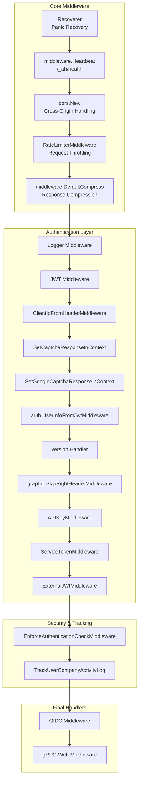

**Sources:** [router.go:100-163](), [router.go:121-148]()

## Authentication Methods

The system supports multiple authentication methods that are processed through dedicated middleware components:

| Authentication Type | Header/Source | Middleware Function | Purpose |
|---------------------|---------------|-------------------|---------|
| JWT Token | `Authorization: Bearer <token>` | JWT Middleware | Standard user authentication |
| API Key | `X-API-KEY` | `APIKeyMiddleware` | Service-to-service authentication via `ValidateApiKey` |
| Service Token | `X-Service-Token` | `ServiceTokenMiddleware` | Internal service authentication |
| External JWT | `Authorization` + `x-slug` | `ExternalJWtMiddleware` | Slug-based external authentication via `VerifyExternalToken` |

### API Key Authentication Details

The `APIKeyMiddleware` validates API keys through the `apiKeypb.ApiKeysClient.ValidateApiKey` service and resolves user profiles:

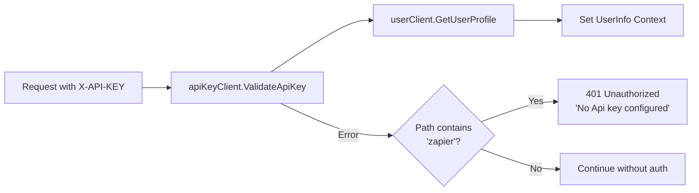

### External JWT Authentication

The `ExternalJWtMiddleware` supports company-specific JWT validation using slug-based routing:

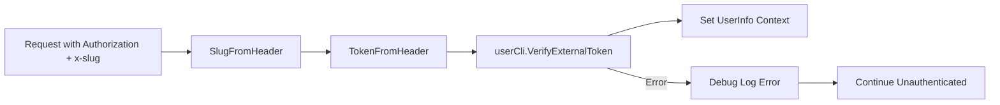

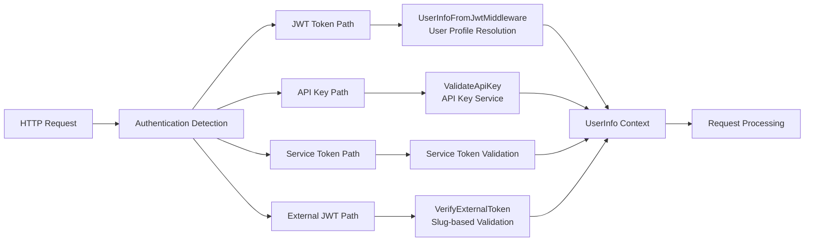

**Sources:** [router.go:140](), [router.go:558-608](), [router.go:610-647]()

## User Activity Tracking

The `TrackUserCompanyActivityLog` middleware implements sophisticated user activity tracking for analytics purposes. It records the last activity timestamp for each user-company pair to track engagement patterns.

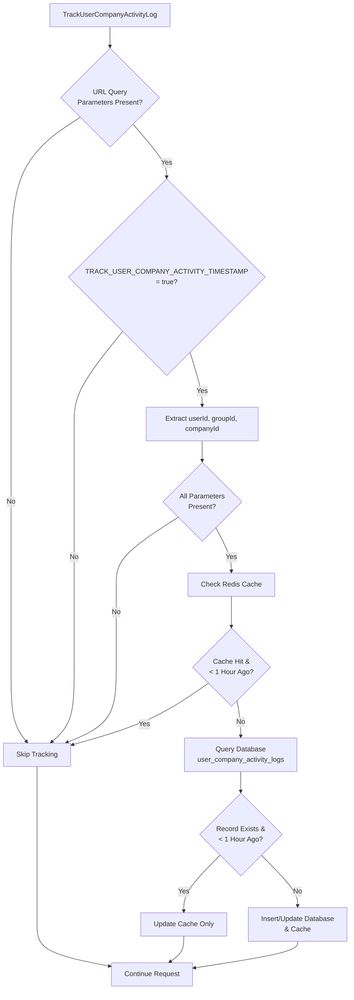

The middleware uses a two-tier caching strategy:
- **Redis Cache**: 90-minute expiry for frequently accessed records
- **Database**: Persistent storage with hourly granularity to prevent excessive writes

| Component | Configuration | Purpose |
|-----------|---------------|---------|
| Cache Key Format | `${userId}-${groupId}/${companyId}` | Unique user-company identifier |
| Cache Expiry | 90 minutes | Reduces database queries |
| Update Frequency | 1 hour minimum | Prevents excessive database writes |
| Table Schema | `user_company_activity_logs` | Persistent activity tracking |

**Sources:** [router.go:165-252]()

## gRPC Interceptor Chain

Alongside HTTP middleware, the service configures gRPC interceptors for internal service communication:

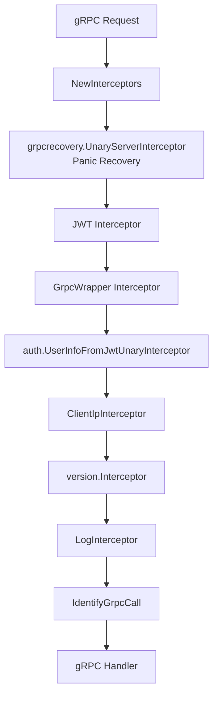

**Sources:** [router.go:388-406]()

## Domain Verification Endpoints

The system provides several domain verification endpoints for third-party service integrations, implemented through the `DomainVerification` fx module:

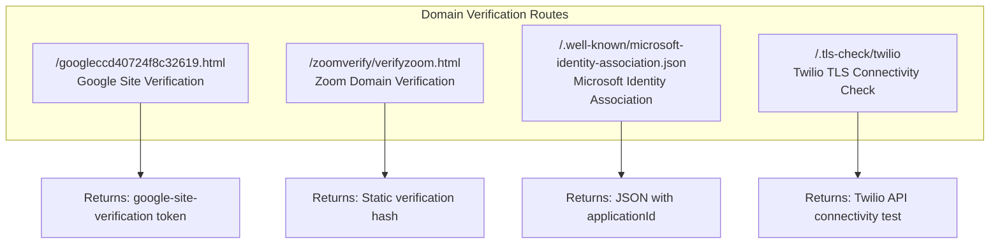

| Endpoint | Purpose | Response Type | Implementation |
|----------|---------|---------------|----------------|
| `/googleccd40724f8c32619.html` | Google Search Console verification | Plain text verification token | Static string response |
| `/zoomverify/verifyzoom.html` | Zoom app domain verification | Static hash: `06dd685d9c4449388a6f136fdd3118b7` | Static string response |
| `/.well-known/microsoft-identity-association.json` | Microsoft Azure AD verification | JSON with application ID `51928232-418d-46ad-b90f-dd1aa4eafbcf` | JSON response with Content-Type header |
| `/.tls-check/twilio` | Twilio webhook TLS verification | Twilio API connectivity test results | Live HTTP test to `api.twilio.com:8443` |

The Twilio TLS check endpoint performs a live connectivity test and returns detailed connection information including headers, content length, and response body.

**Sources:** [verify.go:14-64]()

## Request Processing Pipeline

The complete request processing pipeline shows how HTTP requests flow through the system:

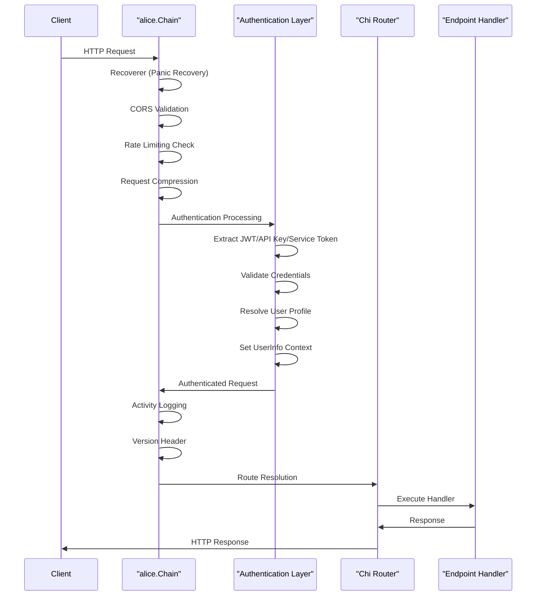

**Sources:** [router.go:100-163](), [router.go:165-252]()

## Rate Limiting Implementation

The rate limiting system uses token bucket algorithm with per-user and per-IP limits, implemented through the `RateLimiterConfig` struct:

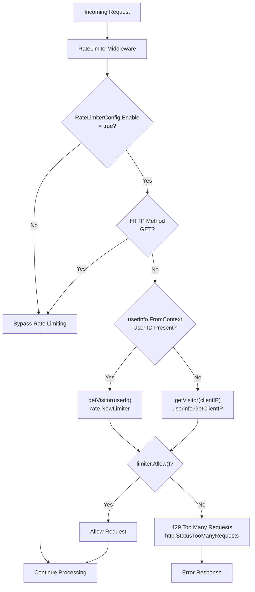

The rate limiter maintains a global `visitors` map with background cleanup via the `cleanupVisitors` goroutine:

| Component | Configuration | Default Value | Implementation |
|-----------|---------------|---------------|----------------|
| Rate Limit | Requests per second | 10 | `rate.Limit(config.Rate)` |
| Burst Limit | Maximum burst requests | 20 | `rate.NewLimiter` burst parameter |
| Cleanup Interval | Visitor map cleanup | 1 minute | Background goroutine with `time.Sleep` |
| Visitor Expiry | Inactive visitor removal | 3 minutes | `time.Since(v.lastSeen)` check |
| Visitor Storage | In-memory map | `map[string]*visitor` | Protected by `sync.Mutex` |

**Sources:** [rate-limiter.go:12-134](), [router.go:132]()

## CORS Configuration

Cross-Origin Resource Sharing (CORS) is configured with dynamic origin validation:

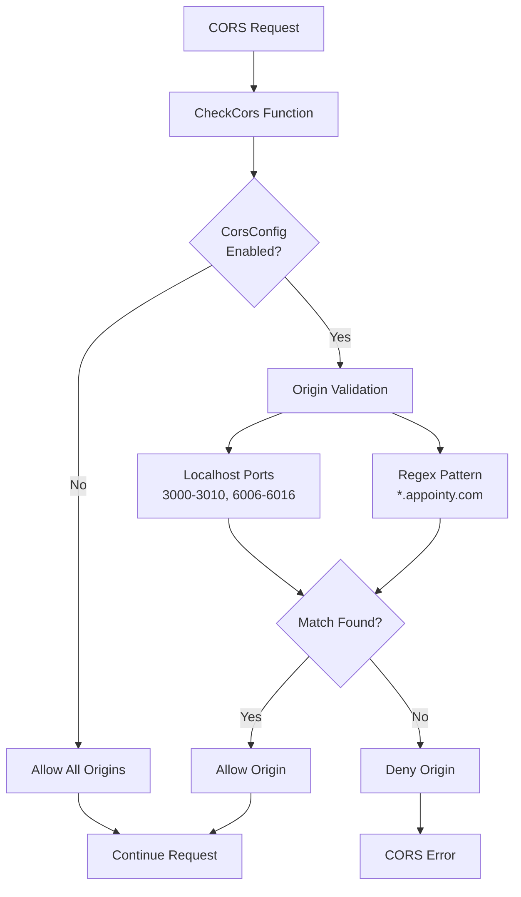

**Sources:** [router.go:124-131](), [router.go:254-301]()

## Authentication Enforcement

The `EnforceAuthenticationCheckMiddleware` provides selective authentication requirements:

```mermaid
graph TD
    AUTH_ENFORCE["EnforceAuthenticationCheckMiddleware"] --> ENV_CHECK{"ENFORCE_AUTHENTICATION_CHECK<br/>= true?"}
    
    ENV_CHECK -->|No| ALLOW_REQUEST["Allow Request"]
    ENV_CHECK -->|Yes| PATH_CHECK["Check URL Path"]
    
    PATH_CHECK --> PREFIX_CHECK{"Path starts with<br/>/api or /graphql?"}
    PREFIX_CHECK -->|No| ALLOW_REQUEST
    PREFIX_CHECK -->|Yes| CODE_CHECK{"Valid UUID code<br/>in query params?"}
    
    CODE_CHECK -->|Yes| ALLOW_REQUEST
    CODE_CHECK -->|No| USER_CHECK{"User ID present<br/>in context?"}
    
    USER_CHECK -->|Yes| ALLOW_REQUEST
    USER_CHECK -->|No| REJECT_UNAUTH["401 Unauthorized<br/>{\"error\": \"unauthenticated\"}"]
    
    style REJECT_UNAUTH fill:#ffebee
    style ALLOW_REQUEST fill:#e8f5e8
```

**Sources:** [router.go:303-342]()