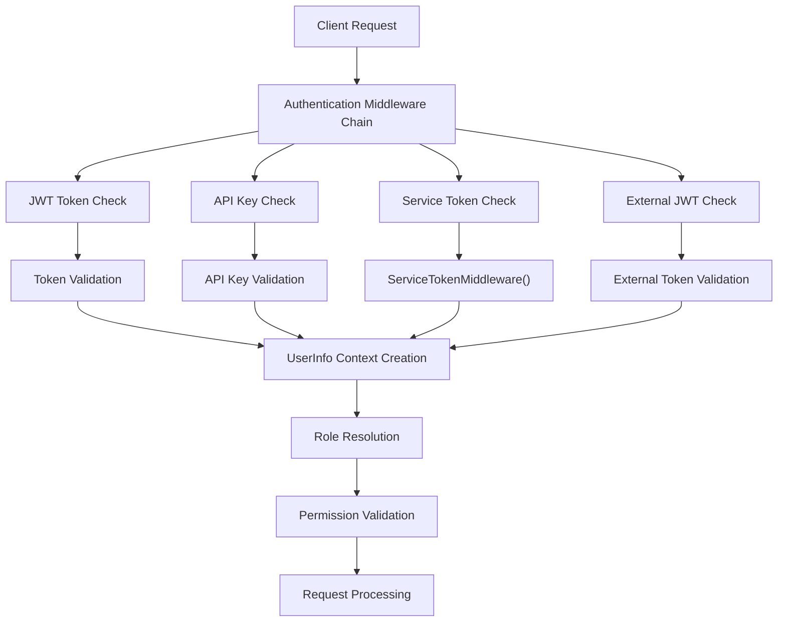
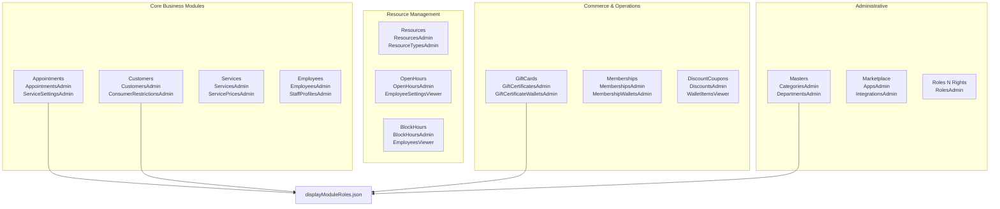
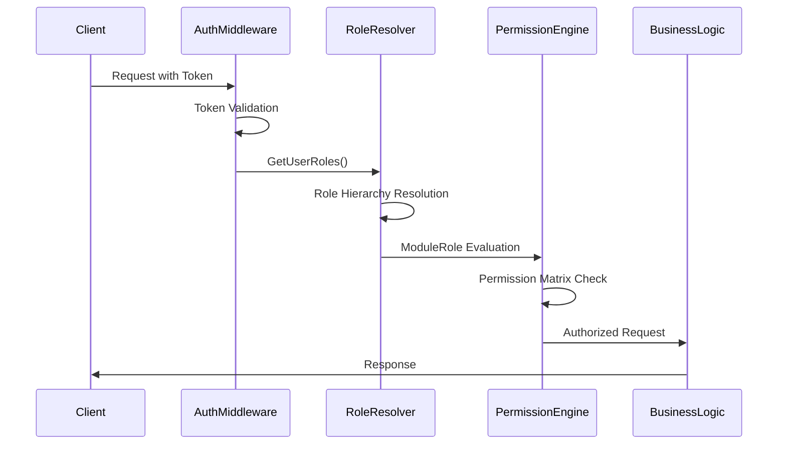

# Security & Access Control

<details>
<summary>Relevant source files</summary>

The following files were used as context for generating this wiki page:

- [Dockerfile](Dockerfile)
- [displayModuleRoles.json](displayModuleRoles.json)
- [go.sum](go.sum)
- [service_token.go](service_token.go)

</details>


This document covers the comprehensive security architecture of the waqt-deployment system, including authentication mechanisms, role-based access control (RBAC), and authorization workflows. The system implements a multi-layered security model with support for JWT tokens, API keys, service tokens, and hierarchical role management.

For information about the authentication middleware implementation details, see [Authentication Middleware](#5.2). For role-based access control specifics, see [Role-Based Access Control](#5.1).

## Authentication Architecture

The system supports multiple authentication mechanisms through a layered middleware approach, providing flexibility for different client types and integration scenarios.

### Authentication Flow



**Sources: [service_token.go:29-93](), [go.sum:194-195]()**

### Service Token Authentication

The `ServiceTokenMiddleWareConfig` provides secure service-to-service authentication with token lifecycle management through the `ServiceTokenMiddleware` method.

#### Service Token Validation Flow

```mermaid
graph LR
    REQUEST["HTTP Request"] --> HEADER_EXTRACT["r.Header.Get(ServiceTokenHeader)"]
    HEADER_EXTRACT --> TOKEN_LOOKUP["serTokClient.GetServiceTokenByTokenValue()"]
    TOKEN_LOOKUP --> ACTIVE_CHECK["serTok.IsActive Validation"]
    ACTIVE_CHECK --> EXPIRY_CHECK["ptypes.TimestampNow() vs serTok.Expiry"]
    EXPIRY_CHECK --> UPDATE_USAGE["serTokClient.UpdateLastUsedOn()"]
    UPDATE_USAGE --> USER_INFO["userinfo.UserInfo Creation"]
    USER_INFO --> CONTEXT_INJECTION["userinfo.NewContext()"]
```



The `ServiceTokenMiddleware` function implements comprehensive token validation:

| Validation Step | Implementation | Error Response |
|----------------|----------------|----------------|
| Header Presence | `r.Header.Get(ServiceTokenHeader)` | Continue to next middleware |
| Token Lookup | `serTokClient.GetServiceTokenByTokenValue()` | HTTP 401 Unauthorized |
| Active Status | `serTok.IsActive` check | HTTP 412 Precondition Failed |
| Expiration | `ptypes.TimestampNow().Seconds > expireSec` | HTTP 412 Precondition Failed |
| Usage Tracking | `serTokClient.UpdateLastUsedOn()` | HTTP 412 Precondition Failed |

The validated token creates a `userinfo.UserInfo` struct with `IsServiceToken: true` and injects it into the request context via `userinfo.NewContext()`.

**Sources: [service_token.go:15-93]()**

## Role Hierarchy System

The system implements a hierarchical role-based access control model with multiple organizational levels and priority-based inheritance.

### Display Module Roles Structure

The system defines hierarchical access control through `displayModuleRoles.json`, with each role containing specific module permissions and organizational scope.

#### Role Hierarchy and Module Assignment

```mermaid
graph TD
    FULL_APPOINTMENTS[dmr_01E9ZEDJ3WCX34NXRK03YZVJQW<br/>"Full access to appointments"<br/>Priority: 1] --> APPOINTMENTS_VIEW[dmr_01FS6J2FZGT5WDQ7DYFD8HBK4G<br/>"Full access + view settings"<br/>Priority: 2]
    
    APPOINTMENTS_VIEW --> APPOINTMENTS_READONLY[dmr_01F6HDMT4P2VXWC0W08E69SWJY<br/>"View access to appointments"<br/>Priority: 3]
    
    FULL_CUSTOMERS[dmr_01E9ZEDJ3XCFY07KCCAD9GD8TY<br/>"Full access to customers"<br/>Priority: 1] --> EDIT_CUSTOMERS[dmr_01E9ZEDJ3XCFY07KCCAD9GDTTT<br/>"Can edit customers"<br/>Priority: 2]
    
    EDIT_CUSTOMERS --> VIEW_CUSTOMER_STATS[dmr_01E9ZEDJ3XQESG12PPVM7BBBBP<br/>"Can view customer stats"<br/>Priority: 3]
    
    subgraph "Level Scoping"
        ALL_LEVEL["Level: all"]
        COM_LEVEL["Level: com"] 
        LOC_LEVEL["Level: loc"]
        EMP_LEVEL["Level: emp"]
        USR_LEVEL["Level: usr"]
    end
    
    FULL_APPOINTMENTS -.-> ALL_LEVEL
    FULL_CUSTOMERS -.-> ALL_LEVEL
```

#### Module Role Structure

Each role in `displayModuleRoles.json` follows this schema:

```json
{
  "Id": "dmr_01E9ZEDJ3WCX34NXRK03YZVJQW",
  "App_name": "Appointments", 
  "Name": "Full access to appointments",
  "Module_roles": ["AppointmentsAdmin", "ServiceSettingsAdmin", ...],
  "Priority": 1,
  "Level": "all",
  "Parent": ""
}
```

**Sources: [displayModuleRoles.json:1-35](), [Dockerfile:20]()**

### Module Role Configuration

The system defines granular permissions through `Module_roles` arrays within each display module role. These roles map to specific business capabilities across the application.

#### Core Module Roles by Application Area

| Application | Example Module Roles | Scope Level |
|-------------|---------------------|-------------|
| **Appointments** | `AppointmentsAdmin`, `AppointmentsAdminSettingsSkip`, `ServiceSettingsAdmin` | `all` |
| **Customers** | `CustomersAdmin`, `CustomerSettingsRestrictionAdmin`, `ConsumerRestrictionsAdmin` | `all` |
| **Resources** | `ResourcesAdmin`, `ResourceTypesAdmin`, `ResourceTypeSettingsAdmin` | `com` |
| **Services** | `ServicesAdmin`, `ServicePricesAdmin`, `ServiceSettingsAdmin` | `all` |
| **Employees** | `EmployeesAdmin`, `EmployeeSettingsAdmin`, `StaffProfilesAdmin` | `all` |
| **Reviews** | `ReviewsAdmin`, `ReviewSettingsAdmin`, `ReplyServiceAdmin` | `com`/`loc` |

#### Permission Hierarchy Examples

The `displayModuleRoles.json` implements inheritance through the `Parent` field:

- `dmr_01E9ZEDJ3WCX34NXRK03YZVJQW` (Full appointments access) → 
- `dmr_01FS6J2FZGT5WDQ7DYFD8HBK4G` (Full + view settings) →
- `dmr_01F6HDMT4P2VXWC0W08E69SWJY` (View only)

Each child role inherits reduced permissions while maintaining the same organizational scope.

**Sources: [displayModuleRoles.json:7-31](), [displayModuleRoles.json:67-68](), [displayModuleRoles.json:98-100]()**

## Module-Based Permissions

The system implements fine-grained access control through module-specific roles that map to business functions.

### Application Module Ecosystem

The `displayModuleRoles.json` defines 20+ application modules with specific role hierarchies and permission sets.

#### Application Modules and Key Roles



Each module defines role hierarchies with Parent-Child relationships and priority-based inheritance.

**Sources: [displayModuleRoles.json:1-50](), [displayModuleRoles.json:937-990](), [displayModuleRoles.json:1073-1137]()**

### Permission Inheritance Model

The `displayModuleRoles.json` implements a priority-based inheritance system where lower priority numbers indicate higher authority levels.

#### Inheritance Pattern Examples

**Appointments Module Hierarchy:**
- Priority 1: `dmr_01E9ZEDJ3WCX34NXRK03YZVJQW` (Full access) → 30 module roles
- Priority 2: `dmr_01FS6J2FZGT5WDQ7DYFD8HBK4G` (Full + view settings) → 25 module roles  
- Priority 3: `dmr_01F6HDMT4P2VXWC0W08E69SWJY` (View only) → 17 module roles

**Role Naming Conventions:**
- **`*Admin` roles**: Full CRUD + settings management (e.g., `AppointmentsAdmin`, `CustomersAdmin`)
- **`*Editor` roles**: Create/Read/Update operations (e.g., `ServicesEditor`, `CustomersNotesEditor`)
- **`*Viewer` roles**: Read-only access (e.g., `ServicesViewer`, `AppointmentsViewer`)
- **`*Settings*` roles**: Configuration management (e.g., `ServiceSettingsAdmin`, `EmployeeSettingsViewer`)

The `Parent` field in each role definition establishes inheritance chains, automatically granting all permissions from parent roles.

**Sources: [displayModuleRoles.json:32-34](), [displayModuleRoles.json:66-68](), [displayModuleRoles.json:98-100]()**

## Authorization Validation Process

The system validates permissions through a multi-step authorization process that considers role hierarchy, module permissions, and organizational scope.

### Permission Resolution Flow



### Role Priority System

The `displayModuleRoles.json` uses numerical priorities to establish authority levels and inheritance chains within each application module.

#### Priority Distribution Analysis

| Priority Level | Authority | Example Roles | Module Count |
|---------------|-----------|---------------|--------------|
| **Priority 1** | Maximum Access | Full access roles (Admin) | All modules |
| **Priority 2** | High Access | Editor roles with settings | Most modules |
| **Priority 3** | Medium Access | Viewer roles with limited editing | Most modules |
| **Priority 4-7** | Specialized Access | Specific function roles | Selected modules |

#### Priority Examples by Module

**Services Module Priorities:**
- Priority 1: `dmr_01E9ZEDJ3XQESG12PPVJ8X4YFR` → 19 module roles (Full access)
- Priority 2: `dmr_01E9ZEDJ3XQESG12PPVJAVTS77` → 15 module roles (Can create)
- Priority 3: `dmr_01E9ZEDJ3XCFY07KCCABXXXMVG` → 11 module roles (Can view)

**Employees Module Priorities:**
- Priority 1: `dmr_01E9ZEDJ3XCFY07KCCADJ9VTJ2` → 14 module roles (Full access)
- Priority 4: `dmr_01FTDYBGFXDR10EGEX7PH53XK9` → 1 module role (`RolesAssignee`)

Lower priority numbers indicate broader permissions and higher organizational authority.

**Sources: [displayModuleRoles.json:32-34](), [displayModuleRoles.json:340-342](), [displayModuleRoles.json:715-717](), [displayModuleRoles.json:773-775]()**

## Security Configuration Files

The system deploys multiple JSON configuration files that define the complete security model and role assignments.

### Configuration File Structure

The `Dockerfile` copies security configuration files into the application container:

```dockerfile
COPY module_parents.json /app/module_parents.json
COPY displayModuleRoles.json /app/displayModuleRoles.json  
COPY moduleRoleLevels.json /app/moduleRoleLevels.json
COPY roles/override_roles.json /app/roles/override_roles.json
```

### Key Configuration Files

| File | Purpose | Structure |
|------|---------|-----------|
| `displayModuleRoles.json` | Complete role hierarchy and permissions | Array of role objects with `Id`, `Module_roles`, `Priority`, `Level` |
| `module_parents.json` | Module parent relationships | Hierarchical module structure |
| `moduleRoleLevels.json` | Organizational level mappings | Role scope definitions (`all`, `com`, `loc`, etc.) |
| `roles/override_roles.json` | Environment-specific overrides | Custom role modifications |

These files are loaded at runtime to construct the complete permission matrix and role inheritance system.

**Sources: [Dockerfile:19-22]()**

## Module Role Definitions

The system maintains comprehensive module role definitions that map business functions to specific permissions across the application ecosystem.

### Display Module Roles Structure

The `displayModuleRoles.json` defines the complete permission matrix with the following key fields:

- **Id**: Unique module role identifier (e.g., `dmr_01E9ZEDJ3WCX34NXRK03YZVJQW`)
- **App_name**: Business module name (Appointments, Customers, etc.)
- **Module_roles**: Array of specific permission roles
- **Priority**: Hierarchy level for inheritance
- **Level**: Organizational scope (`all`, `com`, `loc`, `grp`)
- **Parent**: Inheritance relationship

This structure enables granular permission control while maintaining clear hierarchical relationships between roles and modules.

**Sources: [displayModuleRoles.json:1-100](), [Dockerfile:19-22]()**