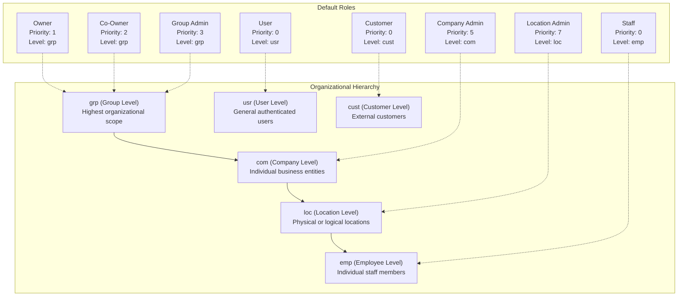
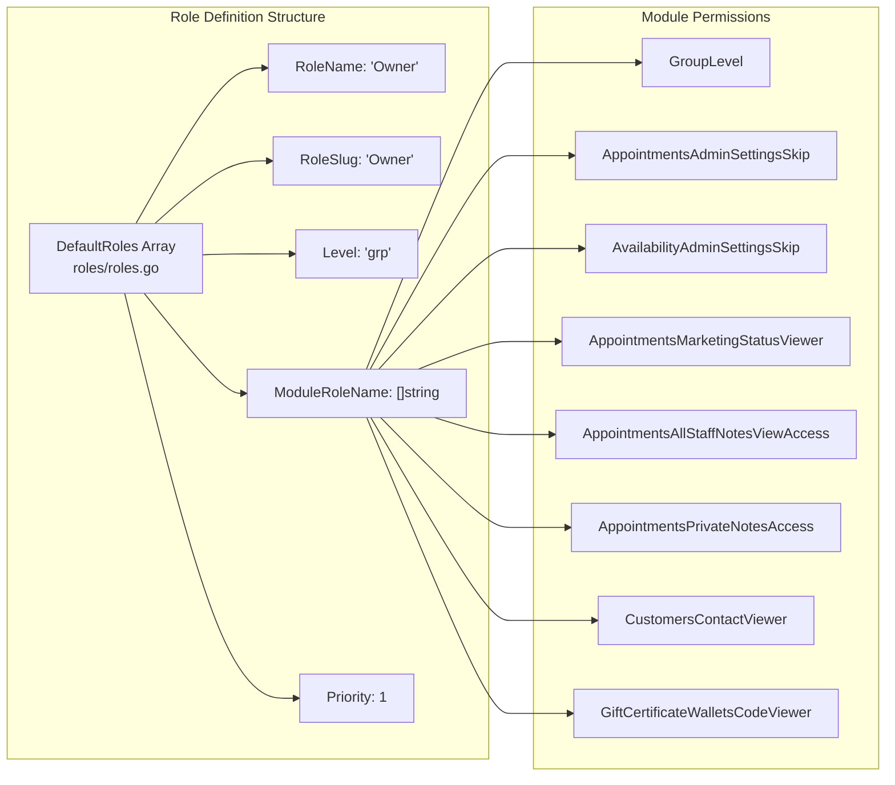
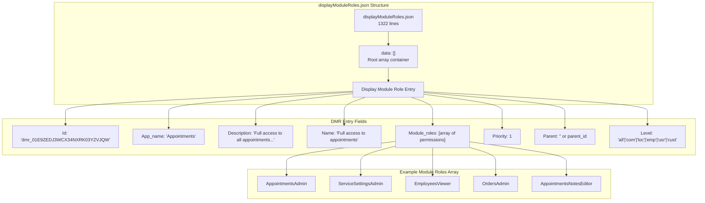
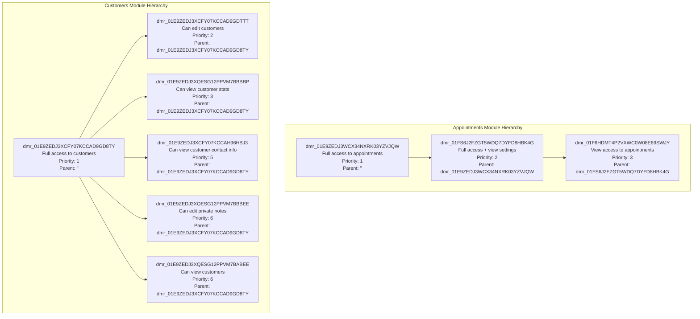
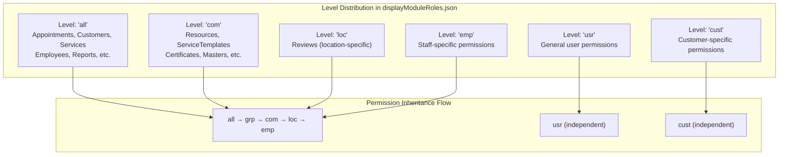
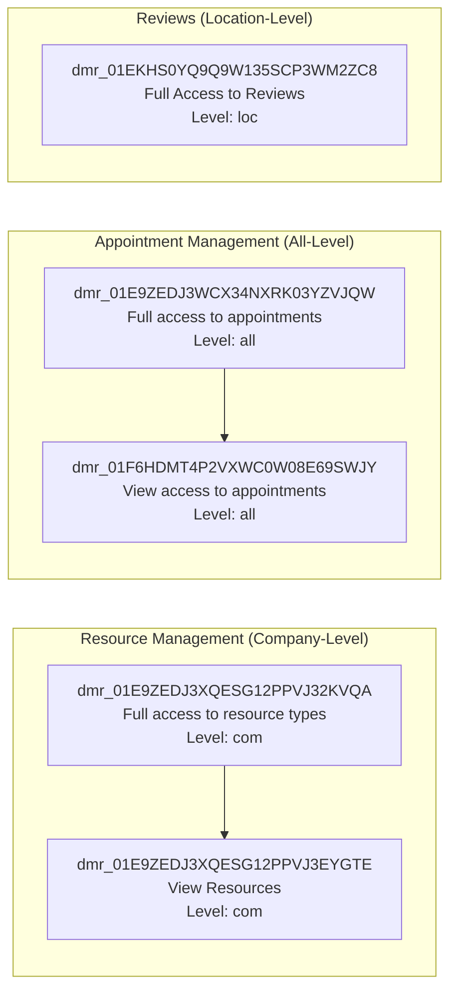
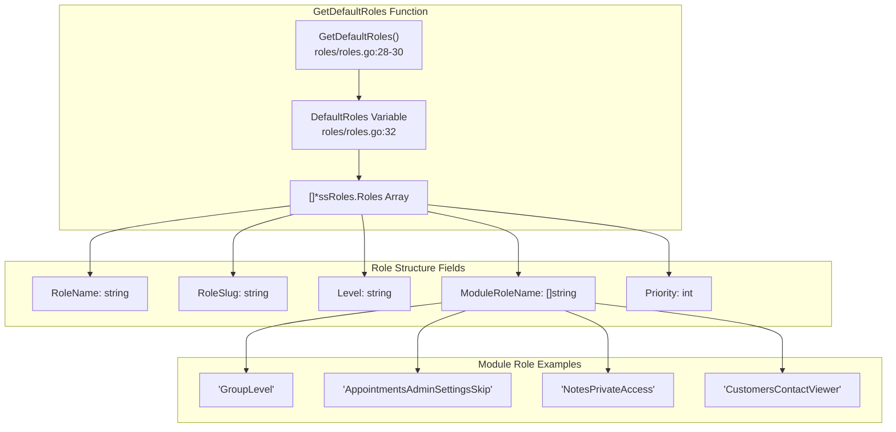
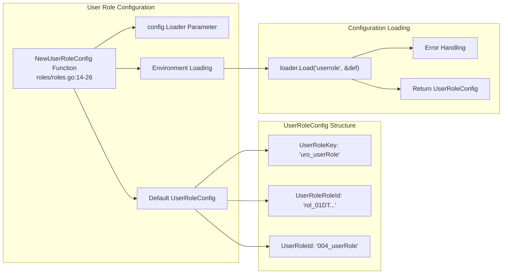

# Role-Based Access Control

Relevant source files

The following files were used as context for generating this wiki page:

- [Dockerfile](Dockerfile)
- [displayModuleRoles.json](displayModuleRoles.json)
- [roles/go.mod](roles/go.mod)
- [roles/roles.go](roles/roles.go)

This document describes the hierarchical role-based access control (RBAC) system that governs user permissions throughout the Waqt deployment system. The system provides fine-grained access control through a combination of default organizational roles and granular module-specific permissions.

For information about the authentication middleware that enforces these permissions, see [Authentication Middleware](#5.2). For details about the broader security architecture, see [Security & Access Control](#5).

## Role Hierarchy System

The RBAC system operates on a multi-level organizational hierarchy with roles scoped to different organizational levels. The system supports inheritance where higher-level roles automatically include permissions from lower levels.

**Sources:** [roles/roles.go:32-216](), [module_parents.json:1-471]()

## Module Role Architecture

The system implements a comprehensive module role system where specific permissions are granted through `ModuleRoleName` arrays. Each role contains multiple module-specific permissions that control access to different functional areas.

**Sources:** [roles/roles.go:32-49]()

## Display Module Roles Configuration

The `displayModuleRoles.json` file defines a comprehensive permission matrix with 25 application modules and hierarchical role relationships. Each display module role aggregates multiple fine-grained module permissions and supports inheritance through parent-child relationships.

### Application Module Overview

| Application | Top-Level Role | Priority | Level | Module Roles Count |
|-------------|---------------|----------|-------|-------------------|
| Appointments | Full access to appointments | 1 | all | 30 |
| Customers | Full access to customers | 1 | all | 12 |
| OpenHours | Complete access to open hours | 1 | all | 4 |
| BlockHours | Complete access to block hours | 1 | all | 3 |
| Resources | Full access to resource types | 1 | com | 5 |
| Services | Full access to services | 1 | all | 20 |
| ServiceTemplates | Full access to service templates | 1 | com | 3 |
| Certificates | Certificates Admin | 1 | com | 1 |
| Marketplace | Apps Full access | 1 | all | 5 |
| Masters | Full access to masters | 1 | all | 6 |
| Employees | Full access to employees | 1 | all | 15 |
| Companies | Viewer access to companies | 1 | com | 1 |
| Roles N Rights | Full access to roles | 1 | com | 1 |
| Reviews | Full Access to Reviews | 1 | com | 4 |
| Billing | Full access to billing | 1 | com | 5 |
| Reports | Full access to all reports | 1 | all | 5 |
| DiscountCoupons | Full access to discount coupons | 1 | all | 8 |
| GiftCards | Full access to gift cards | 1 | all | 7 |
| Memberships | Full access to memberships | 1 | all | 6 |
| Locations | Full access to location | 1 | all | 6 |
| NotificationsApp | Complete access to notification templates | 1 | all | 6 |
| LinkSharing | Full access to link sharing app | 1 | all | 5 |
| Meetings | Full access to meetings calendar | 1 | com | 19 |
| Sitback | Full access to customer staff linking | 1 | all | 2 |
| Tier Allocation | Full access to Tier Allocation | 1 | all | 2 |

### Display Module Role Data Structure

### Hierarchical Role Relationships

The system supports multi-level inheritance where child roles inherit permissions from parents while adding specific restrictions or modifications.

**Sources:** [displayModuleRoles.json:1-1322](), [Dockerfile:20]()

## Permission Levels and Access Scopes

The RBAC system defines access control through level-based scoping where each role and module permission is constrained to specific organizational levels. The system supports six primary access levels with implicit inheritance.

### Access Level Definitions

| Level | Scope | Description |
|-------|-------|-------------|
| `all` | Universal | Access across all organizational levels |
| `grp` | Group | Highest organizational scope, multi-company access |
| `com` | Company | Individual business entity scope |
| `loc` | Location | Physical or logical location scope |
| `emp` | Employee | Individual staff member scope |
| `usr` | User | General authenticated user scope |
| `cust` | Customer | External customer scope |

### Module Level Distribution

### Module-Specific Level Examples

**Sources:** [displayModuleRoles.json:34](), [displayModuleRoles.json:100](), [displayModuleRoles.json:247](), [displayModuleRoles.json:832-840]()

## Default Role Definitions

The system provides a comprehensive set of default roles with specific module permissions. Each role is assigned a priority that determines precedence in permission resolution, with lower numbers indicating higher priority.

### Administrative Roles

| Role Name | Level | Priority | Key Module Roles |
|-----------|-------|----------|------------------|
| Owner | grp | 1 | GroupLevel, AppointmentsAdminSettingsSkip, CustomersContactViewer |
| Co-Owner | grp | 2 | GroupLevel, AppointmentsAdminSettingsSkip, CustomersContactViewer |
| Group Admin | grp | 3 | GroupLevel, AppointmentsAdminSettingsSkip, CustomersContactViewer |
| Company Admin | com | 5 | CompanyLevel, AppointmentsAdminSettingsSkip, CustomersContactViewer |
| Location Admin | loc | 7 | LocationLevel, AppointmentsAdminSettingsSkip, CustomersContactViewer |

### Operational Roles

| Role Name | Level | Priority | Key Module Roles |
|-----------|-------|----------|------------------|
| Staff | emp | 0 | ServiceProviderLevel, AppointmentsReportViewer, NotesPrivateAccess |
| User | usr | 0 | UserLevel |
| Customer | cust | 0 | CustomerLevel |

**Sources:** [roles/roles.go:28-30](), [roles/roles.go:32-216]()

## User Role Configuration

The system includes a configurable user role system that can be customized through environment configuration. This allows for flexible role assignment and management across different deployment environments.

**Sources:** [roles/roles.go:14-26]()

## Integration with Authentication System

The role-based access control system integrates with the broader authentication architecture through dependency injection and module configuration. The system is designed to work seamlessly with JWT tokens, service tokens, and API key authentication methods.

The roles module exports its configuration through the `Module` variable, which uses Uber FX dependency injection to provide `GetDefaultRoles` and `NewUserRoleConfig` functions to the rest of the application.

**Sources:** [roles/roles.go:9-12](), [roles/go.mod:1-14]()