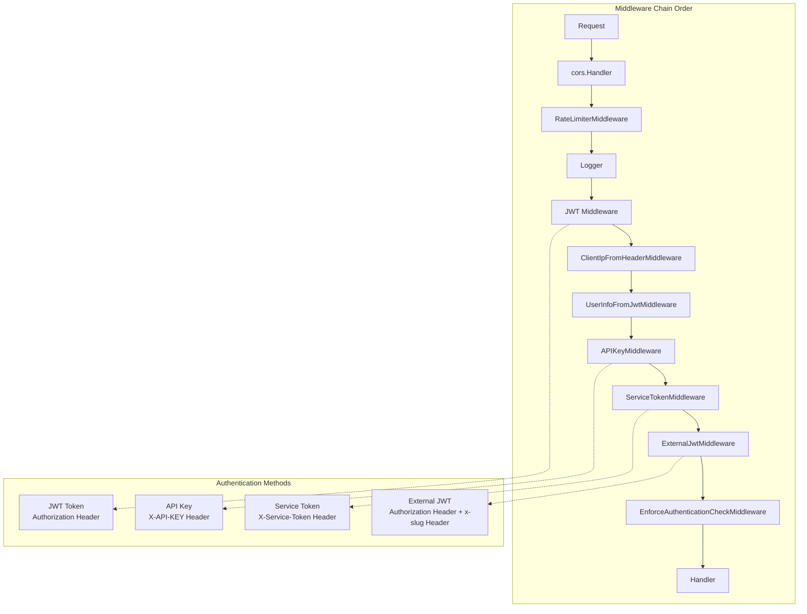
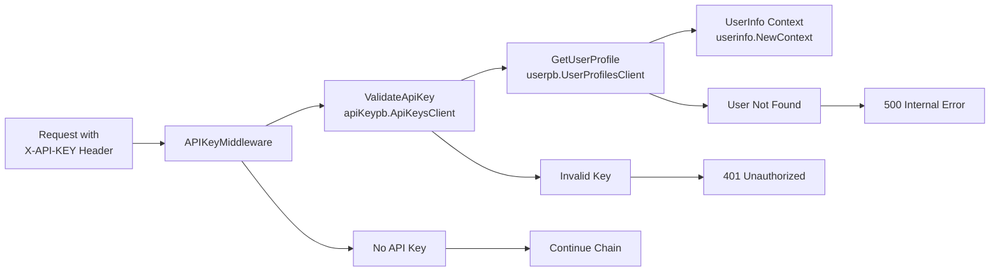
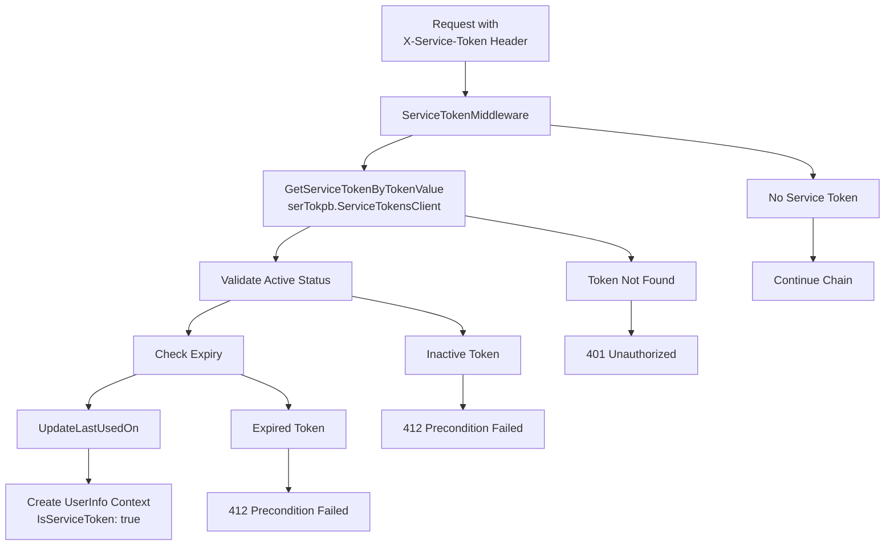
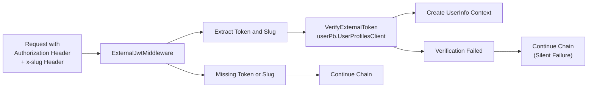
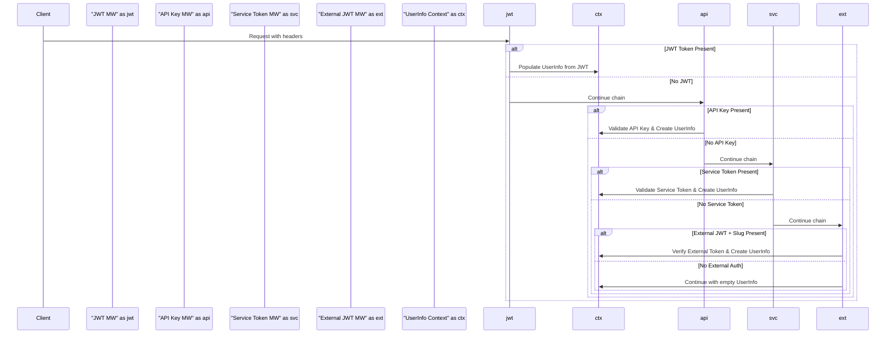

# Authentication Middleware

<details>
<summary>Relevant source files</summary>

The following files were used as context for generating this wiki page:

- [go.sum](go.sum)
- [rate-limiter.go](rate-limiter.go)
- [redis/redis.go](redis/redis.go)
- [router.go](router.go)
- [service_token.go](service_token.go)

</details>


This document covers the authentication middleware components within the waqt-deployment service that validate and process various forms of authentication credentials including JWT tokens, API keys, service tokens, and external tokens. For information about the role-based access control system that operates after authentication, see [Role-Based Access Control](#5.1). For details about module hierarchy and access rights enforcement, see [Module Hierarchy & Rights](#5.3).

## Overview

The authentication middleware system operates as a chain of HTTP middleware handlers that validate different authentication mechanisms and populate the request context with user information. The service supports four primary authentication methods: JWT tokens, API keys, service tokens, and external JWT tokens with company slug validation.



**Sources:** [router.go:120-148]()

## Authentication Middleware Components

### JWT Middleware Chain

The JWT authentication flow involves two middleware components that work together:

| Component | Purpose | Implementation |
|-----------|---------|----------------|
| `JWT Middleware` | Token validation and parsing | External dependency |
| `UserInfoFromJwtMiddleware` | User profile retrieval and context population | `auth.UserInfoFromJwtMiddleware` |

The JWT middleware validates tokens from the `Authorization` header and the subsequent `UserInfoFromJwtMiddleware` fetches complete user profile information from the user service.

**Sources:** [router.go:136](), [router.go:140]()

### API Key Middleware

The `APIKeyMiddleware` validates API keys provided in the `X-API-KEY` header and converts them to user context information.



The middleware handles special routing for Zapier integrations, requiring API key authentication for paths containing "zapier".

**Sources:** [router.go:565-608](), [router.go:553-563]()

### Service Token Middleware

The `ServiceTokenMiddleware` validates service tokens from the `X-Service-Token` header, providing service-to-service authentication.



Service tokens include additional validation for active status and expiration, and they update the last used timestamp upon successful validation.

**Sources:** [service_token.go:29-93](), [service_token.go:15-27]()

### External JWT Middleware

The `NewExternalJWtMiddleware` handles external JWT tokens that require company slug validation, typically used for tenant-specific authentication.



This middleware silently continues the chain on authentication failure, allowing other authentication methods to be attempted.

**Sources:** [router.go:610-647](), [router.go:649-652]()

## Authentication Flow

The complete authentication flow processes multiple authentication mechanisms in sequence:



**Sources:** [router.go:120-148]()

## Authentication Enforcement

### EnforceAuthenticationCheckMiddleware

The `EnforceAuthenticationCheckMiddleware` provides optional strict authentication enforcement controlled by the `ENFORCE_AUTHENTICATION_CHECK` environment variable.

| Path Pattern | Enforcement | Special Cases |
|--------------|-------------|---------------|
| `/api/*` | Required when enabled | UUID code parameter bypasses |
| `/graphql` | Required when enabled | UUID code parameter bypasses |
| Other paths | Not enforced | Always allowed |

The middleware allows requests with valid UUID codes in query parameters to bypass authentication requirements.

**Sources:** [router.go:303-342](), [router.go:55-56]()

### Configuration

| Middleware | Configuration Source | Key Components |
|------------|---------------------|----------------|
| API Key | `ApiMiddleWareConfig` | `apiKeypb.ApiKeysClient`, `userpb.UserProfilesClient` |
| Service Token | `ServiceTokenMiddleWareConfig` | `serTokpb.ServiceTokensClient` |
| External JWT | Function parameters | `userPb.UserProfilesClient`, `*zap.Logger` |
| Enforcement | Environment variable | `ENFORCE_AUTHENTICATION_CHECK` |

**Sources:** [router.go:72-73](), [router.go:94-96](), [service_token.go:19-27]()

## Context Population

All authentication middleware components populate the request context using the `userinfo.UserInfo` structure:

```go
type UserInfo struct {
    Id             string
    Email          string  
    TokenExpiry    time.Time
    IsServiceToken bool
}
```

The context is created using `userinfo.NewContext(ctx, userInfo)` and can be retrieved in downstream handlers using `userinfo.FromContext(ctx)`.

**Sources:** [router.go:592-596](), [service_token.go:85-91](), [router.go:641-644]()