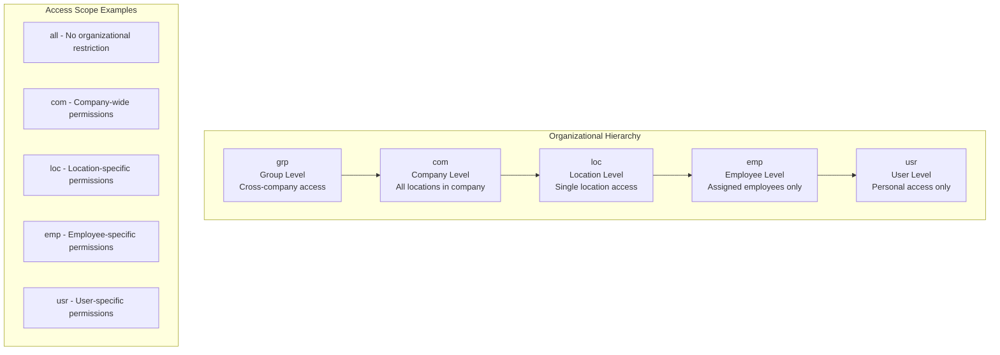
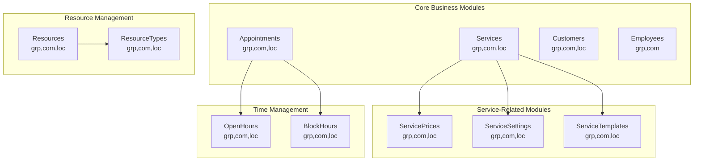
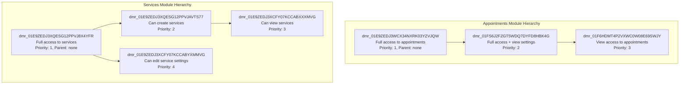
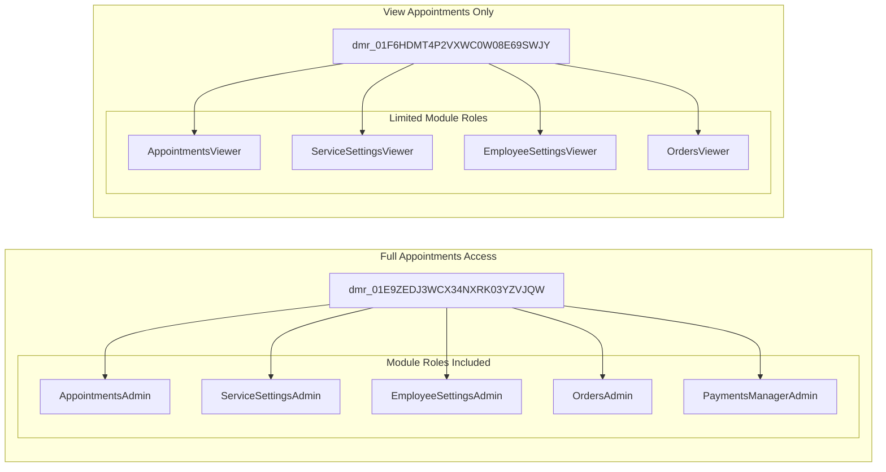
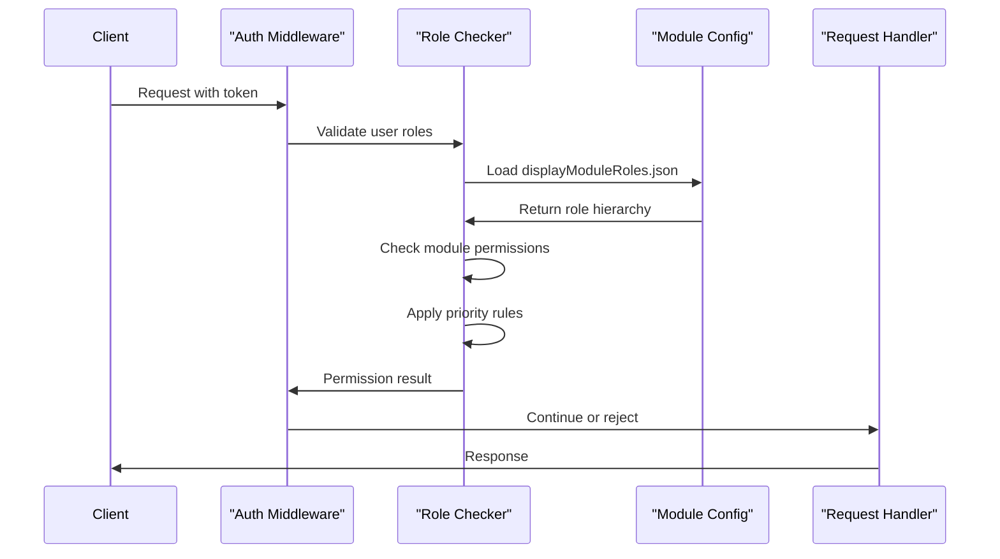

# Module Hierarchy & Rights

<details>
<summary>Relevant source files</summary>

The following files were used as context for generating this wiki page:

- [Dockerfile](Dockerfile)
- [displayModuleRoles.json](displayModuleRoles.json)
- [module_parents.json](module_parents.json)

</details>


This document covers the hierarchical role-based access control (RBAC) system that governs module access permissions throughout the waqt platform. The system defines parent-child relationships between modules, organizational access scopes, and role inheritance patterns to enforce fine-grained access control.

For authentication mechanisms and token validation, see [Authentication Middleware](#5.2). For general RBAC implementation details, see [Role-Based Access Control](#5.1).

## Purpose and Scope

The Module Hierarchy & Rights system establishes a multi-dimensional access control framework that operates across two primary hierarchies:

1. **Module Hierarchy**: Parent-child relationships between business modules (e.g., Services → Service Templates → Service Settings)
2. **Organizational Hierarchy**: Nested access scopes from group level down to individual users (grp → com → loc → emp → usr)

This system enables administrators to grant permissions that automatically cascade through hierarchical relationships while maintaining isolation between organizational boundaries.

## Organizational Access Levels

The system defines five distinct organizational access levels that determine the scope of a user's permissions:

### Access Level Hierarchy



**Sources:** [module_parents.json:1-471](), [displayModuleRoles.json:34](), [displayModuleRoles.json:124]()

### Access Level Definitions

| Level | Code | Scope | Example Use Case |
|-------|------|-------|------------------|
| All | `all` | No organizational restrictions | System-wide appointments access |
| Company | `com` | All locations within a company | Company-wide resource management |
| Location | `loc` | Single location only | Location-specific reviews |
| Employee | `emp` | Assigned employees only | Personal schedule management |
| User | `usr` | Individual user access | Personal profile settings |

## Module Parent Relationships

The system supports complex module hierarchies where business modules can inherit access patterns from their parents. This enables logical grouping of related functionality under broader access categories.

### Module Hierarchy Structure



**Sources:** [module_parents.json:2-470]()

### Parent-Child Configuration

The `module_parents.json` file defines which organizational levels each module supports:

```json
{
  "module_name": "Appointments",
  "parents": ["grp", "com", "loc"]
}
```

This configuration indicates that the Appointments module can be accessed at group, company, and location levels, but not at employee or user levels.

## Role Hierarchy and Inheritance

Display module roles establish a hierarchical permission structure where child roles inherit capabilities from their parents while potentially adding restrictions or specific access patterns.

### Role Inheritance Pattern



**Sources:** [displayModuleRoles.json:3-100](), [displayModuleRoles.json:316-434]()

### Role Priority System

The priority system determines role precedence when multiple roles apply to the same user:

- **Priority 1**: Full administrative access (root level)
- **Priority 2-3**: Operational access with specific restrictions
- **Priority 4+**: Specialized or view-only access

Lower priority numbers indicate higher precedence. When a user has multiple roles for the same module, the system applies the role with the lowest priority number.

## Module Role Composition

Each display module role contains specific module roles that grant granular permissions across different system components.

### Role Composition Examples



**Sources:** [displayModuleRoles.json:8-31](), [displayModuleRoles.json:75-96]()

## Configuration File Structure

The system relies on two primary configuration files that define the module hierarchy and role relationships:

### displayModuleRoles.json Structure

```json
{
  "Id": "dmr_01E9ZEDJ3WCX34NXRK03YZVJQW",
  "App_name": "Appointments",
  "Description": "Full access to all appointments, appointment's settings and appointment custom status.",
  "Name": "Full access to appointments",
  "Module_roles": [
    "AppointmentsAdmin",
    "ServiceSettingsAdmin",
    "EmployeeSettingsAdmin"
  ],
  "Priority": 1,
  "Parent": "",
  "Level": "all"
}
```

### Key Configuration Fields

| Field | Purpose | Example |
|-------|---------|---------|
| `Id` | Unique identifier for the display module role | `dmr_01E9ZEDJ3WCX34NXRK03YZVJQW` |
| `App_name` | Business module name | `Appointments` |
| `Module_roles` | Array of specific permission roles | `["AppointmentsAdmin", "ServicesViewer"]` |
| `Parent` | Parent role ID for inheritance | `dmr_01E9ZEDJ3WCX34NXRK03YZVJQW` |
| `Level` | Organizational access scope | `all`, `com`, `loc`, `emp`, `usr` |
| `Priority` | Precedence order (lower = higher precedence) | `1`, `2`, `3` |

**Sources:** [displayModuleRoles.json:3-35](), [Dockerfile:20]()

### module_parents.json Structure

This file defines which organizational levels each module supports:

```json
{
  "parents": [
    {
      "module_name": "Appointments",
      "parents": ["grp", "com", "loc"]
    }
  ]
}
```

**Sources:** [module_parents.json:1-471](), [Dockerfile:19]()

## Integration with Authorization System

The module hierarchy integrates with the broader authorization middleware to enforce access control during request processing.

### Authorization Flow Integration



**Sources:** [displayModuleRoles.json:1-1323](), [module_parents.json:1-471]()

The system loads these configuration files at runtime to build the complete permission matrix that governs all module access decisions throughout the platform.