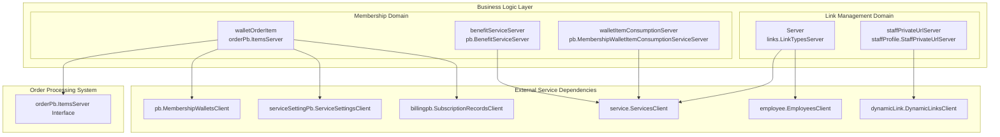
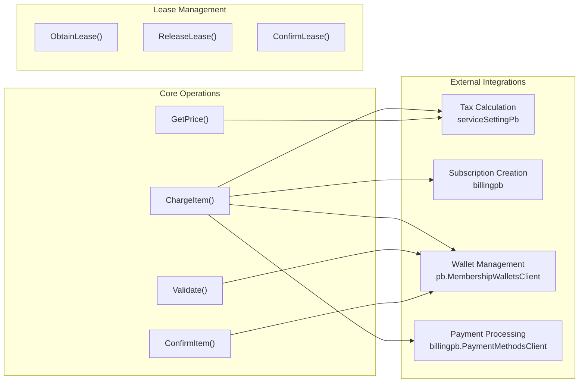
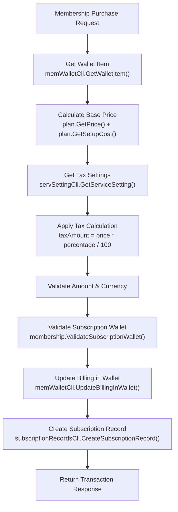
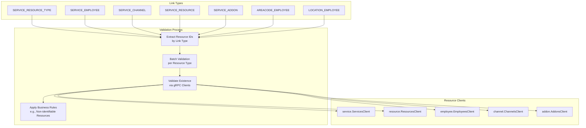
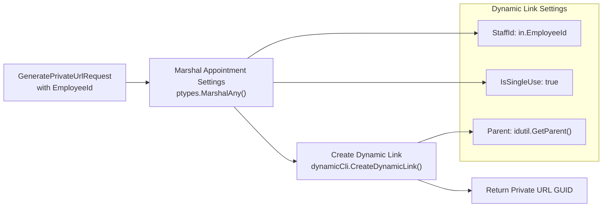
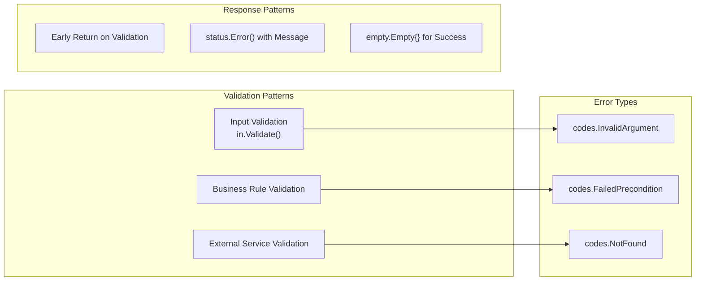

# Business Logic

Relevant source files

The following files were used as context for generating this wiki page:

- [discount-items/consumable_item.go](discount-items/consumable_item.go)
- [discount-items/fx.go](discount-items/fx.go)
- [discount-items/items.go](discount-items/items.go)
- [links/fx.go](links/fx.go)
- [links/go.mod](links/go.mod)
- [links/link_types.go](links/link_types.go)
- [links/staff_private_url.go](links/staff_private_url.go)
- [membership-items/wallet_order_items.go](membership-items/wallet_order_items.go)

This document covers the core business logic implementations within the Waqt deployment system. The business logic layer contains domain-specific operations for membership management, entity relationship validation, and staff workflow automation. These components handle complex business rules, payment processing, subscription management, and inter-service relationship validation.

For authentication and authorization logic, see [Authentication & Authorization](#2.3). For API layer implementation details, see [API Layer](#4).

## Core Business Domains

The business logic is organized into two primary domains that handle distinct business concerns:

| Domain | Purpose | Primary Services |
|--------|---------|------------------|
| **Membership Items** | E-commerce operations for membership purchases, subscription billing, and wallet management | `WalletOrderItemResult`, `BenefitServiceServer`, `MembershipWalletItemConsumptionServiceServer` |
| **Link Management** | Entity relationship validation and staff workflow automation | `LinkTypesServer`, `StaffPrivateUrlServer` |

### Business Domain Architecture

**Sources:** [membership-items/wallet_order_items.go:26-42](), [membership-items/items.go:19-21](), [links/link_types.go:58-69](), [links/staff_private_url.go:12-14]()

## Membership System Business Logic

The membership system handles complex e-commerce operations including subscription billing, tax calculations, payment gateway integration, and lease management for shopping cart operations.

### Wallet Order Item Implementation

The `walletOrderItem` struct serves as the primary business logic handler for membership purchases and subscription management:

**Sources:** [membership-items/wallet_order_items.go:68-168](), [membership-items/wallet_order_items.go:170-257](), [membership-items/wallet_order_items.go:407-435]()

### Subscription and Billing Workflow

The membership system implements sophisticated subscription billing logic with tax calculation and payment gateway integration:

**Sources:** [membership-items/wallet_order_items.go:68-168](), [membership-items/wallet_order_items.go:78-94](), [membership-items/wallet_order_items.go:141-167]()

### Benefit and Consumption Validation

The system validates membership benefits and consumption patterns through service-based validation:

| Operation | Purpose | Implementation |
|-----------|---------|----------------|
| **Benefit Validation** | Validates service IDs against membership benefits using glob patterns | `benefitServiceServer.BatchGetBenefit()` |
| **Consumption Tracking** | Validates membership item consumption against service durations | `walletItemConsumptionServer.GetMembershipWalletItemConsumption()` |
| **Duration Matching** | Ensures consumed service duration matches available service durations | Service duration validation in consumption logic |

**Sources:** [membership-items/items.go:28-80](), [membership-items/items.go:133-203](), [membership-items/items.go:175-200]()

## Link Management Business Logic

The link management system handles validation of relationships between business entities and provides staff workflow automation tools.

### Entity Relationship Validation

The `Server` struct implements comprehensive validation for different types of business entity relationships:

**Sources:** [links/link_types.go:32-39](), [links/link_types.go:78-307](), [links/link_types.go:172-304]()

### Link Type Business Rules

The system enforces specific business rules for different entity relationship types:

| Link Type | First Resource | Second Resource | Business Rule |
|-----------|----------------|-----------------|---------------|
| `SERVICE_RESOURCE_TYPE` | Service | Resource Type | Only non-identifiable resource types allowed |
| `SERVICE_EMPLOYEE` | Service | Employee | Employee must exist and be valid |
| `SERVICE_CHANNEL` | Service | Channel | Channel must be active |
| `SERVICE_RESOURCE` | Service | Resource | Resource must be available |
| `AREACODE_EMPLOYEE` | Area Code | Employee | Geographic assignment validation |

**Sources:** [links/link_types.go:25-30](), [links/link_types.go:100-169](), [links/link_types.go:204-206]()

### Staff Private URL Generation

The system provides dynamic URL generation for staff appointment booking workflows:

**Sources:** [links/staff_private_url.go:25-47](), [links/staff_private_url.go:27-32](), [links/staff_private_url.go:35-44]()

## Service Integration Patterns

The business logic components follow consistent patterns for external service integration and dependency injection:

### Dependency Injection Configuration

Both business domains use FX modules for dependency injection with grouped service registrations:

| Component | Registration Pattern | Purpose |
|-----------|---------------------|---------|
| **Order Items** | `fx.Out` with `group:"order-items"` | Pluggable order processing |
| **gRPC Services** | `fx.Annotated` with `group:"grpc-service"` | Service registration |
| **GraphQL Operations** | `fx.Annotated` with `group:"graphql-service"` | Schema registration |
| **HTTP Handlers** | `fx.Annotated` with `group:"http-service"` | Route registration |

**Sources:** [membership-items/fx.go:8-18](), [links/fx.go:53-65](), [membership-items/wallet_order_items.go:26-29]()

### Error Handling and Validation

The business logic implements comprehensive error handling with gRPC status codes:

**Sources:** [membership-items/wallet_order_items.go:408-410](), [links/link_types.go:310-312](), [membership-items/items.go:30-32]()