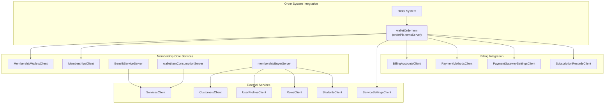
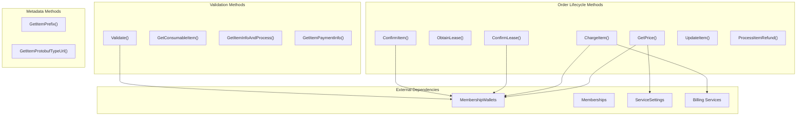
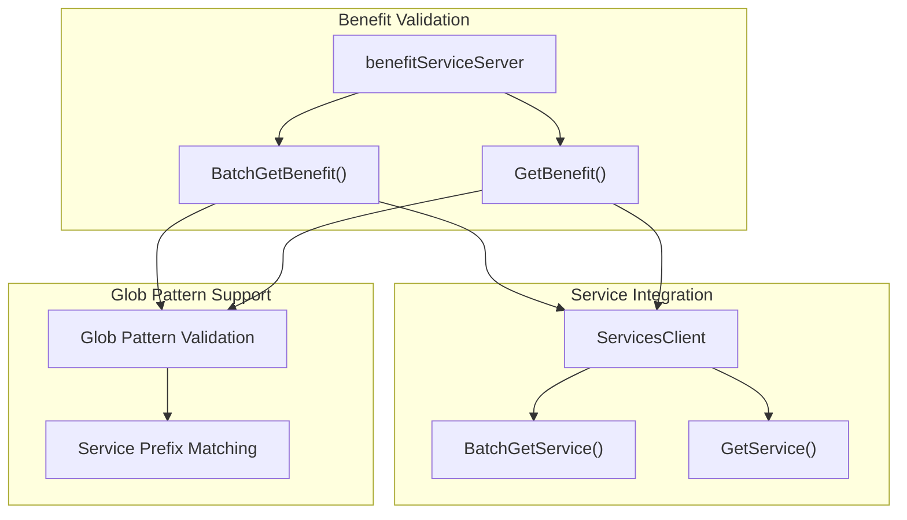
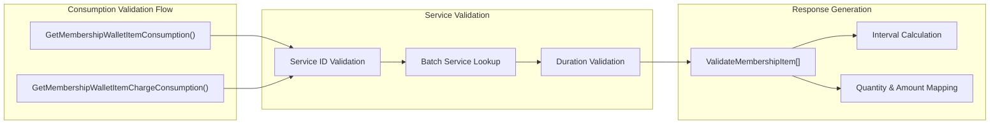
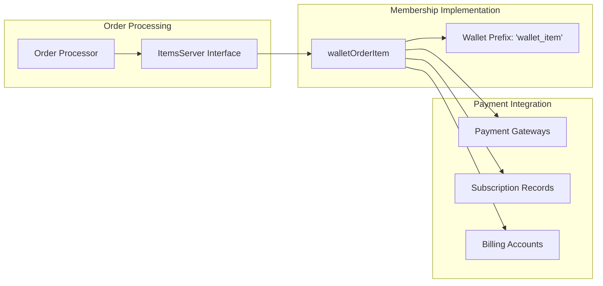
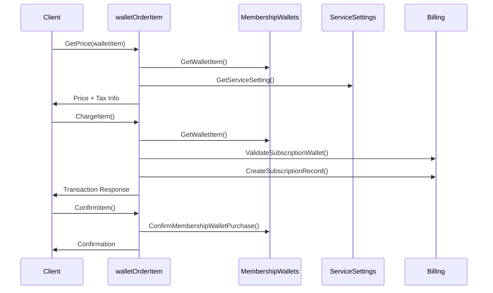
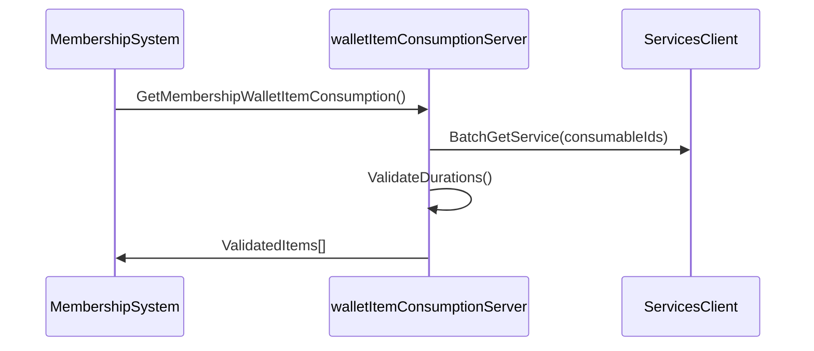

# Membership System

<details>
<summary>Relevant source files</summary>

The following files were used as context for generating this wiki page:

- [discount-items/consumable_item.go](discount-items/consumable_item.go)
- [discount-items/fx.go](discount-items/fx.go)
- [discount-items/items.go](discount-items/items.go)
- [grpc.go](grpc.go)
- [membership-items/fx.go](membership-items/fx.go)
- [membership-items/items.go](membership-items/items.go)
- [membership-items/wallet_order_items.go](membership-items/wallet_order_items.go)

</details>


## Purpose and Scope

The Membership System provides comprehensive membership wallet functionality within the Waqt appointment scheduling platform. This system handles membership purchases, benefit validation, consumption tracking, and buyer management. It integrates with the order system to enable membership purchases as order items and provides validation services for membership benefits and consumption.

For information about role-based access control that governs membership permissions, see [Role-Based Access Control](#5.1). For details about the link management system that handles relationships between membership entities, see [Link Management](#6.2).

## System Architecture

The Membership System consists of four main components that work together to provide complete membership functionality:



**Sources:** [membership-items/wallet_order_items.go:31-42](), [membership-items/items.go:19-21](), [membership-items/items.go:123-125](), [membership-items/buyer.go:15-21]()

## Core Components

### Wallet Order Items

The `walletOrderItem` struct implements the `orderPb.ItemsServer` interface, enabling membership wallet items to be processed as order items within the broader order management system.



**Key Methods:**

| Method | Purpose | Lines |
|--------|---------|-------|
| `ChargeItem` | Processes membership subscription charges with tax calculation | [68-168]() |
| `GetPrice` | Calculates membership plan pricing including taxes | [170-257]() |
| `ObtainLease` | Reserves membership wallet items for purchase | [259-293]() |
| `ConfirmLease` | Confirms reserved items and converts to purchases | [310-344]() |
| `Validate` | Validates membership wallet item structure | [407-435]() |

**Sources:** [membership-items/wallet_order_items.go:31-42](), [membership-items/wallet_order_items.go:68-168](), [membership-items/wallet_order_items.go:170-257]()

### Benefit Management

The benefit service validates membership benefits, which are typically services that can be consumed as part of membership plans.



The system supports both direct service IDs and glob patterns for flexible benefit specification:

- **Direct IDs**: Validates specific service entities
- **Glob Patterns**: Supports wildcard matching using `*` separator for service groups
- **Service Prefix**: Uses `servicePrefix + "*"` pattern for service validation

**Sources:** [membership-items/items.go:19-26](), [membership-items/items.go:28-80](), [membership-items/items.go:88-121]()

### Consumption Validation

The wallet item consumption service validates membership usage against service definitions and durations.



**Validation Process:**

1. **Service Validation**: Verifies consumable IDs match existing services
2. **Duration Matching**: Ensures requested duration matches service's available durations
3. **Quantity Processing**: Validates consumption quantities and amounts
4. **Interval Calculation**: Converts time ranges to minute-based intervals

**Sources:** [membership-items/items.go:123-131](), [membership-items/items.go:133-203](), [membership-items/items.go:205-272]()


## Integration Points

### Order System Integration

The membership system integrates with the order system through the `WalletOrderItemResult` which provides the `orderPb.ItemsServer` interface:



**Sources:** [membership-items/wallet_order_items.go:26-29](), [membership-items/wallet_order_items.go:687-689]()

### Billing System Integration

The system handles recurring membership billing through subscription management:

| Component | Purpose | Integration Point |
|-----------|---------|-------------------|
| `SubscriptionRecordsClient` | Creates billing subscriptions | [membership-items/wallet_order_items.go:141-156]() |
| `PaymentGatewaySettingsClient` | Validates payment methods | [membership-items/wallet_order_items.go:547-569]() |
| `BillingAccountsClient` | Manages billing accounts | [membership-items/wallet_order_items.go:106]() |

**Sources:** [membership-items/wallet_order_items.go:35-39](), [membership-items/wallet_order_items.go:141-156]()

## Key Workflows

### Membership Purchase Workflow



**Sources:** [membership-items/wallet_order_items.go:68-168](), [membership-items/wallet_order_items.go:170-257](), [membership-items/wallet_order_items.go:346-371]()

### Benefit Consumption Workflow



**Sources:** [membership-items/items.go:133-203]()

## Module Configuration

The membership system is configured through the fx dependency injection module:

```go
var Module = fx.Options(
    fx.Provide(
        NewBenefitServiceServer,
        pb.NewLocalBenefitServiceClient,
        NewWalletOrderItemImplementation,
        NewMembershipWalletItemConsumptionServiceServer,
        pb.NewLocalMembershipWalletItemConsumptionServiceClient,
        NewMembershipBuyerServiceServer,
        pb.NewLocalMembershipBuyerServiceClient,
    ),
)
```

**Sources:** [membership-items/fx.go:8-18]()