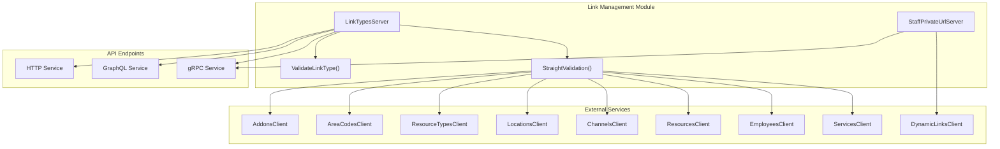
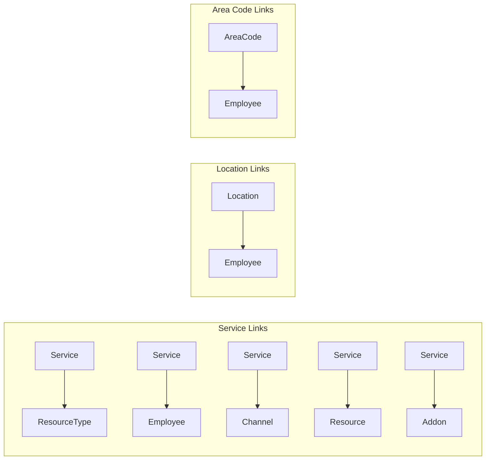
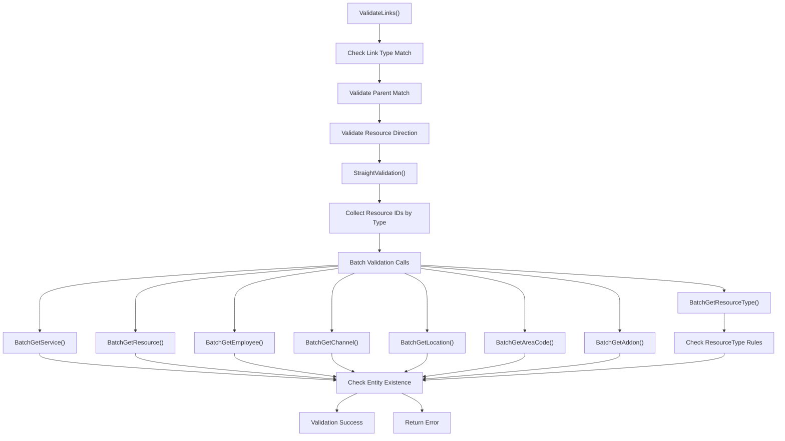
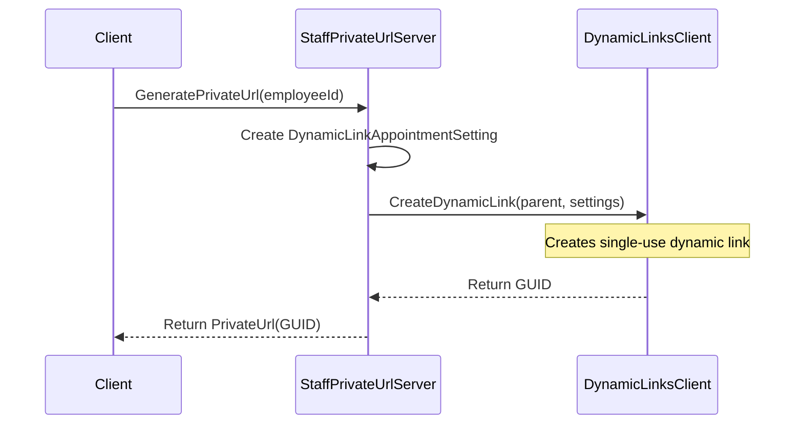
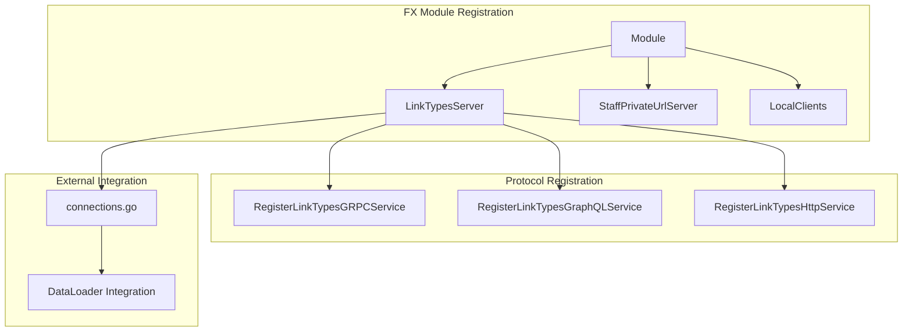

# Link Management

<details>
<summary>Relevant source files</summary>

The following files were used as context for generating this wiki page:

- [connections.go](connections.go)
- [links/fx.go](links/fx.go)
- [links/go.mod](links/go.mod)
- [links/link_types.go](links/link_types.go)
- [links/staff_private_url.go](links/staff_private_url.go)

</details>


## Purpose and Scope

The Link Management system handles validation and management of relationships between different business entities in the waqt platform. This system ensures referential integrity when creating links between services, employees, resources, channels, and other entities. It also provides functionality for generating private URLs for staff members.

For information about URL slug generation and management, see [Slug Management](#6.3). For role-based access control and permissions, see [Role-Based Access Control](#5.1).

## Architecture Overview

The Link Management system is implemented as a module within the deployment service, providing both validation services and staff URL generation capabilities. It integrates with multiple microservices to validate entity relationships and maintain data consistency.

**Link Management System Architecture**



Sources: [links/link_types.go:58-69](), [links/fx.go:13-66](), [links/staff_private_url.go:12-23]()

## Link Types and Resource Relationships

The system defines several link types that represent valid relationships between different business entities. Each link type connects two specific resource types in a directional relationship.

**Link Type Definitions and Resource Mappings**



The following table shows the complete mapping of link types to their resource relationships:

| Link Type | First Resource | Second Resource | Purpose |
|-----------|---------------|-----------------|---------|
| `SERVICE_RESOURCE_TYPE` | Service | ResourceType | Links services to non-identifiable resource types |
| `SERVICE_EMPLOYEE` | Service | Employee | Associates staff members with services |
| `SERVICE_CHANNEL` | Service | Channel | Connects services to booking channels |
| `SERVICE_RESOURCE` | Service | Resource | Links services to specific resources |
| `SERVICE_ADDON` | Service | Addon | Associates add-ons with services |
| `LOCATION_EMPLOYEE` | Location | Employee | Assigns staff to locations |
| `AREACODE_EMPLOYEE` | AreaCode | Employee | Associates area codes with employees |

Sources: [links/link_types.go:25-39](), [links/link_types.go:100-169]()

## Link Validation Process

The system implements a comprehensive validation process to ensure link integrity and business rule compliance. The validation occurs in multiple stages with specific checks for each link type.

**Link Validation Flow**



### Validation Rules

The system enforces several critical validation rules:

1. **Link Type Consistency**: All links in a request must match the specified link type
2. **Parent Matching**: Both resources in a link must belong to the same parent entity  
3. **Resource Direction**: Resources must be positioned correctly based on the link type
4. **Entity Existence**: All referenced resources must exist in their respective services
5. **Resource Type Constraints**: Services can only link to non-identifiable resource types

Sources: [links/link_types.go:309-337](), [links/link_types.go:78-307]()

## Staff Private URL Generation

The system provides functionality to generate private URLs for staff members, enabling secure access to appointment booking interfaces.

**Staff Private URL Generation Process**



The private URL generation process involves:

1. **Request Processing**: Accept employee ID for URL generation
2. **Settings Creation**: Create `DynamicLinkAppointmentSetting` with staff ID
3. **Dynamic Link Creation**: Generate single-use dynamic link via `DynamicLinksClient`
4. **URL Response**: Return GUID-based private URL

Sources: [links/staff_private_url.go:25-47]()

## Resource Prefix Management

The system maintains prefix constants for different resource types to enable efficient resource identification and routing.

```go
var (
    ChannelPrefix      = (&channel.Channel{}).GetPrefix()
    ServicePrefix      = (&service.Service{}).GetPrefix()  
    LocationPrefix     = (&location.Location{}).GetPrefix()
    EmployeePrefix     = (&employee.Employee{}).GetPrefix()
    ResourcePrefix     = (&resource.Resource{}).GetPrefix()
    ResourceTypePrefix = (&resType.ResourceType{}).GetPrefix()
    AreaCodePrefix     = (&areaCode.AreaCode{}).GetPrefix()
    AddOnPrefix        = (&addon.Addon{}).GetPrefix()
)
```

These prefixes are used in the `ValidateFirstResourceWithLinkType()` method to determine the correct resource positioning within links.

Sources: [links/link_types.go:41-50](), [links/link_types.go:350-416]()

## Service Integration

The Link Management module integrates with the broader deployment service through dependency injection and service registration across multiple protocols.

**Service Registration Architecture**



The module provides:

- **gRPC Service**: Direct service-to-service link validation
- **GraphQL Service**: Schema operations for link management queries
- **HTTP Service**: REST API endpoints via grpc-gateway
- **DataLoader Integration**: Batch loading support in GraphQL connections

Sources: [links/fx.go:68-93](), [connections.go:41](), [connections.go:661-688]()