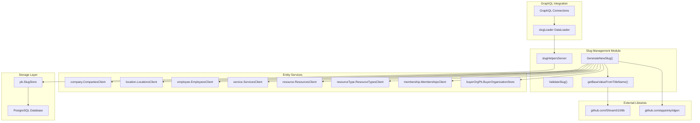
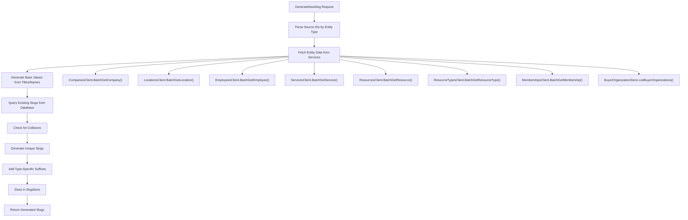
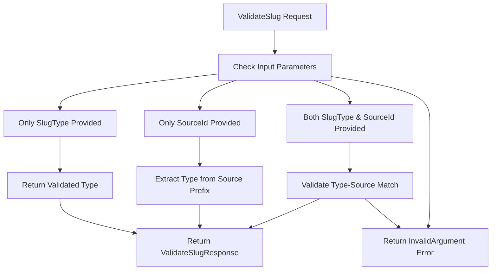

# Slug Management

<details>
<summary>Relevant source files</summary>

The following files were used as context for generating this wiki page:

- [connections.go](connections.go)
- [slugs/go.mod](slugs/go.mod)
- [slugs/go.sum](slugs/go.sum)
- [slugs/slug-helper.go](slugs/slug-helper.go)

</details>


## Purpose and Scope

The Slug Management system provides URL-friendly string generation and validation for various business entities within the waqt platform. This system ensures unique, SEO-friendly identifiers that can be used in URLs for companies, locations, employees, services, resources, and other entities. The slug management functionality is implemented as a standalone service module that integrates with the broader deployment service architecture.

For information about link management and URL routing, see [Link Management](#6.2). For details about the GraphQL data federation layer that consumes slug data, see [GraphQL Gateway](#2.2).

## Architecture Overview

The slug management system operates as both a standalone gRPC service and an integrated component within the deployment service. It coordinates with multiple microservices to fetch entity data and generate collision-free slugs.

**Slug Management System Architecture**



Sources: [slugs/slug-helper.go:79-122](), [connections.go:268-282]()

## Supported Entity Types

The slug management system supports eight distinct entity types, each with specific prefixes and validation rules:

| Entity Type | Constant | Prefix | Suffix | Source Field |
|-------------|----------|---------|---------|--------------|
| Company | `SlugType_Company` | `cmpPrefix` | "c" | `Title` |
| Location | `SlugType_Location` | `locPrefix` | "l" | `Name` |
| Employee | `SlugType_Employee` | `empPrefix` | "e" | `FirstName` |
| Service | `SlugType_Service` | `srvPrefix` | "s" | `Title` |
| Resource | `SlugType_Resource` | `rscPrefix` | "r" | `Title` |
| Resource Type | `SlugType_ResourceType` | `rstPrefix` | "t" | `Name` |
| Membership | `SlugType_Membership` | `memPrefix` | "m" | `Title` |
| Buyer Organization | `SlugType_BuyerOrganization` | `bOrgPrefix` | "b" | `Name` |

Sources: [slugs/slug-helper.go:57-76](), [slugs/slug-helper.go:168-390]()

## Slug Generation Process

The slug generation follows a multi-step process to ensure uniqueness and collision avoidance:

**Slug Generation Flow**



Sources: [slugs/slug-helper.go:124-429]()

## Key Components and Implementation

### SlugHelpersServer Structure

The core implementation is encapsulated in the `slugHelpersServer` struct:

```go
type slugHelpersServer struct {
    db         *sql.DB
    slugStore  pb.SlugStore
    cCli       company.CompaniesClient
    lCli       location.LocationsClient
    eCli       employee.EmployeesClient
    sCli       service.ServicesClient
    rCli       resource.ResourcesClient
    rtCli      resourceType.ResourceTypesClient
    memCli     membership.MembershipsClient
    buyerOrgSt buyerOrgPb.BuyerOrganizationStore
}
```

Sources: [slugs/slug-helper.go:79-90]()

### Base Value Generation

The `getBaseValueFromTitleName` function processes entity names into URL-friendly base values:

- Splits input by spaces and takes the first non-empty segment
- Applies size limits based on `slug.SizeLimit`
- Removes special characters using regex pattern `[^a-zA-Z0-9]+`
- Converts to lowercase for consistency

Sources: [slugs/slug-helper.go:584-595]()

### Collision Detection and Resolution

The system prevents slug collisions through:

1. **Database Query**: Searches existing slugs using `ILIKE` pattern matching
2. **Suffix Removal**: Strips type-specific suffixes for comparison
3. **Unique Generation**: Uses `lib.GenerateSlug()` with existing slugs as exclusion list
4. **Type Suffixes**: Adds single-character suffixes to differentiate entity types

Sources: [slugs/slug-helper.go:393-422]()

## Slug Validation System

The `ValidateSlug` function provides three validation modes:

**Validation Logic Flow**



Sources: [slugs/slug-helper.go:431-574]()

## GraphQL Integration

The slug system integrates with the GraphQL layer through a dedicated dataloader for efficient batch loading:

```go
slugLoader := dataloader.NewBatchedLoader(func(ctx context.Context, keys dataloader.Keys) []*dataloader.Result {
    // Batch slug retrieval implementation
    res, err := slugCli.BatchGetSlug(userinfo.NewContextWithSkipRightKey(ctx), &slug.BatchGetSlugRequest{
        SourceIds: keys.Keys(),
    })
    // Result processing...
}, dataloader.WithCache(&dataloader.NoCache{}))
```

The loader skips rights checking to ensure slug data is accessible for URL generation purposes.

Sources: [connections.go:268-282]()

## Module Registration and Dependency Injection

The slug management module integrates with the fx dependency injection framework:

```go
var Module = fx.Options(
    fx.Provide(
        NewSlugHelpersServer,
        fx.Annotated{
            Name: "public",
            Target: func(srv pb.SlugHelperServer) pb.SlugHelperServer {
                return srv
            },
        },
        pb.NewLocalSlugHelperClient,
        fx.Annotated{
            Group:  "grpc-service",
            Target: RegisterSlugHelperGRPCService,
        },
    ),
)
```

This configuration provides both server and client instances while registering the gRPC service for external consumption.

Sources: [slugs/slug-helper.go:29-46](), [slugs/slug-helper.go:48-55]()