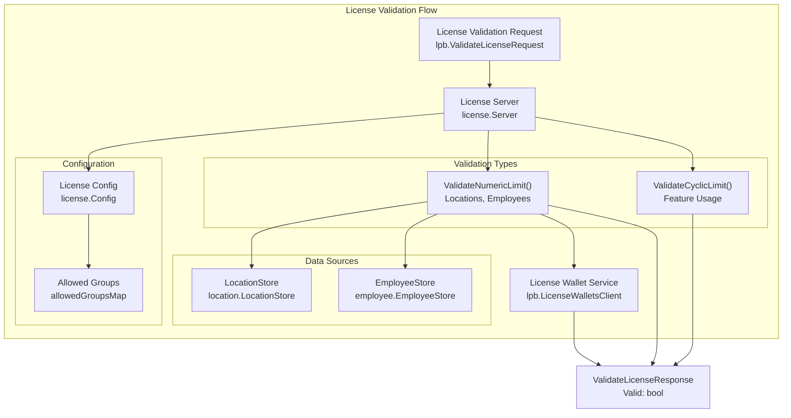
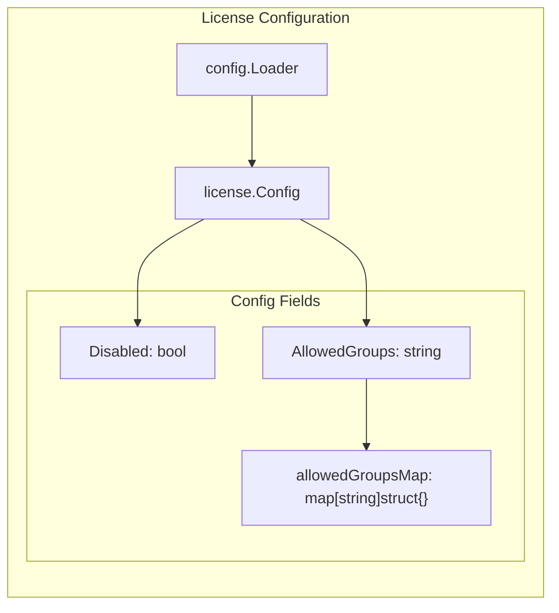
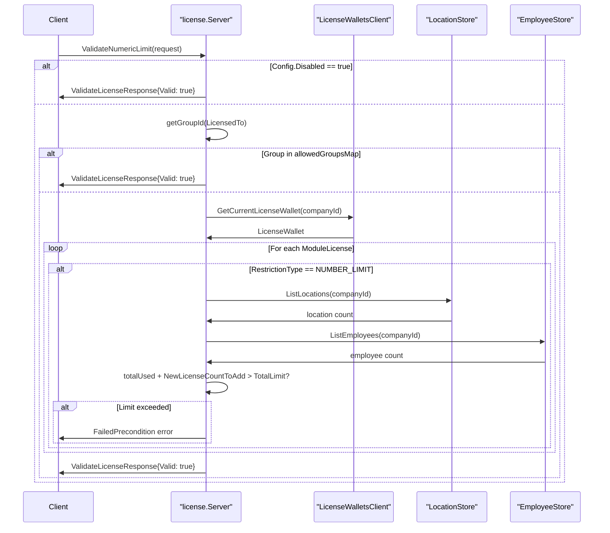
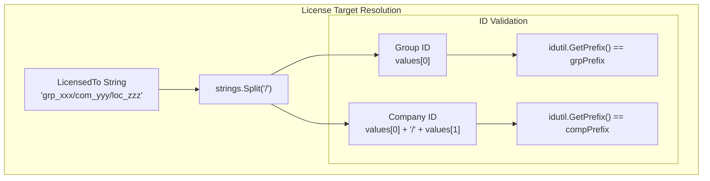
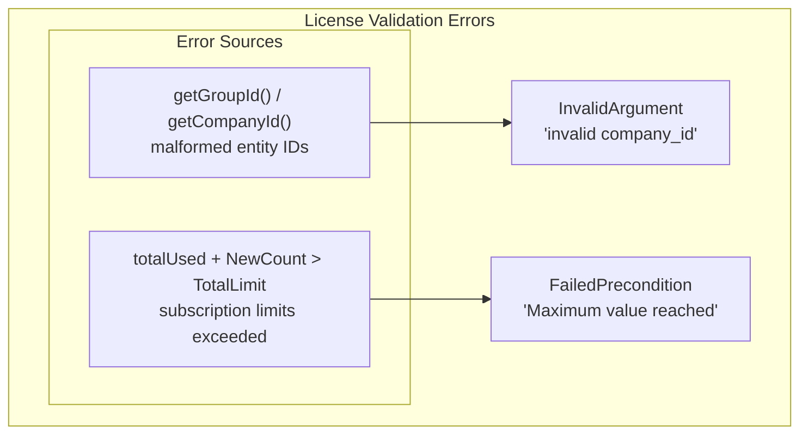

# License Management

<details>
<summary>Relevant source files</summary>

The following files were used as context for generating this wiki page:

- [Dockerfile](Dockerfile)
- [displayModuleRoles.json](displayModuleRoles.json)
- [license/fx.go](license/fx.go)
- [license/go.mod](license/go.mod)
- [license/validate_license.go](license/validate_license.go)

</details>


The License Management system provides license validation functionality for the waqt-deployment service, enforcing usage limits and restrictions based on subscription plans. This module validates whether organizations can create new entities (locations, employees, etc.) without exceeding their licensed limits.

For information about role-based access control and permissions, see [Role-Based Access Control](#5.1). For billing and subscription management, see [Infrastructure & Operations](#7).

## Purpose and Architecture

The License Management system implements a centralized validation service that checks both numeric and cyclic license limits before allowing resource creation. It integrates with the broader saastack.io licensing infrastructure to enforce subscription-based restrictions across the platform.



**Sources:** [license/validate_license.go:23-34](), [license/fx.go:8-14]()

## Core Components

### License Validation Server

The `Server` struct serves as the main license validation service, implementing the `ValidateLicenseServiceServer` interface from the saastack.io license protobuf definitions.

| Component | Type | Purpose |
|-----------|------|---------|
| `LicWalletCli` | `lpb.LicenseWalletsClient` | Retrieves current license information |
| `LocStore` | `location.LocationStore` | Counts existing locations |
| `EmpStore` | `employee.EmployeeStore` | Counts existing employees |
| `Config` | `license.Config` | License validation configuration |

**Sources:** [license/validate_license.go:23-30]()

### Configuration System

The license system supports flexible configuration including bypass mechanisms for specific groups and complete system disabling for development environments.



**Sources:** [license/validate_license.go:168-191]()

## Numeric Limit Validation

The numeric limit validation enforces restrictions on the number of entities (locations, employees) that can be created based on subscription plan limits.

### Validation Process



**Sources:** [license/validate_license.go:36-111]()

### Supported Restriction Types

The system currently validates the following numeric restrictions:

| Restriction Slug | Purpose | Data Source |
|------------------|---------|-------------|
| `Locations_ModuleLicense_NumericLimit` | Location count limits | `LocationStore.ListLocations()` |
| `Employees_ModuleLicense_NumericLimit` | Employee count limits | `EmployeeStore.ListEmployees()` |

**Sources:** [license/validate_license.go:78-101]()

## Entity Resolution and Hierarchies

The license system handles hierarchical entity relationships, extracting group and company identifiers from license target strings.

### ID Extraction Pattern



**Sources:** [license/validate_license.go:139-159]()

## Dependency Injection Module

The license system integrates with the fx dependency injection framework, providing all necessary services and clients.

### Module Definition

The `Module` variable exports the complete set of dependencies required for license validation:

```go
var Module = fx.Options(
    fx.Provide(
        NewConfig,
        NewValidateLicenseServer,
        licensePb.NewLocalValidateLicenseServiceClient,
    ),
)
```

**Sources:** [license/fx.go:8-14]()

## Module Dependencies

The license system depends on several external saastack.io modules for its functionality:

| Module | Version | Purpose |
|--------|---------|---------|
| `go.saastack.io/license` | `v0.0.0-20200212095228-84bdba935857` | Core license protobuf definitions |
| `go.saastack.io/company` | `v0.0.0-20200124112210-5954a6ff4df8` | Company entity management |
| `go.saastack.io/employee` | `v0.0.0-20200127145106-753dcaf684ef` | Employee counting |
| `go.saastack.io/location` | `v0.0.0-20200127121043-a07c1d910ac0` | Location counting |
| `go.saastack.io/group` | `v0.0.0-20200123115235-a3016df5ed96` | Group hierarchy management |

**Sources:** [license/go.mod:12-22]()

## Error Handling

The license validation system provides specific error responses for different failure scenarios:

### Error Types



**Sources:** [license/validate_license.go:105](), [license/validate_license.go:143](), [license/validate_license.go:154]()

## Integration Points

The license management system integrates with the broader platform through several key interfaces:

### Service Registration

The license validation service is registered as a local gRPC service within the deployment service, allowing other modules to validate license constraints before performing operations.

### Role-Based Access Control

License validation intersects with the RBAC system through module roles defined in `displayModuleRoles.json`. Several roles include license-related permissions:

- `LicenseWalletsViewer` - View license wallet information
- `BillingAccountsAdmin` - Full access to billing and license management
- `BillingSubscriptionsAdmin` - Subscription management including license changes

**Sources:** [displayModuleRoles.json:849](), [displayModuleRoles.json:866]()