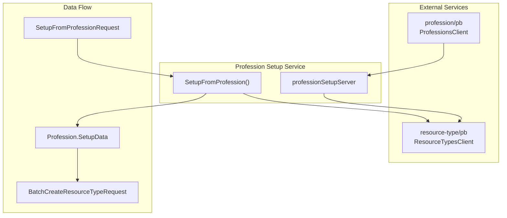
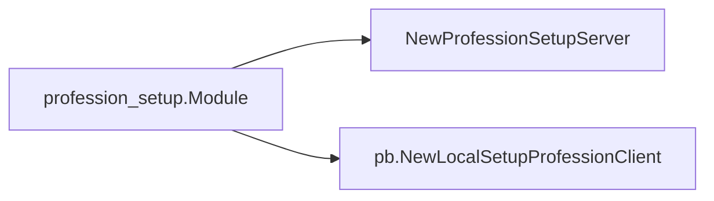
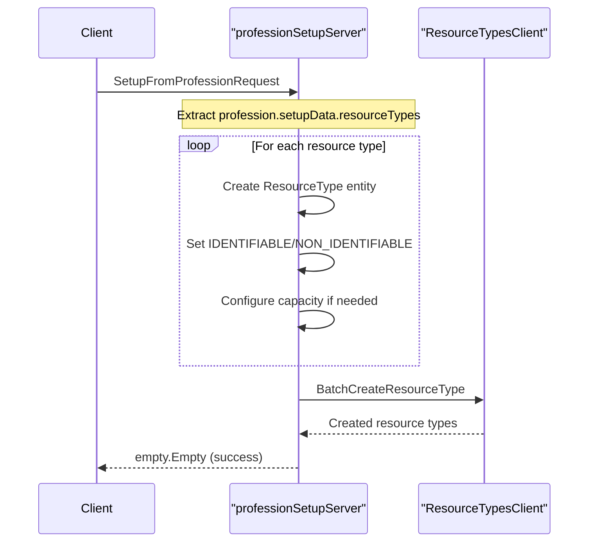
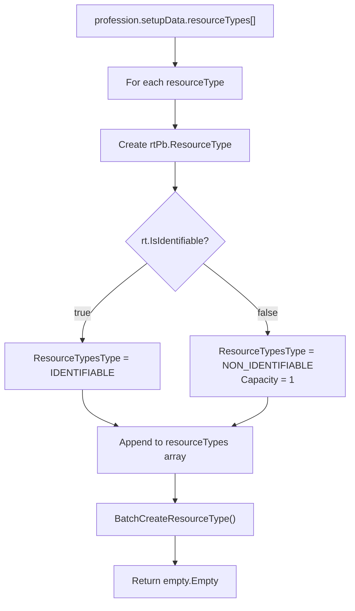
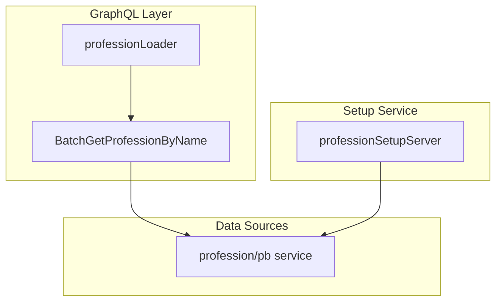

# Profession Setup

Relevant source files

The following files were used as context for generating this wiki page:

- [connections.go](connections.go)
- [profession-setup/setup.go](profession-setup/setup.go)

## Purpose and Scope

The Profession Setup system provides profession-based initialization workflows for new business entities within the waqt platform. It automates the creation of resource types and other business entities based on predefined profession templates, streamlining onboarding for businesses in specific industries.

For information about general resource management, see [Resource Management](#6.2). For license-based feature management, see [License Management](#6.4).

## System Architecture

The profession setup system operates as a gRPC service that bridges profession templates with concrete business entity creation:

Sources: [profession-setup/setup.go:1-54]()

## Core Components

### ProfessionSetupServer

The `professionSetupServer` implements the `pb.SetupProfessionServer` interface and serves as the main entry point for profession-based setup operations.

| Component | Type | Purpose |
|-----------|------|---------|
| `professionSetupServer` | struct | Main service implementation |
| `rstCli` | `rtPb.ResourceTypesClient` | Client for resource type operations |
| `SetupFromProfession` | method | Primary setup workflow handler |

Sources: [profession-setup/setup.go:18-24]()

### Module Registration

The profession setup module is registered using the fx dependency injection framework:

Sources: [profession-setup/setup.go:11-16]()

## Setup Workflow

The profession setup process follows a structured workflow that transforms profession templates into concrete business resources:

Sources: [profession-setup/setup.go:27-53]()

## Resource Type Creation Process

The system processes profession resource type templates and creates corresponding `ResourceType` entities:

### Resource Type Mapping

| Profession Template Field | ResourceType Field | Logic |
|---------------------------|-------------------|-------|
| `rt.Name` | `Name` | Direct mapping |
| `rt.IsIdentifiable` | `ResourceTypesType` | `IDENTIFIABLE` if true, `NON_IDENTIFIABLE` if false |
| N/A | `Active` | Always set to `true` |
| N/A | `Capacity` | Set to `1` for non-identifiable types |

### Processing Logic

Sources: [profession-setup/setup.go:29-50]()

## Integration Points

### GraphQL Integration

The profession setup system integrates with the GraphQL layer through data loaders and connections:

The `professionLoader` in the GraphQL connections handles profession data loading by name, supporting the profession template system.

Sources: [connections.go:796-809]()

### Dependency Injection

The system uses fx.Options for dependency injection configuration:

| Provider | Returns | Dependencies |
|----------|---------|--------------|
| `NewProfessionSetupServer` | `pb.SetupProfessionServer` | `rtPb.ResourceTypesClient` |
| `pb.NewLocalSetupProfessionClient` | Local client interface | - |

Sources: [profession-setup/setup.go:11-16](), [profession-setup/setup.go:22-24]()