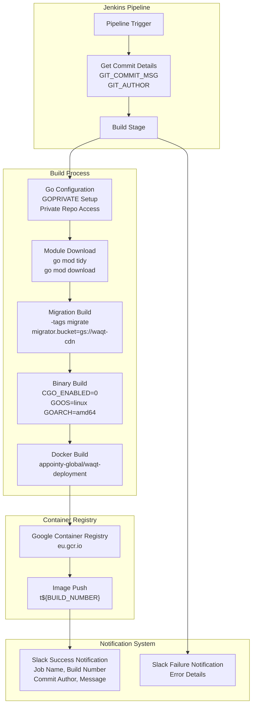
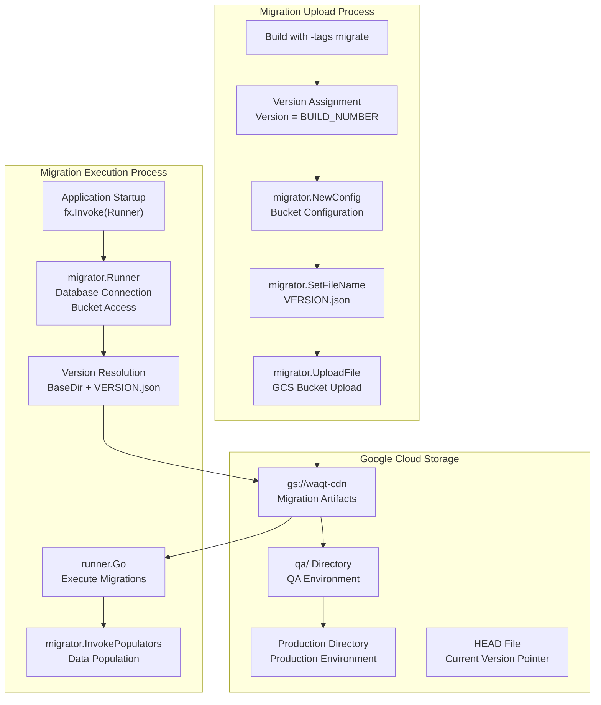
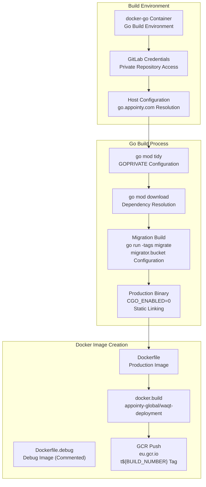
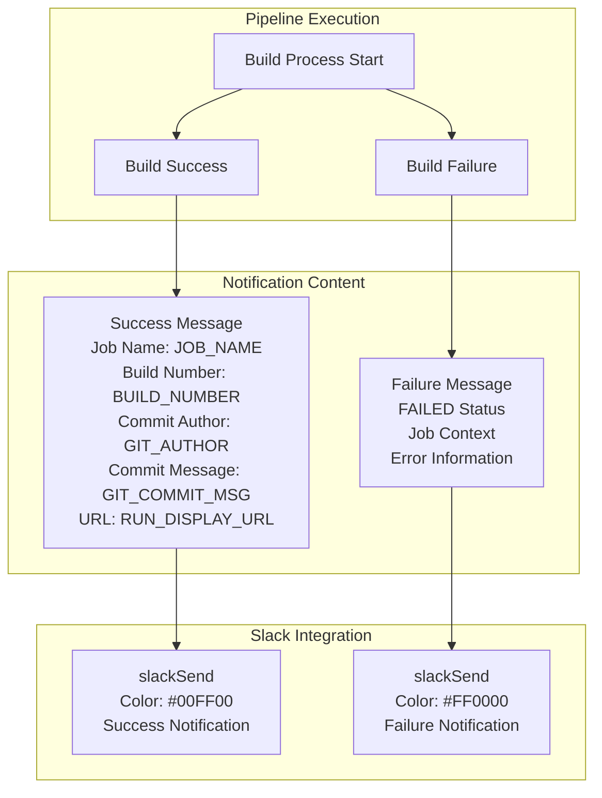

# Infrastructure & Operations

Relevant source files

The following files were used as context for generating this wiki page:

- [Jenkinsfile](Jenkinsfile)
- [migrator.data.go](migrator.data.go)
- [migrator.runner.go](migrator.runner.go)

This section covers the deployment, operations, and infrastructure management components of the waqt-deployment service. It encompasses the CI/CD pipeline, database migration system, container orchestration, and environment configuration management that enable reliable deployment and operation of the service across multiple environments.

For application-level configuration and service modules, see [Core Components](#3). For security and access control in production environments, see [Security & Access Control](#5).

## CI/CD Pipeline Architecture

The deployment pipeline is orchestrated through Jenkins and integrates with Google Cloud Registry for container management and Google Cloud Storage for migration artifacts.

The pipeline executes in a `docker-go` container environment and manages private Go module access through credential injection. The build process includes both migration execution and binary compilation with version injection via ldflags.

**Sources:** [Jenkinsfile:1-67]()

## Database Migration System

The migration system provides versioned database schema management with cloud-based artifact storage and optional execution modes.

The migration system operates in two phases: upload during build time and execution during application startup. It supports optional migrations through configuration flags and handles both QA and production environment deployments.

**Sources:** [migrator.data.go:1-106](), [migrator.runner.go:1-77]()

## Migration Configuration & Execution

| Component | Purpose | Key Features |
|-----------|---------|--------------|
| `migrator.Runner` | Migration execution engine | Bucket-based artifact retrieval, tagged query execution, optional failure handling |
| `migrator.Config` | Configuration management | Environment-specific bucket settings, optional execution flags |
| `migrator.SetFileName` | Version management | Build number integration, JSON file naming |
| `migrator.UploadFile` | Artifact publishing | GCS upload, multi-environment support |
| `InvokePopulators` | Data population | Post-migration data seeding |

The migration runner supports configurable change types and includes comprehensive error handling with structured logging. Migration files are retrieved from GCS buckets using versioned URLs constructed from the application build number.

**Sources:** [migrator.runner.go:16-77](), [migrator.data.go:40-106]()

## Container Build Process

The containerization process creates optimized production binaries with debugging support and multi-stage build capabilities.

The build process includes version injection through ldflags (`-X main.Version=${BUILD_NUMBER}`) and supports both production and debug configurations. Debug builds include additional compiler flags (`-gcflags "all=-N -l"`) for debugging support.

**Sources:** [Jenkinsfile:16-57]()

## Environment Configuration Integration

The infrastructure integrates with the application's environment configuration system through the `config.Loader` interface and supports cloud-based configuration management.

| Configuration Aspect | Implementation | Environment Support |
|---------------------|----------------|-------------------|
| Migration Bucket | `migrator.bucket` environment variable | Development, QA, Production |
| Build Versioning | `main.Version` ldflags injection | Automatic build number assignment |
| Private Modules | `GOPRIVATE` environment variable | `go.appointy.com,go.saastack.io` |
| Database Connection | Fx dependency injection | Runtime configuration loading |
| Optional Execution | `cnf.Optional` configuration flag | Graceful failure handling |

The configuration system allows for environment-specific behavior while maintaining consistent deployment processes across all environments. Migration execution can be made optional to support environments where database access may be restricted.

**Sources:** [migrator.runner.go:16-29](), [migrator.data.go:40-53](), [Jenkinsfile:24-28]()

## Deployment Notification System

Build and deployment status notifications are delivered through Slack integration with comprehensive context information.

The notification system captures Git commit details during the initial pipeline stage and includes them in both success and failure notifications, providing full deployment traceability.

**Sources:** [Jenkinsfile:8-66]()