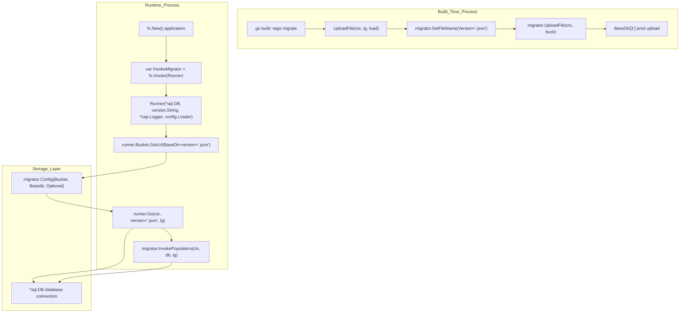
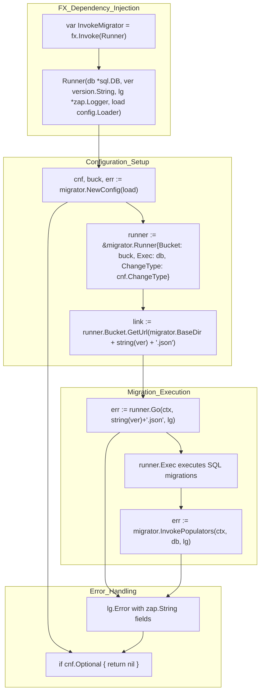
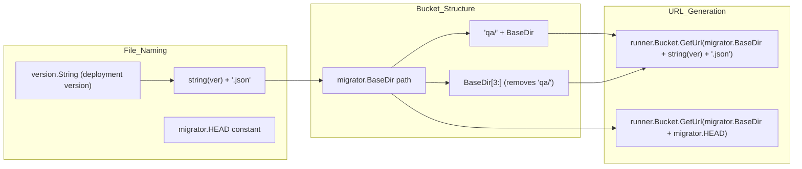

# Database Migrations

<details>
<summary>Relevant source files</summary>

The following files were used as context for generating this wiki page:

- [main.go](main.go)
- [migrator.data.go](migrator.data.go)
- [migrator.runner.go](migrator.runner.go)

</details>


## Purpose and Scope

This page documents the database migration system in the Waqt deployment service. The system handles versioned database schema changes and data population through a two-phase process: build-time migration file upload and runtime migration execution. The system integrates with cloud storage buckets to distribute migration files across environments.

For information about environment-specific configuration that affects migrations, see [Environment Configuration](#7.2). For CI/CD pipeline integration details, see [CI/CD Pipeline](#7.3).

## Migration System Overview

The database migration system operates in two distinct phases:

1. **Build-time Upload**: Migration files are packaged and uploaded to cloud storage during the build process
2. **Runtime Execution**: The application downloads and executes migration files during startup based on the deployment version

The system supports optional migrations, environment-specific directories (QA/production), and includes both schema migrations and data population steps.

### Migration Flow Architecture



**Sources:** [migrator.runner.go:1-78](), [migrator.data.go:1-107]()

## Build-Time Migration Upload

The build-time process uploads migration files to cloud storage when the application is built with the `migrate` build tag. This ensures migration files are available for runtime execution across different environments.

### Upload Process Components

```mermaid
graph LR
    subgraph "Build_Configuration"
        BUILD_TAG["//go:build migrate"]
        VERSION_VAR["var Version = ''"]
        MAIN_FUNC["func main()"]
    end
    
    subgraph "Upload_Pipeline"
        FX_APP["fx.New(log.Module, config.Module)"]
        UPLOAD_INVOKE["fx.Invoke(UploadFile)"]
        CONFIG_INIT["cnf, buck, err := migrator.NewConfig(load)"]
        FILENAME_SET["migrator.SetFileName(Version + '.json')"]
        FILE_UPLOAD["link, err := migrator.UploadFile(ctx, buck)"]
    end
    
    subgraph "Environment_Handling"
        QA_CHECK["if migrator.BaseDir[:3] == 'qa/'"]
        PROD_UPLOAD["migrator.BaseDir = BaseDir[3:]"]
    end
    
    BUILD_TAG --> MAIN_FUNC
    VERSION_VAR --> MAIN_FUNC
    MAIN_FUNC --> FX_APP
    FX_APP --> UPLOAD_INVOKE
    UPLOAD_INVOKE --> CONFIG_INIT
    CONFIG_INIT --> FILENAME_SET
    FILENAME_SET --> FILE_UPLOAD
    FILE_UPLOAD --> QA_CHECK
    QA_CHECK --> PROD_UPLOAD
```



**Sources:** [migrator.data.go:1-4](), [migrator.data.go:22-37](), [migrator.data.go:39-106]()

### Upload Function Implementation

The `UploadFile` function in [migrator.data.go:40-106]() handles the complete upload process:

| Component | Function | Location |
|-----------|----------|----------|
| Configuration | `migrator.NewConfig(load)` | [migrator.data.go:41]() |
| File Naming | `migrator.SetFileName(Version + ".json")` | [migrator.data.go:55]() |
| Upload Execution | `migrator.UploadFile(ctx, buck)` | [migrator.data.go:69]() |
| Production Copy | QA to Production directory handling | [migrator.data.go:86-104]() |

The system automatically uploads to both QA and production directories when building from a QA environment, removing the `qa/` prefix for production deployment.

**Sources:** [migrator.data.go:40-83](), [migrator.data.go:86-104]()

## Runtime Migration Execution

During application startup, the migration system downloads and executes migration files based on the current deployment version. This process is integrated into the dependency injection system using fx.

### Migration Execution Flow



**Sources:** [migrator.runner.go:14-77](), [migrator.runner.go:16-38](), [migrator.runner.go:47-61](), [migrator.runner.go:63-75]()

### Runner Configuration

The `Runner` function in [migrator.runner.go:16-77]() configures the migration execution with the following components:

```go
runner := &migrator.Runner{
    Bucket:      buck,
    Exec:        db,
    ChangeType:  cnf.ChangeType,
    Dump:        nil,                   // default will be noop
    AllowedTags: map[string]struct{}{}, // allowed tags for queries to be executed
}
```

| Field | Type | Purpose | Source |
|-------|------|---------|--------|
| `Bucket` | Cloud storage interface | Downloads migration files from storage | [migrator.runner.go:33]() |
| `Exec` | `*sql.DB` | Database connection for executing SQL migrations | [migrator.runner.go:34]() |
| `ChangeType` | `cnf.ChangeType` | Migration behavior configuration from config | [migrator.runner.go:35]() |
| `Dump` | `nil` | Database dump interface (noop by default) | [migrator.runner.go:36]() |
| `AllowedTags` | `map[string]struct{}` | Security filter for tagged query execution | [migrator.runner.go:37]() |

The function signature includes dependency injection parameters: `Runner(db *sql.DB, ver version.String, lg *zap.Logger, load config.Loader) error`

**Sources:** [migrator.runner.go:16](), [migrator.runner.go:32-38]()

## Migration File Management

The system uses version-based file naming and cloud storage URLs for migration distribution. Files are stored with the pattern `{version}.json` and referenced through bucket URLs.

### File Location Strategy



**Sources:** [migrator.runner.go:40-44](), [migrator.data.go:86-87]()

The URL construction in [migrator.runner.go:40-44]() creates direct links to migration files:

```go
link := runner.Bucket.GetUrl(migrator.BaseDir + string(ver) + ".json")
head := runner.Bucket.GetUrl(migrator.BaseDir + migrator.HEAD)
```

The system logs these URLs for debugging: `lg.Info("Migration File", zap.String("next", link), zap.String("head", head))`

## Error Handling and Optional Migrations

The migration system supports optional execution mode where failures do not prevent application startup. This is controlled through configuration and affects both upload and execution phases.

### Error Handling Matrix

| Phase | Optional Mode | Error Action | Logging |
|-------|---------------|--------------|---------|
| Upload | `cnf.Optional = true` | Return `nil` | Error logged, continue | 
| Upload | `cnf.Optional = false` | Return error | Error logged, exit |
| Execution | `cnf.Optional = true` | Return `nil` | Error logged, continue |
| Execution | `cnf.Optional = false` | Return error | Error logged, exit |

The error handling pattern is consistent across both files, using the `cnf.Optional` boolean configuration:

```go
if cnf.Optional {
    return nil  // Continue application startup despite migration errors
}
return err     // Fail application startup on migration errors
```

This pattern appears in multiple locations: configuration initialization, migration execution, and populator execution phases.

**Sources:** [migrator.runner.go:25-28](), [migrator.runner.go:57-60](), [migrator.runner.go:71-74](), [migrator.data.go:48-52](), [migrator.data.go:63-66](), [migrator.data.go:77-81](), [migrator.data.go:97-101]()

### Logging Configuration

Both phases use structured logging with `zap.Logger` to capture migration events and errors:

| Log Level | Event | Context Fields |
|-----------|--------|----------------|
| Info | Migration file URLs | `next`, `head` |
| Info | Upload success | `link` |
| Error | Configuration failure | `bucket`, `basedir`, `optional` |
| Error | Migration execution failure | `next`, `head`, `bucket`, `basedir`, `optional` |
| Error | Populator failure | `bucket`, `basedir`, `optional` |

**Sources:** [migrator.runner.go:42-45](), [migrator.runner.go:49-56](), [migrator.runner.go:65-70](), [migrator.data.go:83](), [migrator.data.go:103]()