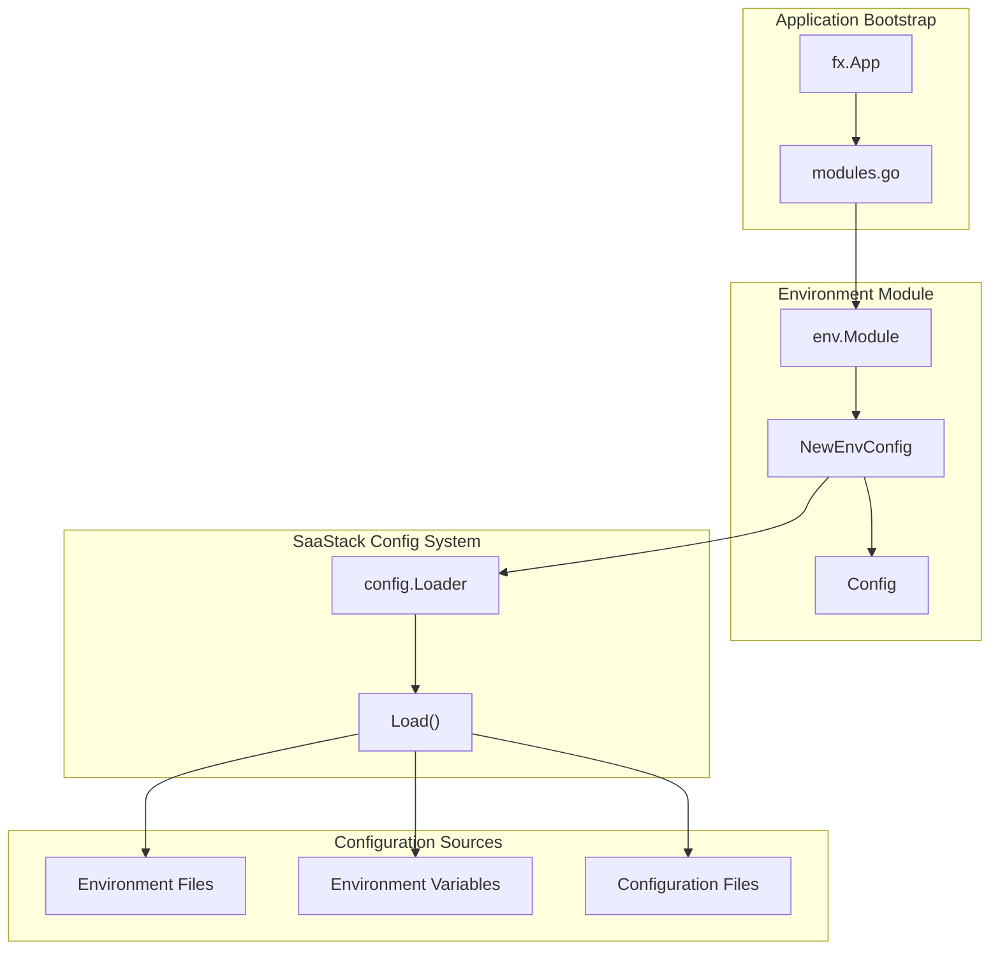
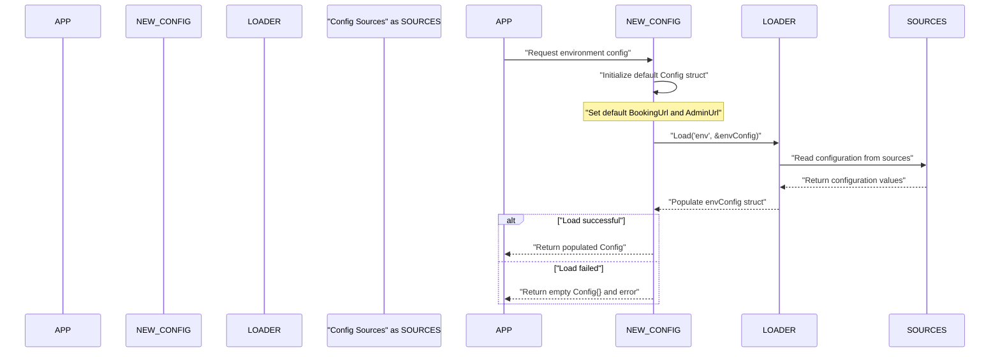
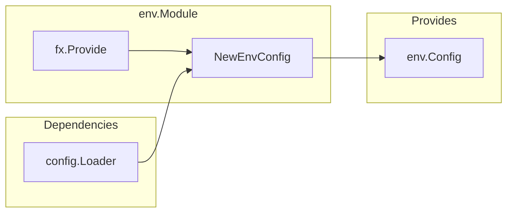

# Environment Configuration

Relevant source files

The following files were used as context for generating this wiki page:

- [go.mod](go.mod)
- [main.go](main.go)

This document covers the environment-specific configuration system used by the waqt-deployment application. The environment configuration module manages deployment-specific settings such as service URLs and security keys that vary between local, development, and production environments.

For information about the broader configuration loading mechanism, see [Infrastructure & Operations](#7). For details about CI/CD pipeline configuration, see [CI/CD Pipeline](#7.3).

## Purpose and Scope

The environment configuration system provides a centralized mechanism for managing environment-specific settings that change between deployment contexts. It handles the loading, validation, and injection of configuration values needed by various application components.

**Sources:** [env/env.go:1-33]()

## Configuration Architecture

The environment configuration system is built around a simple but effective pattern that integrates with the SaaStack deployment configuration framework and Uber FX dependency injection.

**Sources:** [env/env.go:8-12](), [env/env.go:14-26]()

## Configuration Structure

The environment configuration is defined by the `Config` struct, which contains essential deployment-specific settings:

| Field | Type | Purpose | Default Value |
|-------|------|---------|---------------|
| `BookingUrl` | `string` | URL for the booking interface | `https://dev-booking.appointy.com` |
| `AdminUrl` | `string` | URL for the admin interface | `https://dev-waqt.appointy.com` |
| `EnterpriseKey` | `string` | Enterprise license key | `""` (empty) |

The configuration includes TODO comments indicating that URLs need to be adjusted for different deployment environments (local/dev/prod).

**Sources:** [env/env.go:28-33](), [env/env.go:16-19]()

## Configuration Loading Process

The configuration loading follows a specific sequence that ensures proper initialization and error handling:

**Sources:** [env/env.go:14-26]()

## Module Integration

The environment configuration is integrated into the application through the Uber FX dependency injection system:

### FX Module Definition

The `env.Module` is defined as an `fx.Options` that provides the configuration constructor:

The module uses constructor-based dependency injection where `NewEnvConfig` receives a `config.Loader` and returns an `env.Config` instance.

**Sources:** [env/env.go:8-12](), [env/env.go:14]()

## Dependencies and External Integration

The environment configuration module has minimal external dependencies, focusing on integration with the SaaStack configuration system:

### Go Module Dependencies

| Dependency | Version | Purpose |
|------------|---------|---------|
| `go.saastack.io/deployment/config` | `v0.0.0-20200606105055-be770f2d286a` | Configuration loading framework |
| `go.uber.org/fx` | `v1.12.0` | Dependency injection |

### Module Replacements

The module uses custom forks for specific dependencies:
- `go.uber.org/fx` replaced with `github.com/appointy/fx v1.9.1-0.20240415053725-d3724c9879e8`
- `go.uber.org/dig` replaced with `github.com/paullen/dig v1.7.1-0.20191206103422-ea3bdf0115c5`

**Sources:** [env/go.mod:1-14](), [env/go.sum:1-80]()

## Environment-Specific Configuration

The current implementation includes hardcoded default values with TODO comments indicating the need for environment-specific configuration:

### Default Configuration Values

- **Development Environment:**
  - Booking URL: `https://dev-booking.appointy.com`
  - Admin URL: `https://dev-waqt.appointy.com`
  - Enterprise Key: Empty string

### Configuration Override Mechanism

The configuration loading process allows for overriding default values through the `config.Loader` interface, which can read from various sources including:
- Environment variables
- Configuration files
- External configuration services

**Sources:** [env/env.go:15-19](), [env/env.go:21-23]()

## Error Handling

The configuration system implements proper error handling for configuration loading failures:

- Returns an empty `Config{}` struct and error if loading fails
- Allows the application to handle configuration errors appropriately
- Ensures that invalid or missing configuration doesn't cause silent failures

**Sources:** [env/env.go:21-25]()