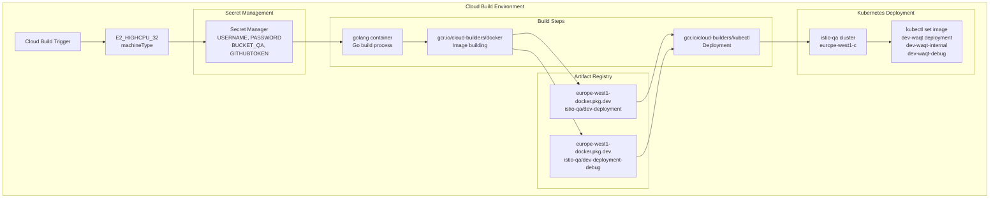
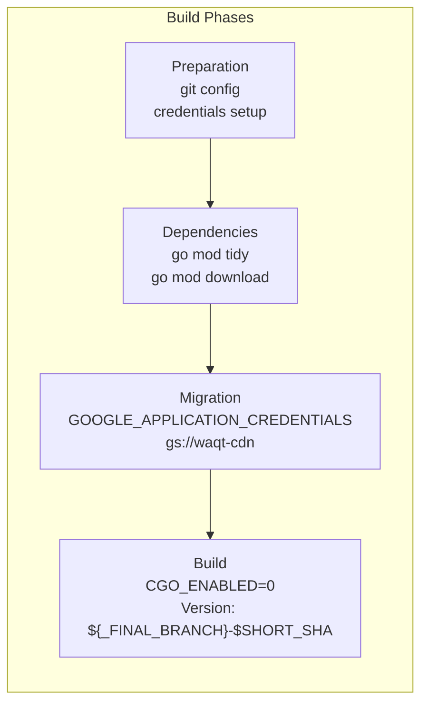
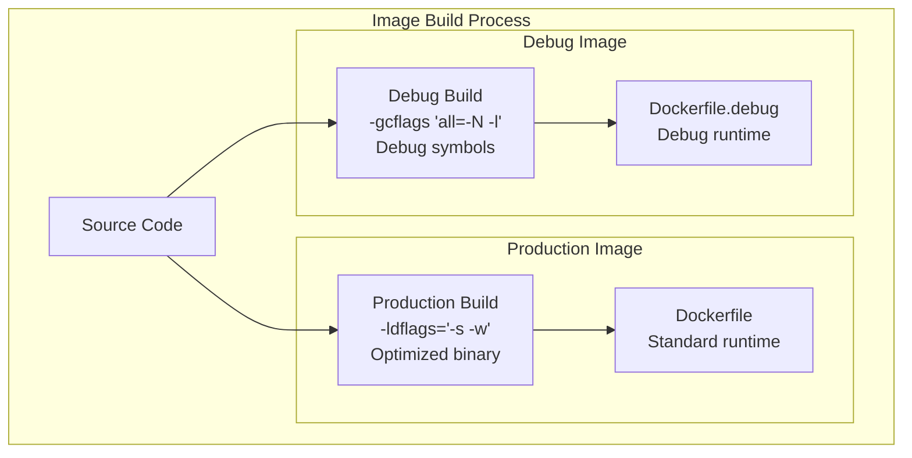
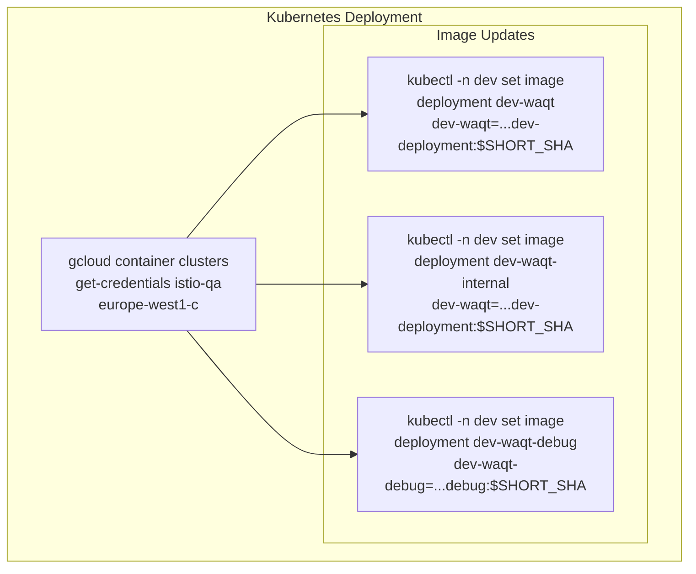
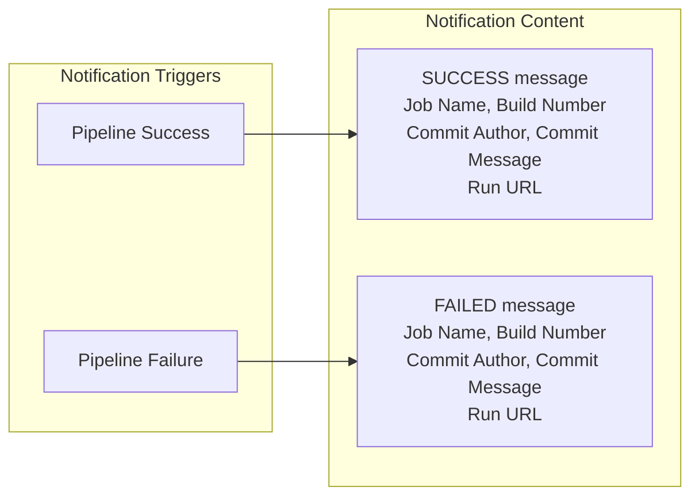

# CI/CD Pipeline

Relevant source files

The following files were used as context for generating this wiki page:

- [Jenkinsfile](Jenkinsfile)
- [cloudbuild.yaml](cloudbuild.yaml)
- [membership-items/buyer.go](membership-items/buyer.go)

This document describes the continuous integration and continuous deployment (CI/CD) pipeline for the waqt-deployment service. The pipeline handles automated building, testing, containerization, and deployment of the application across different environments using both Jenkins and Google Cloud Build systems.

For information about Docker configuration and debugging setup, see [Docker & Debugging](#7.4). For environment-specific configuration management, see [Environment Configuration](#7.2).

## Pipeline Architecture

The waqt-deployment service employs a dual-pipeline architecture supporting both Jenkins-based and Google Cloud Build-based workflows for different deployment scenarios.

### Jenkins Pipeline Architecture

```mermaid
graph TB
    subgraph "Jenkins Environment"
        TRIGGER["Git Push/PR Trigger"]
        AGENT["Jenkins Agent<br/>(label: agent)"]
        
        subgraph "Pipeline Stages"
            COMMIT["Get commit details<br/>GIT_COMMIT_MSG<br/>GIT_AUTHOR"]
            BUILD["Build Stage<br/>docker-go container"]
        end
        
        subgraph "Build Process"
            GIT_CONFIG["Git Authentication<br/>credentials('2b6f4db0-dc0b-468d-941f-5ef218516142')"]
            GO_BUILD["Go Build Process<br/>GOPRIVATE settings<br/>go mod tidy/download"]
            MIGRATE["Migration Runner<br/>-tags migrate"]
            COMPILE["Binary Compilation<br/>CGO_ENABLED=0 GOOS=linux GOARCH=amd64"]
        end
        
        subgraph "Docker Operations"
            DOCKER_BUILD["Docker Build<br/>appointy-global/waqt-deployment"]
            DOCKER_PUSH["Push to GCR<br/>eu.gcr.io<br/>tag: t${BUILD_NUMBER}"]
        end
        
        subgraph "Notifications"
            SLACK_SUCCESS["Slack Success<br/>color: #00FF00"]
            SLACK_FAILURE["Slack Failure<br/>color: #FF0000"]
        end
    end
    
    TRIGGER --> AGENT
    AGENT --> COMMIT
    COMMIT --> BUILD
    BUILD --> GIT_CONFIG
    GIT_CONFIG --> GO_BUILD
    GO_BUILD --> MIGRATE
    MIGRATE --> COMPILE
    COMPILE --> DOCKER_BUILD
    DOCKER_BUILD --> DOCKER_PUSH
    DOCKER_PUSH --> SLACK_SUCCESS
    DOCKER_BUILD --> SLACK_FAILURE
```

Sources: [Jenkinsfile:1-67]()

### Google Cloud Build Architecture

Sources: [cloudbuild.yaml:1-71]()

## Build Process

### Jenkins Build Configuration

The Jenkins pipeline uses a containerized build environment with specific Go module configurations:

| Stage | Container | Key Operations |
|-------|-----------|----------------|
| Git Authentication | docker-go | Sets up GitLab credentials, configures hosts |
| Dependency Management | docker-go | `GOPRIVATE="go.appointy.com,go.saastack.io"` |
| Migration | docker-go | `go run -tags migrate` with `migrator.bucket="gs://waqt-cdn"` |
| Compilation | docker-go | `CGO_ENABLED=0 GOOS=linux GOARCH=amd64` |

The build process includes version injection using `-ldflags="-s -w -X main.Version=${BUILD_NUMBER}"` for production builds.

Sources: [Jenkinsfile:18-38]()

### Cloud Build Configuration

Cloud Build uses a multi-step approach with enhanced security and deployment capabilities:

The Cloud Build process creates both production and debug images with different build flags:
- Production: `-ldflags="-s -w -X main.Version=${_FINAL_BRANCH}-$SHORT_SHA"`
- Debug: `-ldflags="-X main.Version=${_FINAL_BRANCH}-$SHORT_SHA" -gcflags "all=-N -l"`

Sources: [cloudbuild.yaml:9-48]()

## Docker Image Management

### Registry Configuration

The system uses two different container registries depending on the pipeline:

| Pipeline | Registry | Image Pattern |
|----------|----------|---------------|
| Jenkins | `eu.gcr.io` | `appointy-global/waqt-deployment:t${BUILD_NUMBER}` |
| Cloud Build | `europe-west1-docker.pkg.dev` | `appointy-global/istio-qa/dev-deployment:$SHORT_SHA` |

### Image Variants

Two image variants are built for different purposes:

Sources: [Jenkinsfile:27-28](), [cloudbuild.yaml:21](), [cloudbuild.yaml:44](), [cloudbuild.yaml:46]()

## Kubernetes Deployment

### Deployment Targets

The Cloud Build pipeline automatically deploys to three Kubernetes deployments in the `dev` namespace:

| Deployment | Image Type | Purpose |
|------------|------------|---------|
| `dev-waqt` | Production | Main application service |
| `dev-waqt-internal` | Production | Internal service endpoints |
| `dev-waqt-debug` | Debug | Debug/development environment |

### Deployment Process

Sources: [cloudbuild.yaml:54-57]()

## Environment Configuration

### Secret Management

The pipelines use different credential management systems:

**Jenkins Credentials:**
- `GOOGLE_APPLICATION_CREDENTIALS`: Service account for GCS access
- `2b6f4db0-dc0b-468d-941f-5ef218516142`: GitLab authentication
- `gcr:appointy-global`: Container registry access

**Cloud Build Secret Manager:**
- `projects/293885036851/secrets/git_username/versions/latest`
- `projects/293885036851/secrets/git_password/versions/latest`
- `projects/293885036851/secrets/dev-waqt-cdn/versions/1`
- `projects/293885036851/secrets/github_token_atlas/versions/5`

Sources: [Jenkinsfile:5](), [Jenkinsfile:20](), [cloudbuild.yaml:58-67]()

### Build Environment Variables

Key environment variables used across pipelines:

| Variable | Purpose | Value |
|----------|---------|-------|
| `GOPRIVATE` | Private module access | `"go.appointy.com,go.saastack.io"` |
| `CGO_ENABLED` | Disable CGO | `0` |
| `GOOS` | Target OS | `linux` |
| `GOARCH` | Target architecture | `amd64` |
| `migrator.bucket` | Migration storage | `"gs://waqt-cdn"` |

Sources: [Jenkinsfile:24-28](), [cloudbuild.yaml:18-22]()

## Monitoring and Notifications

### Slack Integration

Jenkins pipeline includes comprehensive Slack notifications:

The notifications include:
- `${env.JOB_NAME}`: Jenkins job identifier
- `${env.BUILD_NUMBER}`: Build number for tracking
- `${env.GIT_AUTHOR}`: Commit author information
- `${env.GIT_COMMIT_MSG}`: Commit message content
- `${env.RUN_DISPLAY_URL}`: Direct link to build results

Sources: [Jenkinsfile:59-66]()

## Pipeline Comparison

| Feature | Jenkins | Cloud Build |
|---------|---------|-------------|
| Trigger | Git webhooks | Cloud Source Repositories |
| Build Environment | `docker-go` container | Native `golang` image |
| Registry | Google Container Registry | Artifact Registry |
| Deployment | Manual/separate process | Automatic Kubernetes deployment |
| Notifications | Slack integration | Cloud Build notifications |
| Debug Support | Commented out | Fully implemented |
| Machine Resources | Default agent | `E2_HIGHCPU_32` |
| Timeout | Default | 3600s |

Sources: [Jenkinsfile:1-67](), [cloudbuild.yaml:1-71]()