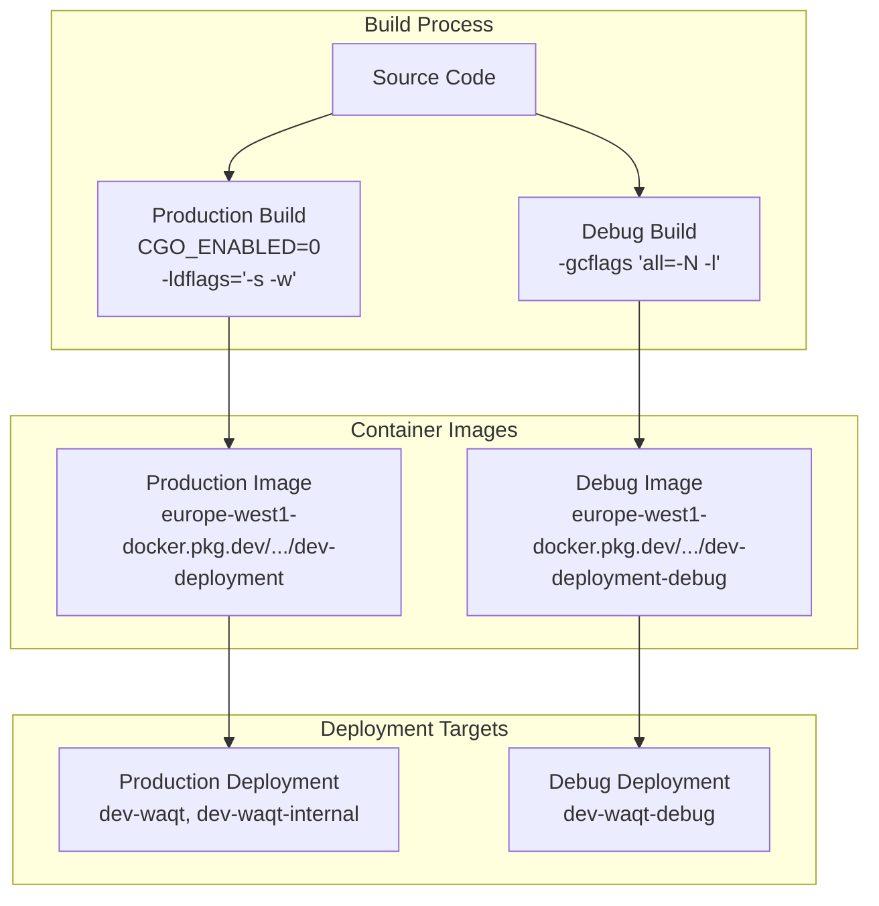
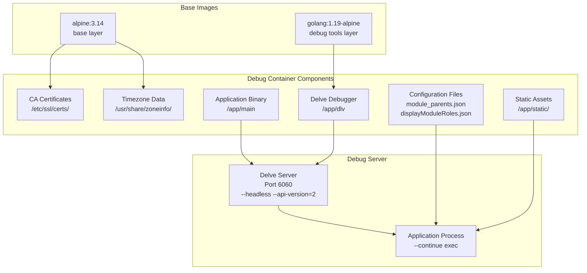
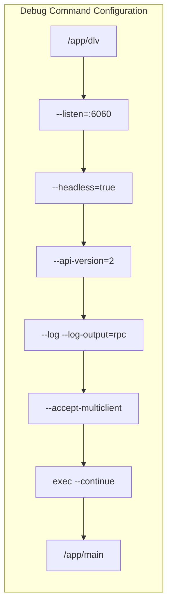
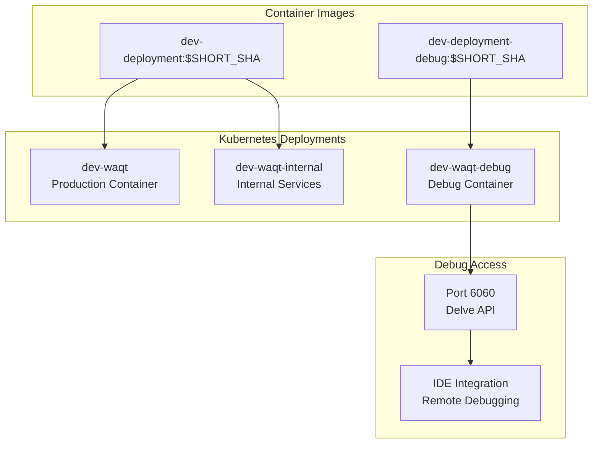

# Docker & Debugging

<details>
<summary>Relevant source files</summary>

The following files were used as context for generating this wiki page:

- [.gitignore](.gitignore)
- [Dockerfile.debug](Dockerfile.debug)
- [cloudbuild.yaml](cloudbuild.yaml)
- [membership-items/buyer.go](membership-items/buyer.go)

</details>


This document covers the containerization strategy and debugging infrastructure for the waqt-deployment service. It details the Docker configuration for both production and development environments, the integrated debugging setup using Delve, and the CI/CD pipeline that builds and deploys these containers.

For information about the overall CI/CD pipeline configuration, see [CI/CD Pipeline](#7.3). For environment-specific deployment settings, see [Environment Configuration](#7.2).

## Container Architecture

The waqt-deployment service uses a dual-container approach with separate configurations for production and debugging environments. The production container is optimized for size and performance, while the debug container includes development tools and remote debugging capabilities.



**Sources:** [cloudbuild.yaml:21-22](), [cloudbuild.yaml:44](), [cloudbuild.yaml:30](), [cloudbuild.yaml:46]()

## Debug Container Configuration

The debug container extends the base Alpine Linux image with Go debugging tools and remote debugging capabilities. It uses Delve (dlv) as the primary debugging tool, configured for remote access.



**Sources:** [Dockerfile.debug:1-4](), [Dockerfile.debug:6-11](), [Dockerfile.debug:13-24]()

## Build Pipeline Integration

The Cloud Build pipeline orchestrates the creation of both production and debug containers, handling dependency management, compilation, and deployment in a coordinated workflow.

| Build Stage | Purpose | Key Flags | Output |
|-------------|---------|-----------|--------|
| Dependency Setup | Download private modules | `GOPRIVATE="go.appointy.com,go.saastack.io"` | Dependencies |
| Migration Build | Database migration execution | `-tags migrate` | Migration runner |
| Production Build | Optimized binary | `CGO_ENABLED=0 -ldflags="-s -w"` | `main` binary |
| Debug Build | Debug-enabled binary | `-gcflags "all=-N -l"` | Debug `main` binary |
| Container Build | Docker image creation | `--build-arg GO_VERSION=1.16` | Container images |
| Deployment | Kubernetes deployment | `kubectl set image` | Running pods |

**Sources:** [cloudbuild.yaml:10-23](), [cloudbuild.yaml:36-48](), [cloudbuild.yaml:49-57]()

## Debug Server Configuration

The debug container runs the application through Delve with specific configuration for remote debugging access. The debugger accepts multi-client connections and provides comprehensive logging.



**Debug Server Features:**
- **Port 6060**: Remote debugging interface
- **Headless Mode**: Server operation without interactive terminal
- **API Version 2**: Latest Delve API for IDE integration
- **Multi-client Support**: Multiple debugging sessions
- **Automatic Continue**: Application starts immediately
- **RPC Logging**: Detailed communication logs

**Sources:** [Dockerfile.debug:24]()

## Development Workflow

The debugging infrastructure supports multiple development scenarios through container-based debugging and local development setup.

### Container Debugging Workflow

1. **Build Debug Image**: Cloud Build creates debug-enabled container
2. **Deploy to Development**: Debug container deployed to `dev-waqt-debug` deployment
3. **Connect Debugger**: IDE or debugger client connects to port 6060
4. **Set Breakpoints**: Interactive debugging with full symbol information
5. **Inspect State**: Variables, goroutines, and call stacks available

### Local Development Setup

The build configuration supports local debugging by generating debug-enabled binaries with the same flags used in the container build process.

```bash
# Local debug build (matching container configuration)
CGO_ENABLED=0 GOOS=linux GOARCH=amd64 go build -gcflags "all=-N -l" -o main

# Local debugging with Delve
dlv exec --headless --listen=:6060 --api-version=2 ./main
```

**Sources:** [cloudbuild.yaml:44](), [Dockerfile.debug:10](), [Dockerfile.debug:24]()

## File Exclusions and Artifacts

The development environment excludes specific files and artifacts from version control to maintain clean repositories and prevent credential exposure.

### Excluded Files

| Pattern | Purpose |
|---------|---------|
| `*.exe`, `*.dll`, `*.so` | Platform-specific binaries |
| `deployment`, `main` | Built application binaries |
| `bin/` | Binary output directory |
| `bucket.json` | Google Cloud Storage credentials |
| `.env` | Environment configuration |
| `dump.rdb` | Redis database dumps |
| `.idea/`, `.vscode/` | IDE configuration |

**Sources:** [.gitignore:1-30]()

## Integration with Kubernetes

The deployment pipeline integrates with Kubernetes to manage both production and debug containers in the development environment, allowing for side-by-side operation and testing.



**Sources:** [cloudbuild.yaml:55-57]()