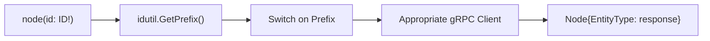
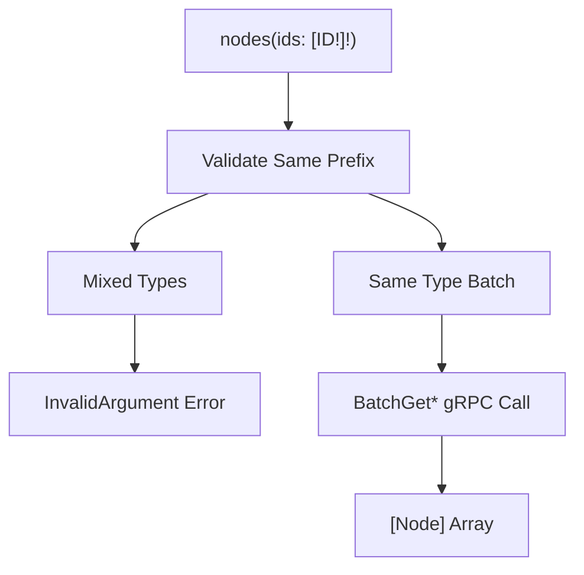
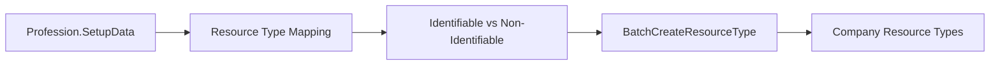
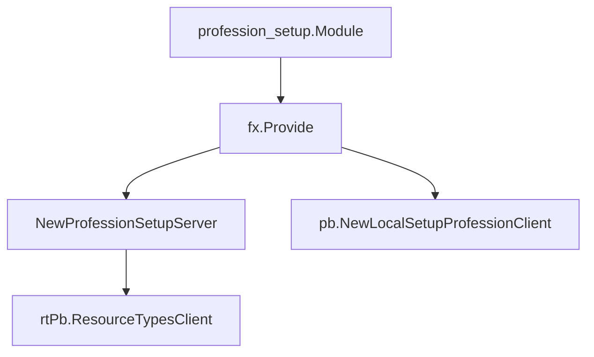
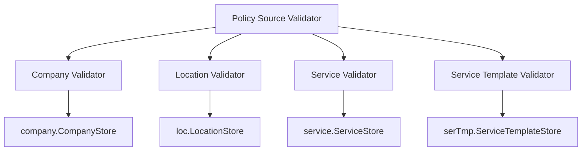
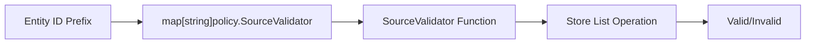

# Utilities & Helpers

Relevant source files

The following files were used as context for generating this wiki page:

- [node.go](node.go)
- [policy-sources/validator.go](policy-sources/validator.go)
- [subscriptions.go](subscriptions.go)
- [verify.go](verify.go)

This document covers utility services and helper functions that support the core application functionality. These components provide common infrastructure patterns including unified entity access through GraphQL, automated resource setup from profession definitions, and validation utilities for policy enforcement.

For information about the main GraphQL schema and connection patterns, see [GraphQL API](#4.1). For details about business domain services that use these utilities, see [Business Logic](#6).

## Overview

The utilities system provides three main categories of helper functionality:

| Component | Purpose | Interface Type |
|-----------|---------|----------------|
| Node Interface | Unified GraphQL entity access with batching support | GraphQL Query |
| Profession Setup | Automated resource type creation from profession definitions | gRPC Service |
| Policy Source Validation | Entity existence validation for policy enforcement | Validation Functions |

## Node Interface

The Node interface implements the GraphQL Node specification, providing unified access to all entities in the system through a single query interface. This pattern enables efficient data fetching and supports both single entity lookup and batch operations.

### Entity Type Support

The `Node` struct provides unified access to 22+ different entity types through embedded protobuf message pointers:

```mermaid
graph TD
    Node["Node struct"] --> WaqtEntities["Waqt Entities"]
    Node --> SaasEntities["SaaStack Entities"]
    
    WaqtEntities --> Appointment["Appointment"]
    WaqtEntities --> BlockHourRule["BlockHourRule"]
    WaqtEntities --> Category["Category"]
    WaqtEntities --> OpenHourRule["OpenHourRule"]
    WaqtEntities --> Resource["Resource"]
    WaqtEntities --> ResourceType["ResourceType"]
    WaqtEntities --> Service["Service"]
    WaqtEntities --> ServiceSetting["ServiceSetting"]
    WaqtEntities --> ServiceTemplate["ServiceTemplate"]
    
    SaasEntities --> Addon["Addon"]
    SaasEntities --> AreaCode["AreaCode"]
    SaasEntities --> Channel["Channel"]
    SaasEntities --> Company["Company"]
    SaasEntities --> Customer["Customer"]
    SaasEntities --> Department["Department"]
    SaasEntities --> Designation["Designation"]
    SaasEntities --> Employee["Employee"]
    SaasEntities --> Group["Group"]
    SaasEntities --> Location["Location"]
    SaasEntities --> Order["Order"]
    SaasEntities --> Policy["Policy"]
    SaasEntities --> Role["Role"]
    SaasEntities --> UserProfile["UserProfile"]
```

Sources: [node.go:38-64]()

### Single Entity Access

The `RegisterNodeInterface` function registers a GraphQL query field `node` that accepts an ID and returns the corresponding entity. The implementation uses ID prefixes to determine entity type and route to the appropriate gRPC client:

Key implementation details:
- Uses `idutil.GetPrefix(idutil.GetId(id))` for entity type detection
- Each case calls the corresponding gRPC client's `Get*` method
- Returns `nil` for unrecognized prefixes
- Applies empty field masks for GraphQL field selection optimization

Sources: [node.go:66-257]()

### Batch Entity Access

The `RegisterBatchNodeInterface` function provides efficient batch entity retrieval through the `nodes` query field. This implementation includes validation to ensure all requested IDs belong to the same entity type:

The batch implementation includes:
- Early return for empty input arrays
- Prefix validation ensuring all IDs belong to the same entity type
- Batch gRPC calls for improved performance
- Proper error handling for mismatched entity types

Sources: [node.go:282-576]()

### Metadata Support

The `MetaInfo` type provides standardized creation and update tracking across all entities:

| Field | Type | Purpose |
|-------|------|---------|
| `CreatedBy` | `UserProfile` | User who created the entity |
| `UpdatedBy` | `UserProfile` | User who last updated the entity |
| `CreatedOn` | `Timestamp` | Creation timestamp |
| `UpdatedOn` | `Timestamp` | Last update timestamp |

Sources: [node.go:259-279]()

## Profession Setup

The profession setup service provides automated resource type creation based on profession definitions. This gRPC service bridges the gap between SaaStack profession management and Waqt-specific resource configuration.

### Service Implementation

The `professionSetupServer` implements the `pb.SetupProfessionServer` interface:

### Resource Type Configuration

The service maps profession resource types to Waqt resource configurations:

| Profession Field | Waqt ResourceType Field | Logic |
|------------------|-------------------------|-------|
| `rt.Name` | `Name` | Direct mapping |
| `rt.IsIdentifiable` | `ResourceTypesType` | `IDENTIFIABLE` or `NON_IDENTIFIABLE` |
| Always | `Active` | Set to `true` |
| `!rt.IsIdentifiable` | `Capacity` | Set to `1` for non-identifiable types |

Sources: [profession-setup/setup.go:18-53]()

### Module Integration

The profession setup service integrates with the application through Uber FX dependency injection:

Sources: [profession-setup/setup.go:11-16]()

## Policy Source Validation

The policy source validation system ensures that policy references to entities are valid by verifying entity existence in their respective data stores.

### Supported Entity Types

The validator supports four entity types with their corresponding validation logic:

### Validation Logic

Each validator follows a consistent pattern:

1. Query the appropriate store with provided IDs
2. Compare result count with input count
3. Return `InvalidArgument` error if counts don't match

| Validator | Store Method | Error Message |
|-----------|--------------|---------------|
| Company | `ListCompanys` | "company(s) is/are invalid" |
| Location | `ListLocations` | "location(s) is/are invalid" |
| Service | `ListServices` | "service(s) is/are invalid" |
| Service Template | `ListServiceTemplates` | "service template(s) is/are invalid" |

Sources: [policy-sources/validator.go:32-77]()

### Integration Pattern

The validation functions are provided as a map keyed by entity prefix, allowing the policy system to dynamically select the appropriate validator:

Sources: [policy-sources/validator.go:26-31]()