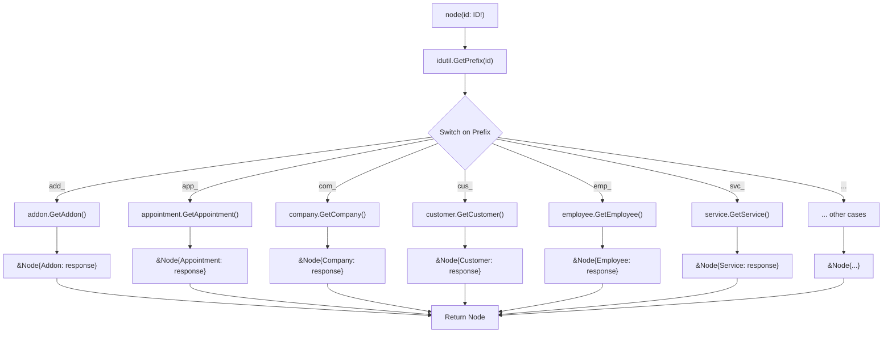
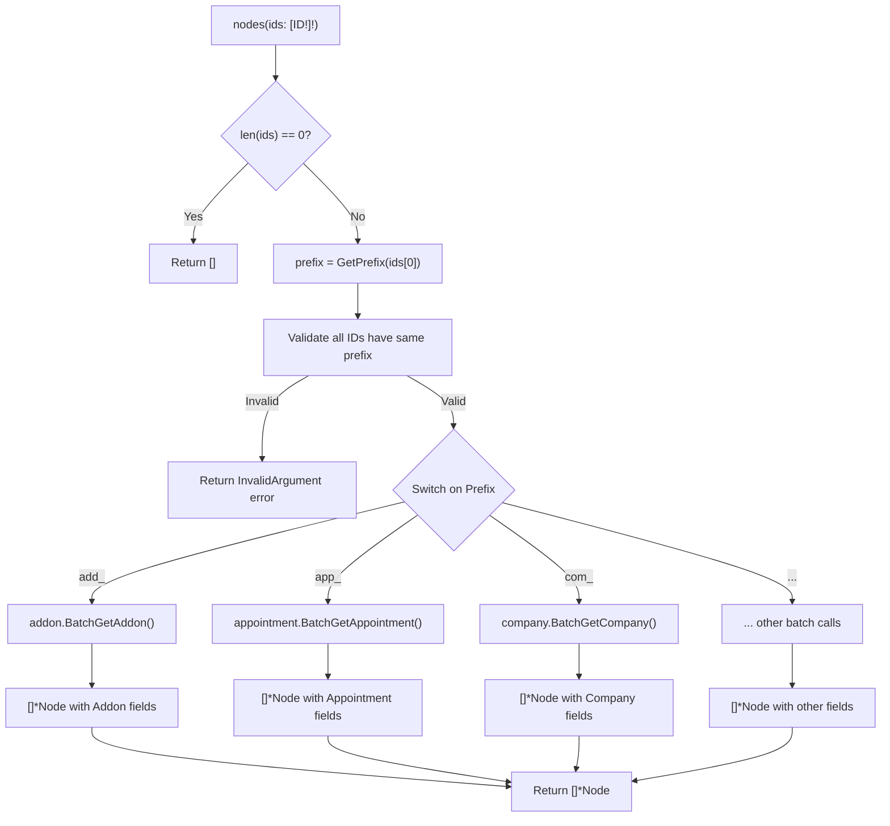
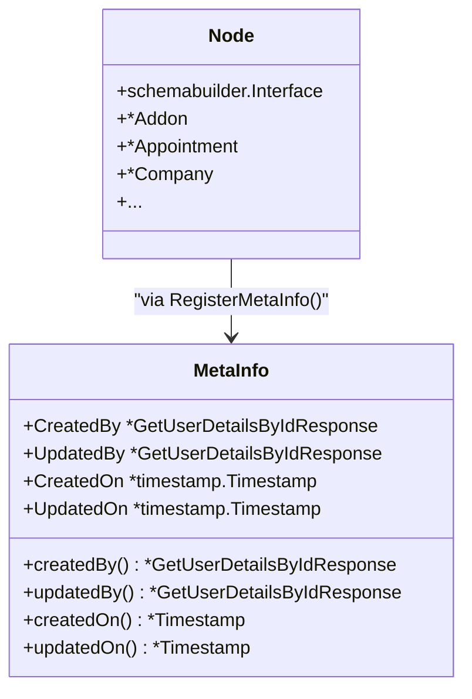
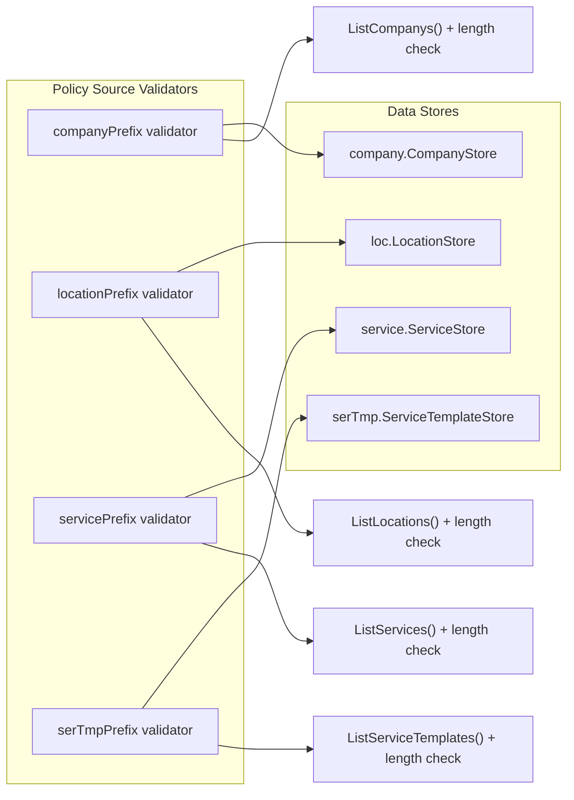

# Node Interface

Relevant source files

The following files were used as context for generating this wiki page:

- [connections.go](connections.go)
- [node.go](node.go)
- [policy-sources/validator.go](policy-sources/validator.go)

## Purpose and Scope

The Node Interface provides a polymorphic data retrieval mechanism for the waqt-deployment service, enabling unified access to entities across multiple microservices through a single GraphQL interface. This system implements the GraphQL Node pattern, allowing clients to fetch any entity by its global ID without knowing the specific entity type in advance.

For information about GraphQL schema registration and connections, see [GraphQL Gateway](#2.2). For details about authentication and authorization mechanisms, see [Authentication & Authorization](#2.3).

## Architecture Overview

The Node Interface acts as a central dispatcher that routes entity retrieval requests to appropriate microservice clients based on entity ID prefixes. It supports both individual and batch entity retrieval operations while maintaining type safety through Go's embedded struct composition.

```mermaid
graph TB
    subgraph "GraphQL Layer"
        NodeQuery["node(id: ID!)"]
        NodesQuery["nodes(ids: [ID!]!)"]
        NodeInterface["Node Interface"]
    end
    
    subgraph "Node Implementation"
        NodeStruct["Node Struct"]
        MetaInfo["MetaInfo"]
        
        subgraph "Embedded Types"
            Addon["*Addon"]
            Appointment["*Appointment"] 
            Company["*Company"]
            Customer["*Customer"]
            Employee["*Employee"]
            Service["*Service"]
            Location["*Location"]
            Order["*Order"]
            Resource["*Resource"]
            Others["... 15+ other types"]
        end
    end
    
    subgraph "Microservice Clients"
        AddonClient["addonpb.AddonsClient"]
        AppointmentClient["apppb.AppointmentsClient"]
        CompanyClient["companypb.CompaniesClient"]
        CustomerClient["customerpb.CustomersClient"]
        EmployeeClient["emppb.EmployeesClient"]
        ServiceClient["servicepb.ServicesClient"]
        LocationClient["locpb.LocationsClient"]
        OrderClient["orderpb.OrdersClient"]
        ResourceClient["resourcepb.ResourcesClient"]
        OtherClients["... other clients"]
    end
    
    NodeQuery --> NodeInterface
    NodesQuery --> NodeInterface
    NodeInterface --> NodeStruct
    NodeStruct --> Addon
    NodeStruct --> Appointment
    NodeStruct --> Company
    NodeStruct --> Customer
    NodeStruct --> Employee
    NodeStruct --> Service
    NodeStruct --> Location
    NodeStruct --> Order
    NodeStruct --> Resource
    NodeStruct --> Others
    
    NodeInterface --> AddonClient
    NodeInterface --> AppointmentClient
    NodeInterface --> CompanyClient
    NodeInterface --> CustomerClient
    NodeInterface --> EmployeeClient
    NodeInterface --> ServiceClient
    NodeInterface --> LocationClient
    NodeInterface --> OrderClient
    NodeInterface --> ResourceClient
    NodeInterface --> OtherClients
```

**Sources:** [node.go:38-64](), [node.go:66-89](), [node.go:282-305]()

## Node Struct Composition

The `Node` struct uses Go's embedded struct pattern to create a polymorphic type that can represent any entity in the system. Only one embedded field will be non-nil for any given Node instance, determined by the entity type prefix extracted from the ID.

| Entity Type | Protobuf Package | Client Interface | ID Prefix |
|-------------|------------------|------------------|-----------|
| Addon | `addonpb` | `AddonsClient` | `add_` |
| Appointment | `apppb` | `AppointmentsClient` | `app_` |
| AreaCode | `areapb` | `AreaCodesClient` | `arc_` |
| BlockHourRule | `bhpb` | `BlockHoursClient` | `bhr_` |
| Category | `catpb` | `CategoriesClient` | `cat_` |
| Channel | `channelpb` | `ChannelsClient` | `chl_` |
| Company | `companypb` | `CompaniesClient` | `com_` |
| Customer | `customerpb` | `CustomersClient` | `cus_` |
| Department | `deppb` | `DepartmentsClient` | `dep_` |
| Designation | `despb` | `DesignationsClient` | `des_` |
| Employee | `emppb` | `EmployeesClient` | `emp_` |
| Group | `grouppb` | `GroupsClient` | `grp_` |
| Location | `locpb` | `LocationsClient` | `loc_` |
| OpenHourRule | `openHourpb` | `OpenHoursClient` | `ohr_` |
| Order | `orderpb` | `OrdersClient` | `ord_` |
| Policy | `policypb` | `PoliciesClient` | `pol_` |
| Resource | `resourcepb` | `ResourcesClient` | `rsr_` |
| ResourceType | `typepb` | `ResourceTypesClient` | `rst_` |
| Role | `rolepb` | `RolesClient` | `rol_` |
| Service | `servicepb` | `ServicesClient` | `svc_` |
| ServiceTemplate | `serviceTemplatepb` | `ServiceTemplatesClient` | `stp_` |
| UserProfile | `userpb` | `UserProfilesClient` | `usp_` |

**Sources:** [node.go:38-64](), [node.go:96-255]()

## Query Interface Implementation

The Node Interface exposes two primary GraphQL query fields: `node` for single entity retrieval and `nodes` for batch retrieval operations.

### Single Node Retrieval

The `node` query field accepts an ID parameter and uses prefix-based routing to determine the appropriate microservice client:

**Sources:** [node.go:91-256]()

### Batch Node Retrieval

The `nodes` query field implements batch retrieval with type validation to ensure all requested IDs belong to the same entity type:

**Sources:** [node.go:307-575](), [node.go:319-326]()

## MetaInfo Integration

The Node Interface includes a `MetaInfo` struct that provides standardized metadata fields for entities that support audit trails:

The `RegisterMetaInfo` function registers GraphQL field resolvers that convert protobuf timestamps to GraphQL-compatible timestamp types and provide access to user details for audit fields.

**Sources:** [node.go:259-279](), [node.go:264-278]()

## Policy Source Validation

The Node Interface integrates with the policy system through source validators that verify entity existence before policy operations. These validators are organized by entity prefix and perform existence checks against respective data stores:

Each validator follows the same pattern: query the data store for the provided IDs and return an error if the number of found entities doesn't match the number of requested IDs.

**Sources:** [policy-sources/validator.go:15-20](), [policy-sources/validator.go:32-78]()

## Integration with GraphQL Connections

The Node Interface works in conjunction with the GraphQL connections system defined in `connections.go`, which provides dataloader-based field resolvers for establishing relationships between entities. While the Node Interface handles direct entity retrieval, the connections system handles related entity loading through efficient batched operations.

The relationship between these systems enables:
- Direct entity access via `node(id)` queries
- Efficient related entity loading via field resolvers
- Consistent entity representation across different access patterns
- Optimized database access through dataloader batching

**Sources:** [connections.go:88-154](), [connections.go:156-173]()