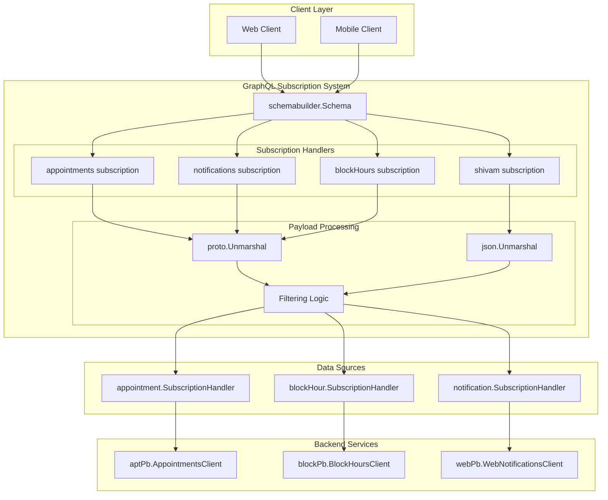
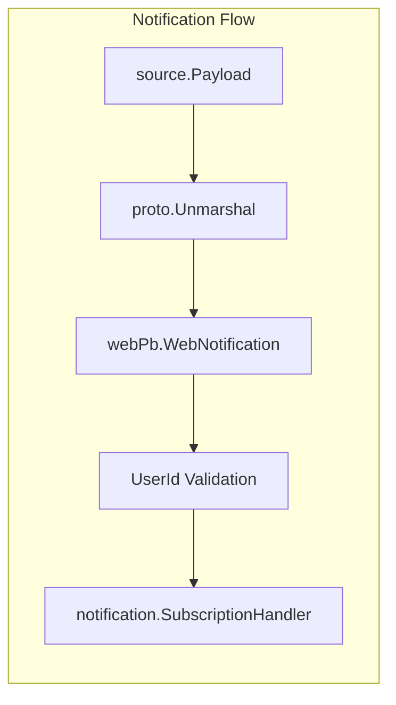
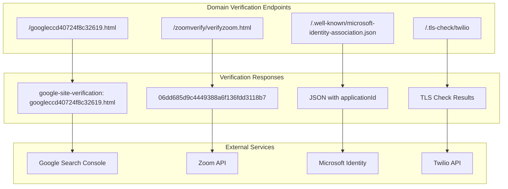

# GraphQL Subscriptions

Relevant source files

The following files were used as context for generating this wiki page:

- [graphql.go](graphql.go)
- [subscriptions.go](subscriptions.go)
- [verify.go](verify.go)

This document covers the real-time GraphQL subscription system and domain verification endpoints implemented in the waqt-deployment service. The GraphQL subscriptions enable clients to receive real-time updates for appointments, notifications, and block hours, while the domain verification endpoints support third-party service integrations.

For information about GraphQL schema registration and federation, see [GraphQL Gateway](#2.2). For details about the broader GraphQL API structure, see [GraphQL API](#4.1).

## Purpose and Scope

The GraphQL subscription system provides real-time data streaming capabilities for critical business entities including appointments, notifications, and resource availability. The subscription handlers implement sophisticated filtering and access control mechanisms. Additionally, the service exposes domain verification endpoints required for integration with external services like Google, Zoom, Microsoft, and Twilio.

## GraphQL Subscription Architecture

The subscription system is built on the `schemabuilder.Schema` from the Jaal GraphQL library and integrates with multiple backend services through gRPC clients.

**Sources:** [subscriptions.go:18-167]()

## Subscription Types

The system implements four distinct subscription types, each with specific filtering capabilities and data structures.

### Appointments Subscription

The `appointments` subscription provides real-time updates for appointment changes with comprehensive filtering options.

| Filter Parameter | Type | Purpose |
|------------------|------|---------|
| `Parents` | `[]string` | Filter by organizational hierarchy |
| `EmployeeIds` | `[]string` | Filter by specific employees |
| `ServiceIds` | `[]string` | Filter by service types |
| `ResourceIds` | `[]string` | Filter by specific resources |
| `ResourceTypeIds` | `[]string` | Filter by resource categories |
| `StartTime` | `schemabuilder.Timestamp` | Filter by time range start |
| `EndTime` | `schemabuilder.Timestamp` | Filter by time range end |

The subscription handler performs access control validation using `idutil.GetParent()` and the `contains()` utility function before delegating to `appointment.SubscriptionHandler()`.

**Sources:** [subscriptions.go:46-89]()

### Notifications Subscription

The `notifications` subscription streams web notification updates with user-specific filtering.

The subscription accepts filtering parameters including `UserId`, `Locale`, `EventType`, and `NotificationStatusType` from the `webPb.NotificationStatusType` enum.

**Sources:** [subscriptions.go:91-118]()

### Block Hours Subscription

The `blockHours` subscription monitors resource availability changes and blocked time periods.

The filtering logic includes validation for:
- Organizational parents using `idutil.GetParent(blk.Id)`
- Employee and resource ID matching
- Time range constraints via `StartTime` and `EndTime`

**Sources:** [subscriptions.go:120-166]()

### Test Subscription

The `shivam` subscription serves as a development/testing endpoint that processes JSON payloads and returns `userPb.UserProfile` objects.

**Sources:** [subscriptions.go:24-44]()

## Domain Verification System

The service implements domain verification endpoints required for third-party service integrations. These endpoints are registered as HTTP routes through the `router.RouteFunc` pattern.

### Verification Endpoints

| Endpoint | Purpose | Response Type |
|----------|---------|---------------|
| `/googleccd40724f8c32619.html` | Google Search Console verification | Plain text |
| `/zoomverify/verifyzoom.html` | Zoom API domain verification | Plain text hash |
| `/.well-known/microsoft-identity-association.json` | Microsoft Identity verification | JSON with `applicationId` |
| `/.tls-check/twilio` | Twilio TLS connectivity test | HTTP proxy response |

**Sources:** [verify.go:14-64]()

## Implementation Details

### Error Handling

The subscription system uses `graphql.ErrNoUpdate` to signal when no update should be sent to subscribers. This occurs in several scenarios:

- Protobuf unmarshaling failures
- Access control filter mismatches
- Invalid payload data

**Sources:** [subscriptions.go:36,62,104,135]()

### Access Control Integration

Each subscription implements hierarchical access control by validating:

1. **Parent Organization**: Using `idutil.GetParent()` to extract organizational hierarchy
2. **Resource Ownership**: Matching employee, service, and resource IDs
3. **Time-based Filtering**: Applying temporal constraints through timestamp validation

### Dependency Injection

The subscription registration follows the fx dependency injection pattern, requiring:

- `*schemabuilder.Schema` for GraphQL schema registration
- gRPC clients for backend service communication (`blockPb.BlockHoursClient`, `aptPb.AppointmentsClient`, `webPb.WebNotificationsClient`)

**Sources:** [subscriptions.go:18-22]()

### Utility Functions

The `contains()` helper function provides slice membership testing for string arrays, supporting the filtering logic across all subscription types.

**Sources:** [subscriptions.go:169-177]()